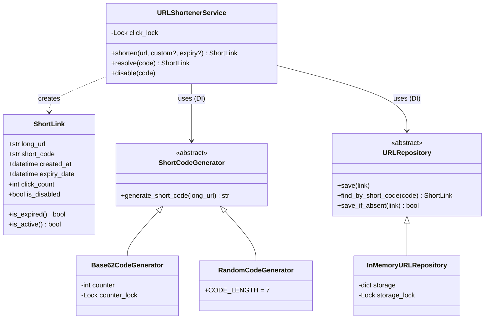
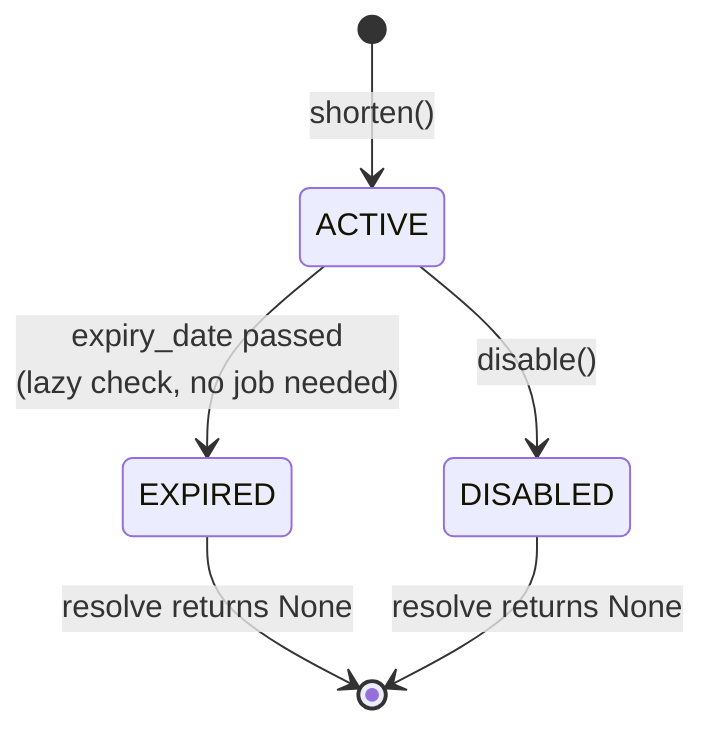
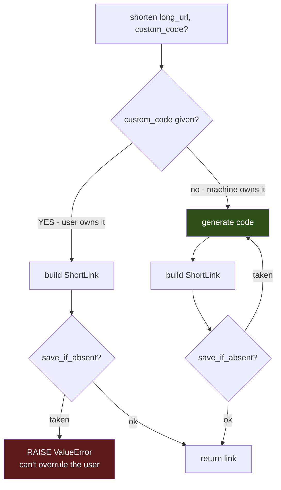

# URL Shortener — Diagrams

## 1. Class diagram



## 2. ShortLink states



> These aren't stored as a status field — they're **computed** from `expiry_date` and `is_disabled`
> via `is_active()`. Cheap, and never goes stale.

## 3. `shorten()` — same clash, opposite reaction



**The rule: who owns the input decides the reaction.**
User picked it → **raise**. Machine picked it → **retry**.

## 4. Why `save_if_absent` and not `exists()` + `save()`

```
   exists() + save()  =  TWO operations, a GAP between them

   Thread A: exists("abc")? -> free ✓
                                        <- Thread B: exists("abc")? -> free ✓
   Thread A: save(...)                  <- Thread B: save(...)   💥 one link lost

   save_if_absent()   =  ONE operation, no gap
   ┌────────────────────────────┐
   │ with lock:                 │   Thread B waits at the door
   │   if code in storage: NO   │   until A is completely done
   │   storage[code] = link     │
   │   return YES               │
   └────────────────────────────┘
```

Same shape at every scale: `INSERT ... ON CONFLICT DO NOTHING` (SQL), `SET key val NX` (Redis),
`PutItem(attribute_not_exists)` (DynamoDB).
