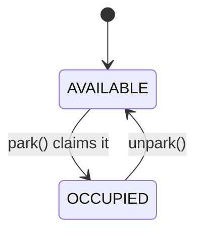
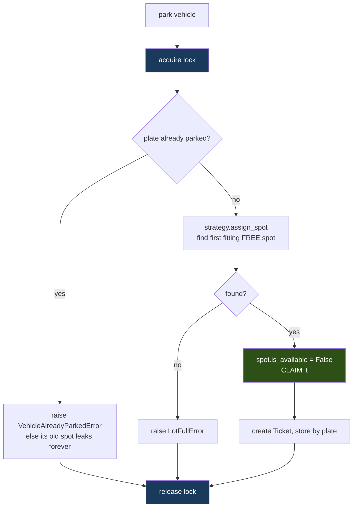
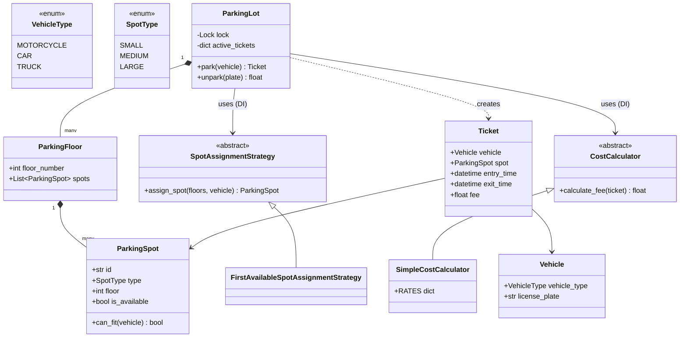

# Parking Lot — Diagrams

## 0. THE LOT AT START — what the data actually looks like

```
   FLOOR 2      [S]  [S]      [M]  [M]      [L]
                 1    2        3    4        5

   FLOOR 1      [S]  [S]      [M]  [M]      [L]
                 1    2        3    4        5
                                              ▲
                          ENTRY ──────────────┘

   [S]=SMALL  [M]=MEDIUM  [L]=LARGE      all AVAILABLE at start
```

### Who can park where

```
                 [S]      [M]      [L]
   🏍  MOTORCYCLE  ✓        ✓        ✓      (fits anywhere)
   🚗  CAR         ✗        ✓        ✓
   🚚  TRUCK       ✗        ✗        ✓      (large only)
```

### In memory

```python
lot.floors = [
    ParkingFloor(1, [ParkingSpot("1-small-0", SMALL, floor=1, is_available=True),
                     ParkingSpot("1-small-1", SMALL, floor=1, is_available=True),
                     ParkingSpot("1-medium-0", MEDIUM, floor=1, ...), ...]),
    ParkingFloor(2, [...]),
]
lot.active_tickets = {}        # plate -> Ticket   (empty at start)
lot.lock = Lock()              # ONE lock for the whole lot
```

### After a truck parks

```
   FLOOR 1      [S]  [S]      [M]  [M]      [X]     <- 1-large-0 taken
                                              ▲
                              Ticket("MH-03-T") -> spot 1-large-0, entry 14:30

   lot.active_tickets = {"MH-03-T": Ticket(vehicle, spot, entry_time)}
                          ^ keyed by PLATE, so unpark(plate) can find it
```

---

## 1. The fit rule as a picture

```
                    SMALL    MEDIUM    LARGE
   MOTORCYCLE         ✓         ✓         ✓
   CAR                ✗         ✓         ✓
   TRUCK              ✗         ✗         ✓
```

That table **is** the code:
```python
FIT_RULE = {
    MOTORCYCLE: {SMALL, MEDIUM, LARGE},
    CAR:        {MEDIUM, LARGE},
    TRUCK:      {LARGE},
}
```
Adding a scooter = **one row of data**, not an `elif`. That's Open/Closed in practice.

## 2. Spot lifecycle (deliberately simple — compare with Movie Booking)



> **Only two states here** — because a car physically arrives at the moment it parks. The movie
> problem has a third state (`HELD`) because there's a gap between *choosing* and *paying*. That gap
> is what creates all the difficulty there and none here.

## 3. `park()` — the critical section



**The whole find→claim sequence is inside ONE lock.** Release it after `assign_spot` and two cars
both get handed the same free spot.

## 4. Class diagram



**Two Strategies** — because the requirements said *two* things were swappable (pricing **and**
assignment). Spotting both is the whole trick; it's easy to catch pricing and miss assignment.

## 5. `can_fit` vs `is_available` — two different questions

```
   can_fit(vehicle)      "COULD this vehicle ever use this spot?"   -> about TYPES
   is_available          "is it free RIGHT NOW?"                    -> about STATE

   assignment strategy asks BOTH:
       if spot.is_available and spot.can_fit(vehicle):
```

Merging them into `can_fit` makes the name lie, and breaks a query like *"how many car-compatible
spots exist in total?"* (occupied ones included).
