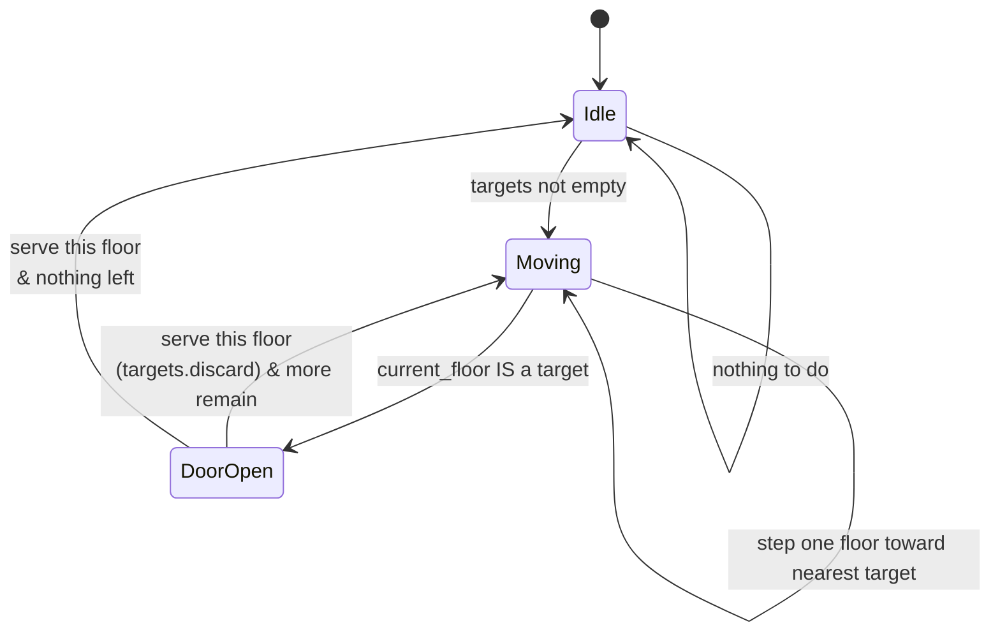
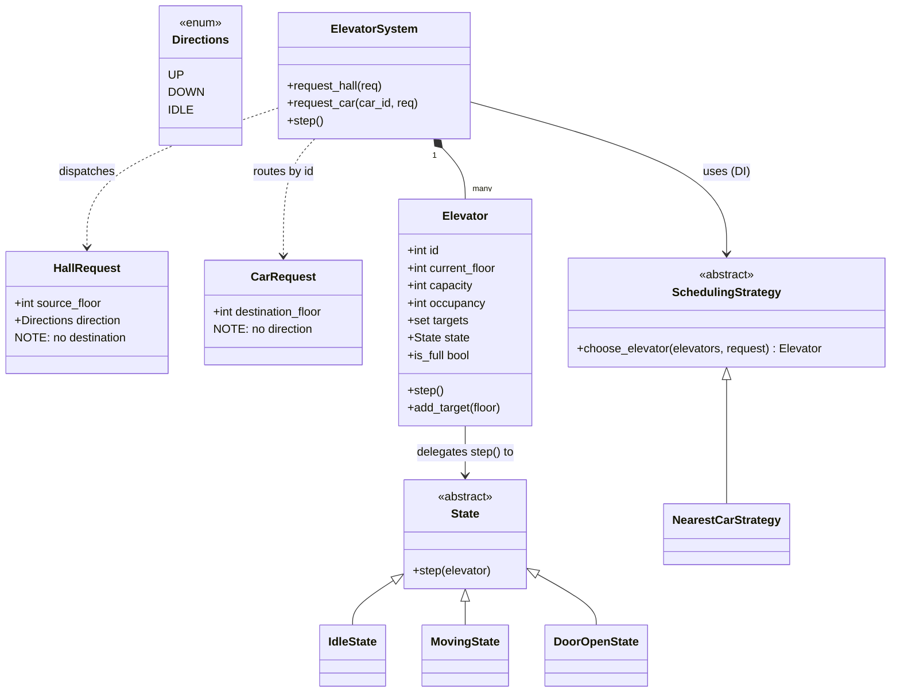

# Elevator — Diagrams

## 0. THE BUILDING AT START

```
   floor          E0        E1        E2
    4      │            │        │        │
    3      │            │        │        │
    2      │            │        │   [E2] │   <- Idle, targets={}
    1      │            │        │        │
    0      │      [E0]  │  ...   │        │   <- E0 Idle at 0
           │            │  [E1]  │        │   <- E1 Idle at 4  (drawn at its floor)
           └────────────┴────────┴────────┘

   All three: state=IdleState, direction=IDLE, targets=set(), occupancy=0
```

### In memory

```python
system.elevators = [
    Elevator(id=0, current_floor=0, state=IdleState(), targets=set(), capacity=8),
    Elevator(id=1, current_floor=4, state=IdleState(), targets=set(), capacity=8),
    Elevator(id=2, current_floor=2, state=IdleState(), targets=set(), capacity=8),
]
system._by_id = {0: <E0>, 1: <E1>, 2: <E2>}    # O(1) routing for car calls
system.lock   = Lock()
```

### A request arrives: ⬆ pressed on floor 3

```
   HallRequest(source_floor=3, direction=UP)
              │
              ▼  no car assigned yet -> ask the STRATEGY
   NearestCarStrategy: |0-3|=3   |4-3|=1 ✓   |2-3|=1 (E2 is FULL, skipped)
              │
              ▼
   E1.add_target(3)      ->  E1.targets = {3}
                             next tick: IdleState sees targets -> MovingState
```

Compare with a **car** call — no strategy at all, it already belongs to that lift:
```
   CarRequest(destination_floor=7)  +  car_id=1
              │
              ▼
   system._by_id[1].add_target(7)    ->  straight there
```

---

## 1. The State pattern, visually



**Each box is a CLASS**, not an enum value:

```
class IdleState:      step() -> if targets: become MovingState
class MovingState:    step() -> at target? become DoorOpenState
                               else move one floor
class DoorOpenState:  step() -> discard this floor
                               become Moving or Idle
```

And `Elevator.step()` is **one line**:
```python
def step(self):
    self.state.step(self)      # no if. ever.
```

## 2. Why State pattern here but enum in Parking

```
                    Do the values BEHAVE differently?
                              │
              ┌───────────────┴───────────────┐
             NO                              YES
              │                               │
     only DATA differs                 BEHAVIOUR differs
              │                               │
      enum + lookup map                  State pattern
              │                               │
   Parking: VehicleType             Elevator: Idle/Moving/DoorOpen
   (Car/Truck both just              (step() does completely
    occupy one spot; only             different work in each)
    WHICH spot fits differs)
```

## 3. A tick-by-tick trace

Elevator at floor 2, targets = {5}:

```
tick  state       floor  targets   what happened
────  ──────────  ─────  ────────  ─────────────────────────
 0    Idle          2     {5}      targets exist -> Moving
 1    Moving        3     {5}      moved one floor up
 2    Moving        4     {5}      moved one floor up
 3    Moving        5     {5}      moved one floor up
 4    Moving        5     {5}      AT a target -> DoorOpen
 5    DoorOpen      5     {}       served! discard(5) -> Idle
 6    Idle          5     {}       nothing to do
```

## 4. The hall vs car request asymmetry

```
HALL button (outside, on floor 3)      CAR button (inside the lift)
┌──────────────────────┐               ┌──────────────────────┐
│  source_floor = 3    │               │  destination = 7     │
│  direction   = UP    │               │  direction   = ---   │
│  destination = ???   │  <- unknown!  │  which car   = THIS  │
│  which car   = ???   │  <- dispatch  │                      │
└──────────────────────┘               └──────────────────────┘
        │                                       │
   needs a DISPATCHER                    already assigned
   (SchedulingStrategy)                  (just add_target)
```

You haven't decided where you're going when you press ⬆ in the hallway — that's why
`HallRequest` has **no destination**, and why it's a different class, not one class with a flag.

## 5. Class diagram


