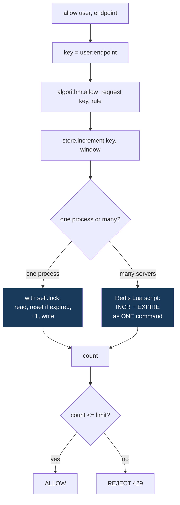
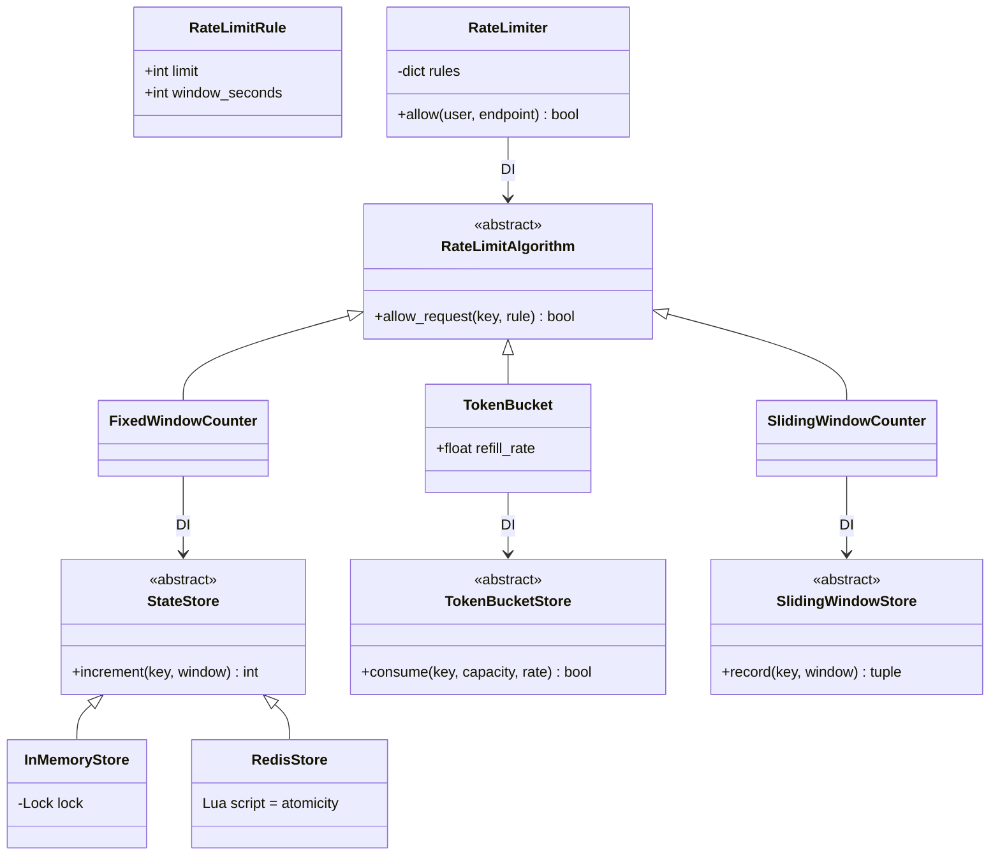

# Rate Limiter — Diagrams

## 1. The layering (the whole design in one picture)

```
   RateLimiter          "build the key, ask the algorithm"
        │                            key = f"{user}:{endpoint}"
        ▼
   RateLimitAlgorithm   STATELESS LOGIC — owns no dict, no lock
        │                            "count <= limit?"
        ▼
   StateStore           THE STATE — and the ATOMICITY
        │
   ┌────┴─────┐
   ▼          ▼
InMemory    Redis        <- swap THIS, and single-process becomes distributed
(a lock)   (Lua script)     Algorithm and RateLimiter don't change one line
```

## 2. The three algorithms, visually

```
FIXED WINDOW — the boundary burst
   |----- minute 1 -----|----- minute 2 -----|
                    50 reqs  50 reqs
                        ^^^^^^^^
                    100 requests in ~1 second, and BOTH windows are "legal"

SLIDING WINDOW COUNTER — weight the previous window
   |--- prev ---|--- current ---|
                 ^ we are 30% in
   estimated = current + prev * (1 - 0.30)      <- smooths the boundary

TOKEN BUCKET — burst on purpose, then throttle
   bucket: [●●●●●] capacity 5, refills 2/sec
   burst of 8 ->  ✓✓✓✓✓ ✗✗✗        (5 through, 3 rejected)
   wait 1 sec ->  [●●]              (2 refilled)
   2 more     ->  ✓✓ ✗
```

**The interview question isn't "which is most accurate"** — it's *"what traffic shape do you want?"*
Hard cap → sliding window. Allow bursts then throttle → token bucket.

## 3. Where atomicity lives



## 4. Why a lock is useless across servers

```
   ONE PROCESS                    THREE SERVERS
   ┌──────────────┐         ┌────────┐ ┌────────┐ ┌────────┐
   │ dict + lock  │         │dict+lk │ │dict+lk │ │dict+lk │
   │              │         │  50    │ │  50    │ │  50    │
   │  limit 50 ✓  │         └────────┘ └────────┘ └────────┘
   └──────────────┘             user gets 150 requests 💥
                                each lock guards its OWN memory;
                                they've never heard of each other

   FIX: one shared store
   ┌────────┐ ┌────────┐ ┌────────┐
   │ server │ │ server │ │ server │
   └───┬────┘ └───┬────┘ └───┬────┘
       └──────────┼──────────┘
              ┌───▼────┐
              │ REDIS  │  <- the only thing all three share,
              │ INCR   │     so IT must be the arbiter
              └────────┘
```

## 5. Class diagram — note the THREE store interfaces (ISP)



**Three narrow store interfaces, not one fat one** — each algorithm needs different state
(a counter / tokens+time / curr+prev counts). Forcing one interface would make every store fake
methods it can't honestly implement. That's **Interface Segregation**.
