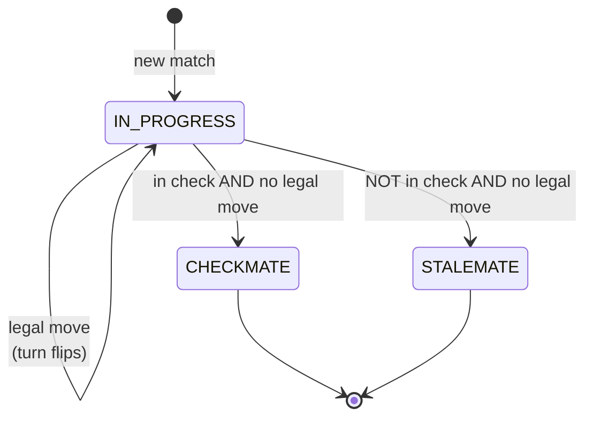
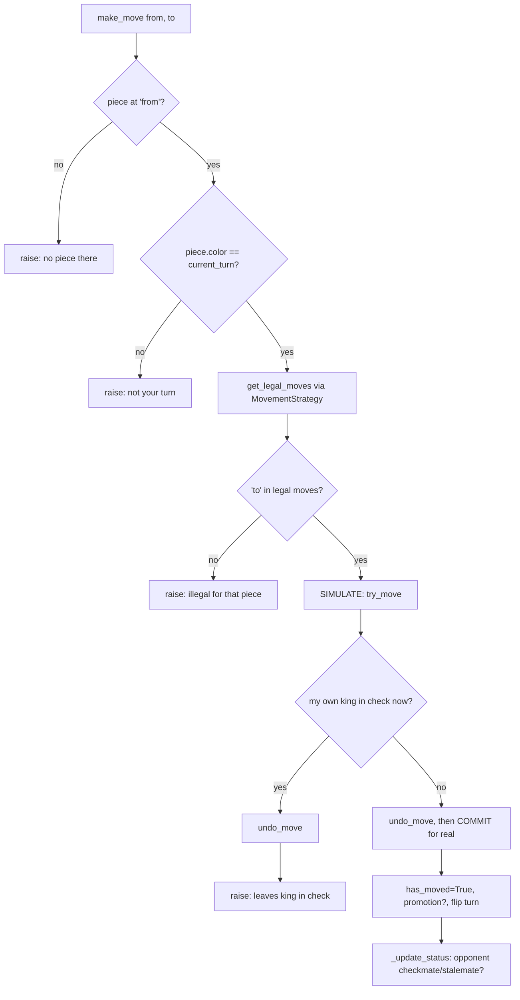
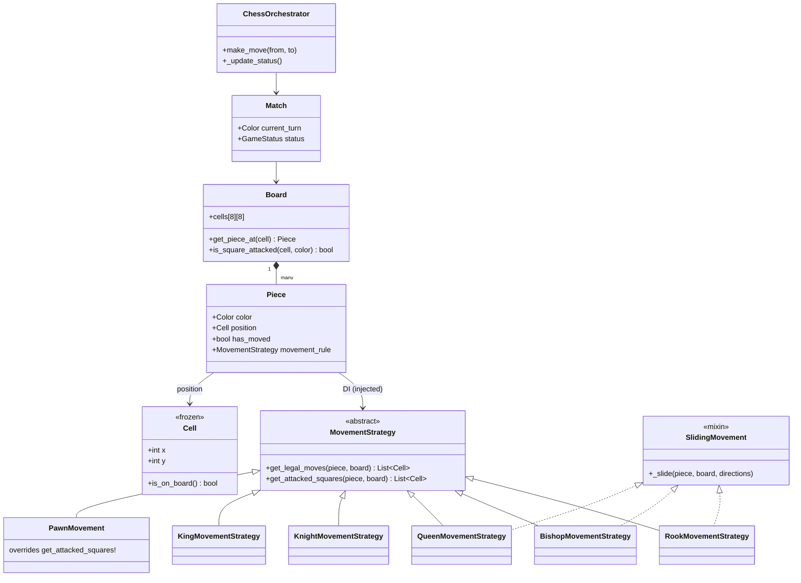

# Chess — Diagrams

## 0. THE BOARD AT START — what the data actually looks like

```
          x=0    1     2     3     4     5     6     7
        ┌─────┬─────┬─────┬─────┬─────┬─────┬─────┬─────┐
  y=7   │ ♜ r │ ♞ n │ ♝ b │ ♛ q │ ♚ k │ ♝ b │ ♞ n │ ♜ r │   BLACK back rank
        ├─────┼─────┼─────┼─────┼─────┼─────┼─────┼─────┤
  y=6   │ ♟ p │ ♟ p │ ♟ p │ ♟ p │ ♟ p │ ♟ p │ ♟ p │ ♟ p │   BLACK pawns
        ├─────┼─────┼─────┼─────┼─────┼─────┼─────┼─────┤
  y=5   │     │     │     │     │     │     │     │     │        │
        ├─────┼─────┼─────┼─────┼─────┼─────┼─────┼─────┤        │ black
  y=4   │     │     │     │     │     │     │     │     │        │ moves
        ├─────┼─────┼─────┼─────┼─────┼─────┼─────┼─────┤        ▼ DOWN (-1)
  y=3   │     │     │     │     │     │     │     │     │
        ├─────┼─────┼─────┼─────┼─────┼─────┼─────┼─────┤        ▲ white
  y=2   │     │     │     │     │     │     │     │     │        │ moves
        ├─────┼─────┼─────┼─────┼─────┼─────┼─────┼─────┤        │ UP (+1)
  y=1   │ ♙ P │ ♙ P │ ♙ P │ ♙ P │ ♙ P │ ♙ P │ ♙ P │ ♙ P │   WHITE pawns
        ├─────┼─────┼─────┼─────┼─────┼─────┼─────┼─────┤
  y=0   │ ♖ R │ ♘ N │ ♗ B │ ♕ Q │ ♔ K │ ♗ B │ ♘ N │ ♖ R │   WHITE back rank
        └─────┴─────┴─────┴─────┴─────┴─────┴─────┴─────┘
```

**32 pieces, 16 per side:** 8 pawns, 2 rooks, 2 knights, 2 bishops, 1 queen, 1 king.

### The coordinate gotcha (this trips everyone)

```
   Cell(4, 0)   means  x=4, y=0   ->  the white KING     (x FIRST)
   cells[0][4]  means  y=0, x=4   ->  the same square    (y FIRST — REVERSED!)
```

`self.cells` is a **list of rows**. The outer index picks the row (**y**), the inner picks the
column (**x**). So the flip happens in exactly **one place**:

```python
def get_piece_at(self, cell):
    return self.cells[cell.y][cell.x]     # <- the ONLY place x/y get swapped
```

Everywhere else you pass a `Cell` and never think about it. The other two places touching raw
indexes are `try_move` / `undo_move` — which is why those got explicit hints.

### In memory it's this

```python
board.cells = [
  [Piece(WHITE,Cell(0,0),Rook), Piece(WHITE,Cell(1,0),Knight), ... ],   # row y=0
  [Piece(WHITE,Cell(0,1),Pawn), Piece(WHITE,Cell(1,1),Pawn),   ... ],   # row y=1
  [None, None, None, None, None, None, None, None],                    # row y=2
  ...
  [Piece(BLACK,Cell(0,7),Rook), ... ],                                 # row y=7
]
```

Each `Piece` holds `color`, `position` (a `Cell`), `has_moved`, and its **injected
`movement_rule`** — that last one is where the behaviour lives:

```
   Piece(WHITE, Cell(0,0)) ──movement_rule──▶ RookMovementStrategy()
   Piece(WHITE, Cell(1,0)) ──movement_rule──▶ KnightMovementStrategy()
   Piece(WHITE, Cell(0,1)) ──movement_rule──▶ PawnMovement()
```

Same `Piece` class every time. **Only the strategy object differs.**

---

## 1. Game state machine



> **Both endings are the SAME computation** — `has_any_legal_move() == False`.
> The only difference is the `is_in_check` flag. That's why the code is:
> ```python
> if not can_move:
>     status = CHECKMATE if in_check else STALEMATE
> ```

## 2. Where "check" fits — it is NOT a state

```
       Is the player in check?
              │
      ┌───────┴────────┐
     YES              NO
      │                │
  can they move?   can they move?
   ┌──┴──┐          ┌──┴──┐
  YES   NO         YES   NO
   │     │          │     │
 keep  CHECKMATE  keep  STALEMATE
 playing          playing
```

**"Check" is a condition, not a game state.** You never store `status = CHECK`. It's computed
(`is_in_check`) and combined with "any legal move?" to decide the *real* status.

## 3. make_move() — the 5 steps



**Step 4 is the clever one.** "Don't move into check" is enforced **once, here** — not inside
`KingMovementStrategy`. Two reasons:
1. **Infinite recursion:** if the King's move-generator asked "is that square attacked?", the Board
   would loop the enemy pieces including the *enemy king*, which would ask the same question back.
2. **It catches pins for free** — a bishop shielding your king can't move either, and no code
   anywhere mentions the word "pin".

## 4. Class diagram



## 5. The one method only Pawn overrides

```
Every other piece:   squares I can MOVE to  ==  squares I ATTACK
Pawn:                moves STRAIGHT          !=  attacks DIAGONALLY

        ♟ black pawn at (3,4)
       ↙   ↓   ↘
   (2,3) (3,3) (4,3)
    ATT   MOVE  ATT      <- three different squares, three different meanings
```

That's why `get_attacked_squares()` exists as a **default method on the ABC** (returns
`get_legal_moves`) that **only PawnMovement overrides**. Five pieces get it free; the one real
exception declares itself.
