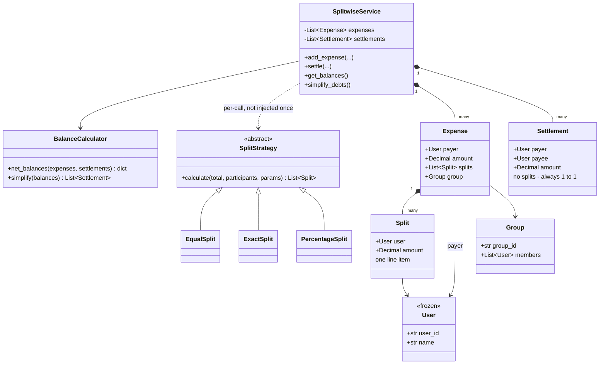

# Splitwise — Diagrams

## 1. One expense, visually

Alice pays ₹900 for dinner, split equally between Alice, Bob, Carol:

```
   Expense(payer=Alice, amount=900)
        │
        ├── Split(Alice, 300)      <- Alice is in her OWN splits
        ├── Split(Bob,   300)
        └── Split(Carol, 300)

   Balance effect:
        payer      gets  +900   (she put the money in)
        each split gets  -share (they consumed it)

        Alice:  +900 - 300 = +600     (is owed)
        Bob:           - 300 = -300     (owes)
        Carol:         - 300 = -300     (owes)
                              ────────
                       always sums to 0
```

## 2. The settlement sign trap

```
   balances is a LEDGER POSITION, not a wallet.
        positive = money is owed TO you
        negative = you owe money

   Bob pays Alice ₹300:

        Bob:   -300  ──(+300)──▶   0     paying a debt moves you TOWARD zero
                                          = UP when you're negative
        Alice: +600  ──(-300)──▶ +300     she got repaid that much

   payer  += amount      <- feels backwards, is correct
   payee  -= amount
```

> The "sum must be zero" check does **not** catch a sign flip — flipped signs still sum to zero.
> You have to reason about the direction separately.

## 3. simplify_debts — greedy max-match

```
   balances:  Alice +450 | Bob -50 | Carol -250 | Dave -150

   round 1:  biggest creditor Alice(450)  vs  biggest debtor Carol(250)
             transfer min(450,250) = 250      -> Carol hits 0, drops out
             Alice now +200

   round 2:  Alice(200) vs Dave(150)
             transfer 150                     -> Dave hits 0, drops out
             Alice now +50

   round 3:  Alice(50) vs Bob(50)
             transfer 50                      -> BOTH hit 0

   3 transfers for 4 people   ->   at most n-1
```

**Say this out loud:** greedy gives ≤ n−1 but is **not provably optimal**. True minimisation means
finding zero-sum subgroups = subset-sum = **NP-hard**. Greedy is the standard practical answer.

## 4. The rounding rule

```
   ₹1000 split 3 ways = 333.333...

   naive round:   333.33 × 3 = 999.99      ✗ a paisa vanished
   round UP:      333.34 × 3 = 1000.02     ✗ money INVENTED (worse!)

   correct:
     base      = ROUND_DOWN(1000/3) = 333.33      (deliberately under-allocate)
     allocated = 333.33 × 3         = 999.99
     leftover  = 1000 - 999.99      = 0.01        (1 paisa)
     give 1 extra paisa to the first person:

     [333.34, 333.33, 333.33]  ->  sums to EXACTLY 1000.00 ✓
```

## 5. Class diagram



> **Strategy passed PER CALL here**, not injected in `__init__` — because the split type varies per
> *expense*, unlike parking's assignment rule which varies per *lot*. The axis of variation decides.

## 6. Derive vs materialize (LLD → HLD)

```
   LLD (derive):                          HLD (materialize):

   expenses: [e1, e2, ... e20000]         balances table:
        │                                    user | group | amount
        │ sum ALL of them                    -----+-------+-------
        ▼   every single read                Alice| goa   | 666.66
   balance = 666.66                          Bob  | goa   |-333.33
                                                  │
   O(n) reads  ✗                                  ▼ O(1) read ✓
   no lock needed ✓                          needs a TRANSACTION
   always correct ✓                          can drift -> reconcile job
```

Both are right at their own scale. Say the tradeoff out loud.
