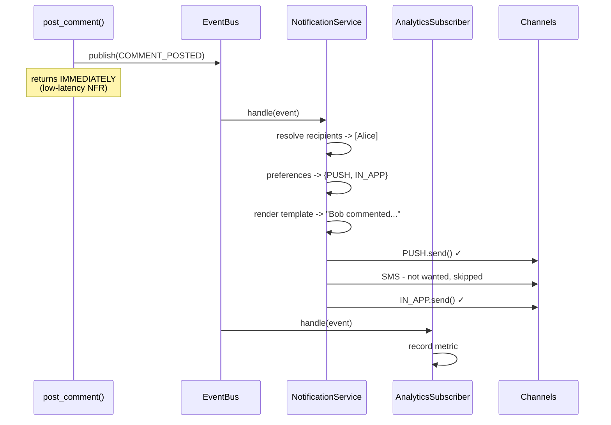
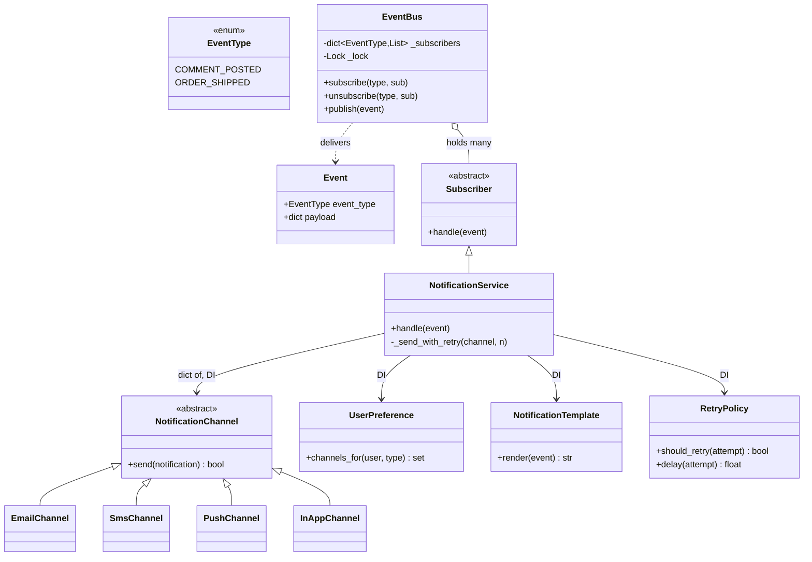

# Notification System — Diagrams

## 1. Before and after Observer

```
   WITHOUT Observer — post_comment knows EVERYTHING

   post_comment() ──▶ email_service.send()
                 ├──▶ sms_service.send()
                 ├──▶ push_service.send()
                 └──▶ analytics.track()

   add Slack? EDIT post_comment. add badges? EDIT post_comment.
   slow SMS? post_comment gets slow. email throws? push never runs.


   WITH Observer — post_comment knows NOTHING

   post_comment() ──▶ event_bus.publish(COMMENT_POSTED)
                              │
                              │  bus only knows: sub.handle(event)
                    ┌─────────┼─────────┐
                    ▼         ▼         ▼
            Notification  Analytics  BadgeCounter
              Service                 (added later - post_comment
                                       never changed)
```

## 2. The TWO layers (don't conflate them)

```
   ┌─ LAYER 1: decoupling (Observer) ──────────────────────┐
   │                                                        │
   │   EventBus ──publish──▶ Subscriber.handle(event)       │
   │                                                        │
   │   That's the bus's ENTIRE knowledge. It has never      │
   │   heard of email, users, or templates.                 │
   └────────────────────────────────────────────────────────┘
                            │
                            ▼  NotificationService is the HINGE
                               (implements Subscriber, owns the pipeline)
   ┌─ LAYER 2: the pipeline ───────────────────────────────┐
   │                                                        │
   │   recipients → preferences → render → dispatch → retry │
   │                                                        │
   │   Ordinary orchestration, inside ONE subscriber.        │
   └────────────────────────────────────────────────────────┘
```

## 3. One event, end to end



## 4. Bulkhead — where the try/except sits

```
   WITHOUT bulkhead                  WITH bulkhead

   for ch in channels:               for ch in channels:
       ch.send(n)                        try:    ch.send(n)
                                         except: log; continue

   email raises 💥                   email raises -> caught
   sms   never runs                  sms   ✓
   push  never runs                  push  ✓
   inapp never runs                  inapp ✓
```

**That one `try/except`, placed INSIDE the loop, IS the NFR.** Outside the loop it does nothing.

Ship analogy — the name comes from watertight compartments:
```
   ┌─────┬═════┬─────┬─────┐
   │  1  │💧💧💧│  3  │  4  │   compartment 2 floods,
   └─────┴═════┴─────┴─────┘   the ship still floats
```

## 5. Channel is BOTH an enum and a Strategy

```
   ChannelType (enum)              NotificationChannel (Strategy)
   ─────────────────              ──────────────────────────────
   just a LABEL                   the actual BEHAVIOUR
   stored in preferences          EmailChannel.send()
   "notify me by EMAIL"           SmsChannel.send()

              └──────── linked by ────────┘
              dict[ChannelType, NotificationChannel]
```

> Data-vs-behaviour isn't always either/or. Sometimes you need the **label** *and* the
> **implementation**, with a lookup between them.

## 6. Class diagram



**`Subscriber <|-- NotificationService`** is the key arrow — that IS-A relationship is what lets the
bus hold it without knowing what notifications are.

## 7. LLD → HLD: the same bulkhead, one level up

```
   LLD                               HLD
   for ch in channels:               Kafka topics, one per channel
       try: ch.send(n)                  send.email  -> email workers
       except: continue                 send.sms    -> sms workers  (Twilio down?
                                        send.push   -> push workers  only THIS lane
                                        send.inapp  -> inapp writer  backs up)

   try/except in code          →     separate queue + worker pool per channel
```
