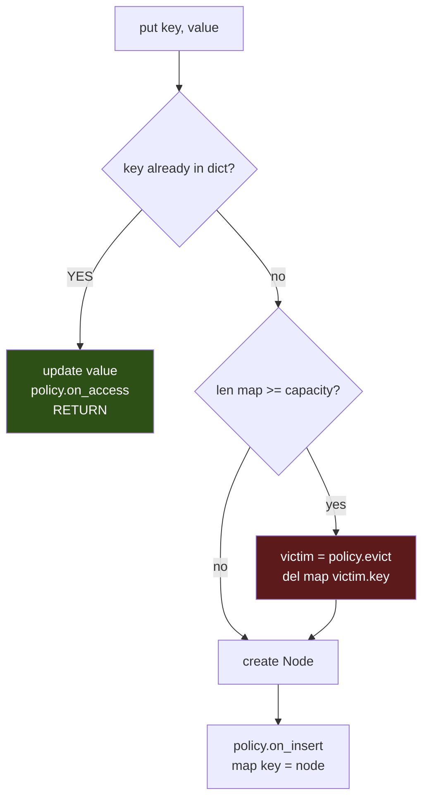
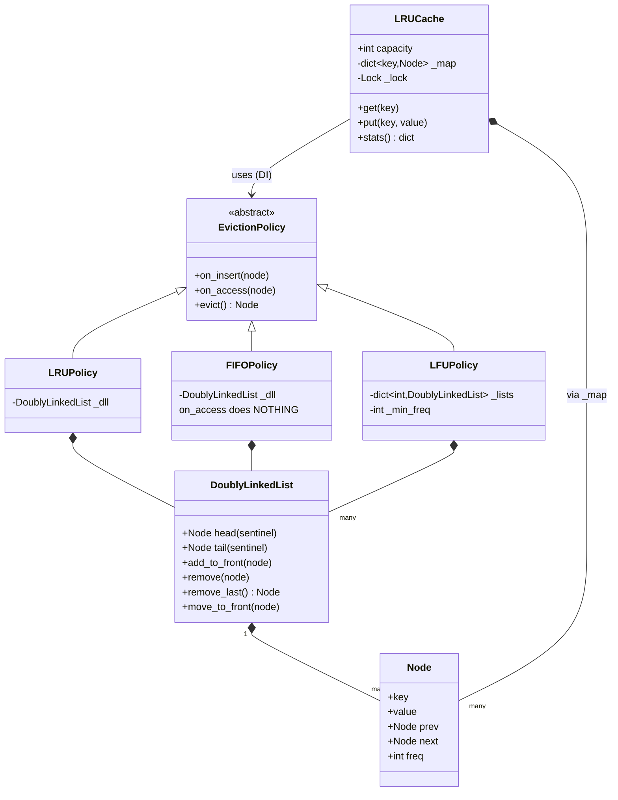

# LRU Cache — Diagrams

## 0. THE CACHE AT START — and after each put

**Empty (capacity 3):**
```
   dict:  {}                    DLL:   head ⇄ tail
                                       (only the two sentinels)
```

**After `put("a", 1)`:**
```
   dict:  {"a" ──┐}             DLL:   head ⇄ [a] ⇄ tail
                 └──────────────────────────────┘
```

**After `put("b", 2)`, `put("c", 3)`:**
```
   dict:  {"a" ─────────┐
           "b" ──────┐  │      DLL:  head ⇄ [c] ⇄ [b] ⇄ [a] ⇄ tail
           "c" ───┐  │  │                     ▲             ▲
                  │  │  └─────────────────────┼─────────────┘
                  │  └────────────────────────┤
                  └───────────────────────────┘
                                             MRU           LRU
                                          (newest)    (dies next)
```

Note the list is **newest-first**: `c` went in last, so it sits at the head.

**Now `put("d", 4)` — cache is FULL:**
```
   1. evict FIRST:   victim = dll.remove_last()   -> [a]
                     del dict[victim.key]         -> del dict["a"]   <- needs node.key!
   2. then insert:   head ⇄ [d] ⇄ [c] ⇄ [b] ⇄ tail

   dict:  {"b", "c", "d"}          "a" is gone from BOTH structures
```

**Both structures always stay in sync.** If you delete from the DLL but forget the dict, the dict
grows forever and `len(map)` stops matching reality — the capacity check silently breaks.

### In memory

```python
cache._map = {"b": <Node b>, "c": <Node c>, "d": <Node d>}   # key -> NODE, not value
cache.policy._dll = head ⇄ [d] ⇄ [c] ⇄ [b] ⇄ tail            # the POLICY owns this
cache._lock = Lock()
cache._hits, cache._misses = 0, 0
```

> Note: after the LFU refactor, the **policy** owns the list — the cache owns only the dict.

---

## 1. The two structures, side by side (THE picture for this problem)

```
        dict                              Doubly Linked List
   key  ->  Node ref                  (order: newest ... oldest)

   "a" ──────────┐
   "b" ────────┐ │      head ⇄ [ c ] ⇄ [ a ] ⇄ [ b ] ⇄ tail
   "c" ──────┐ │ │      dummy    ▲       ▲       ▲     dummy
             │ │ │              MRU              LRU
             │ │ └────────────────┘       │       │
             │ └────────────────────────────────  ┘
             └──────────────────┘
```

- **dict** answers *"where is key X?"* → O(1), but knows nothing about order
- **DLL** answers *"who's oldest?"* → O(1), but can't find a key without walking
- The **arrows** are the trick: dict stores the **Node**, not the value

## 2. What happens on `get("b")`

```
BEFORE:   head ⇄ [c] ⇄ [a] ⇄ [b] ⇄ tail        dict["b"] ──┐
                                  ▲                         │
                                  └─────────────────────────┘

  1. node = dict["b"]        O(1)  ← dict hands us the node directly
  2. dll.remove(node)        O(1)  ← node.prev / node.next surgery
  3. dll.add_to_front(node)  O(1)  ← now most-recently-used

AFTER:    head ⇄ [b] ⇄ [c] ⇄ [a] ⇄ tail
                  ▲                 ▲
                 MRU               LRU (dies next)
```

**Notice step 2 needs no searching.** That's the entire reason the dict points at nodes.

## 3. Why DOUBLY linked

```
Removing X:            ... ⇄ [A] ⇄ [X] ⇄ [B] ⇄ ...

   need:   A.next = B      and     B.prev = A
                ↑
        you need A = X's PREVIOUS node

   Singly linked:  walk from head to find A       -> O(n)  ✗
   Doubly linked:  X.prev IS A                    -> O(1)  ✓
```

## 4. Why sentinels

```
WITHOUT sentinels:                  WITH sentinels:
   [A] ⇄ [B] ⇄ [C]                  head ⇄ [A] ⇄ [B] ⇄ [C] ⇄ tail
                                    dummy                    dummy

Remove A?  "is it first? update      Remove A?
 head? is it last? is the list         node.prev.next = node.next
 empty?" -> 4 special cases            node.next.prev = node.prev
                                       -> SAME 2 lines, always
```

Every real node **always** has a prev and a next. No `if node is None` anywhere.

## 5. `put()` — the two ordering traps



**Trap 1 — check "exists" FIRST.** An update doesn't grow the cache, so evicting would throw away a
good entry for nothing.

**Trap 2 — evict BEFORE insert.** At `capacity = 1`:
```
insert-then-evict:  add new at head -> [new]
                    evict tail      -> head and tail are the SAME node
                    -> you just deleted what you inserted. Cache stays empty forever.
```

## 6. LFU — one list PER frequency

LRU needs one list. **LFU cannot work with one list** — that's what broke the first interface.

```
   min_freq = 1
        │
   freq 1: head ⇄ [ D ] ⇄ [ C ] ⇄ tail    <- evict from HERE (tail = C)
   freq 2: head ⇄ [ A ] ⇄ tail
   freq 5: head ⇄ [ B ] ⇄ tail

   get("C") -> C moves from bucket 1 to bucket 2
            -> bucket 1 now has only D, still not empty, min_freq stays 1
```

Ties inside a bucket break by **LRU** (we take that bucket's tail).

## 7. Class diagram



**Note the arrows into the policies.** Each policy **owns** its structure — that's the fix LFU
forced. The cache owns only the dict.
