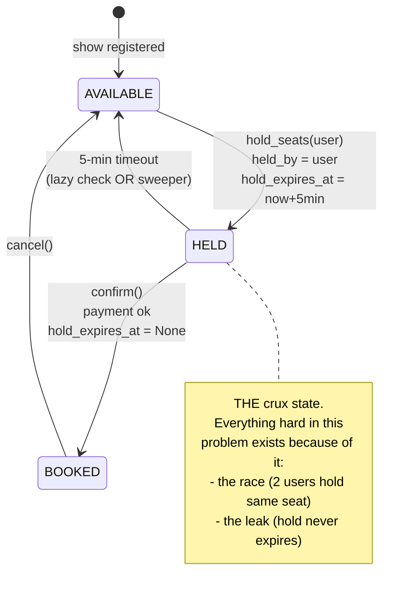
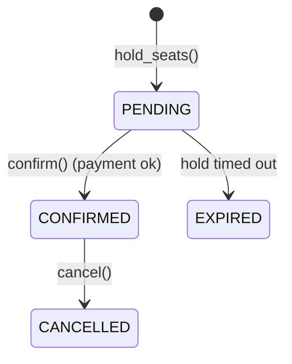
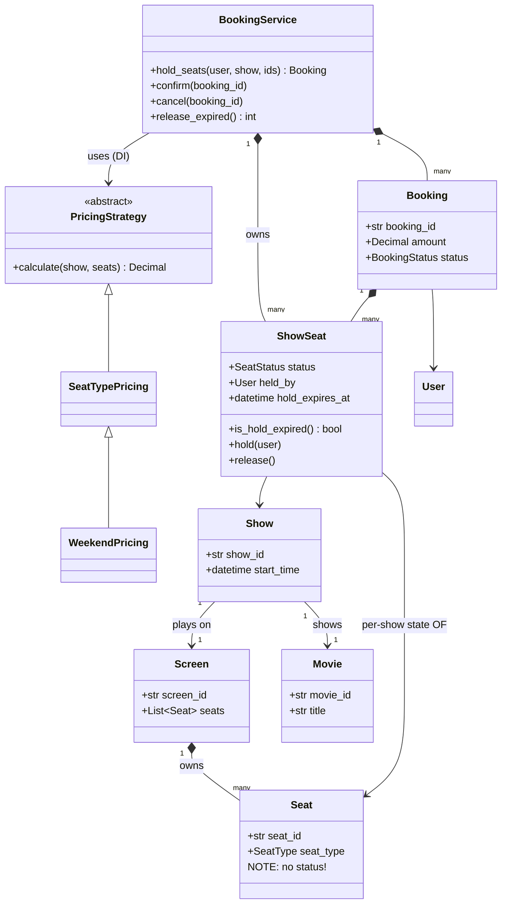
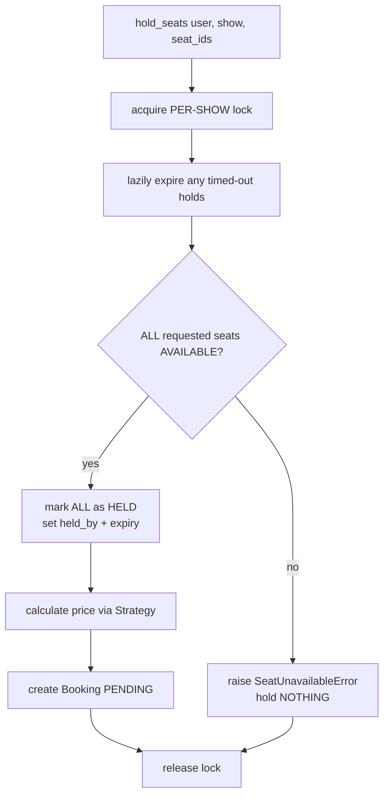

# Movie Booking — Diagrams

## 0. THE HALL AT START — what the data actually looks like

```
                    ┌──────────────────────────┐
                    │         SCREEN           │
                    └──────────────────────────┘

   RECLINER   C1    C2    C3                      ₹500
             [ ]   [ ]   [ ]

   PREMIUM    B1    B2    B3    B4                ₹350
             [ ]   [ ]   [ ]   [ ]

   REGULAR    A1    A2    A3    A4    A5          ₹200
             [ ]   [ ]   [ ]   [ ]   [ ]

             [ ] = AVAILABLE    [~] = HELD    [X] = BOOKED
```

### The same hall, three different shows

```
   Screen 1 has ONE set of physical seats:
        Seat("A1", REGULAR), Seat("A2", REGULAR), ... Seat("C3", RECLINER)
        ^ these have NO status. Ever.

   But three shows run on it today:

   3pm show          6pm show          9pm show
   A1 [ ]            A1 [X]            A1 [~]
   A2 [ ]            A2 [X]            A2 [ ]
   A3 [X]            A3 [ ]            A3 [ ]
   ...               ...               ...

   ONE Seat("A1")  ──┬── ShowSeat(3pm) : AVAILABLE
                     ├── ShowSeat(6pm) : BOOKED
                     └── ShowSeat(9pm) : HELD by Bob, expires 20:47
```

**That's the whole reason `ShowSeat` exists.** Put `status` on `Seat` and booking A1 for the 6pm show
would book it for every show of the day.

### In memory it's this

```python
# static catalogue — built once
screen.seats = [Seat("A1", REGULAR), Seat("A2", REGULAR), ..., Seat("C3", RECLINER)]

# per-show state — one dict per show, built by register_show()
service._show_seats = {
    "3pm_show": {"A1": ShowSeat(AVAILABLE), "A2": ShowSeat(AVAILABLE), ...},
    "6pm_show": {"A1": ShowSeat(BOOKED),    "A2": ShowSeat(BOOKED),    ...},
    "9pm_show": {"A1": ShowSeat(HELD, held_by=Bob, expires=20:47), ...},
}

service._locks = {"3pm_show": Lock(), "6pm_show": Lock(), "9pm_show": Lock()}
                   ^ ONE LOCK PER SHOW — the 3pm rush must not block 9pm buyers
```

---

## 1. Seat lifecycle (the crux of this problem)



## 2. Booking lifecycle (runs in parallel with the seat)



> **Two state machines, kept in sync.** A `Booking` is PENDING while its seats are HELD; it becomes
> CONFIRMED when they become BOOKED. `confirm()` re-checks the seats precisely because these two can
> drift apart (payment took too long → seats expired but booking still says PENDING).

## 3. Class diagram



**The split to notice:** `Seat` (physical, on the Screen) has **no status**. `ShowSeat` is the
per-show state. One `Seat` → many `ShowSeat`s, one per show.

```
Seat "A5"  ──┬── ShowSeat(3pm show)  : AVAILABLE
             ├── ShowSeat(6pm show)  : BOOKED
             └── ShowSeat(9pm show)  : HELD
```

## 4. hold_seats() flow



**Why the check loop finishes before any mutation:** all-or-nothing. If a user asks for 3 seats and
only 2 are free, holding those 2 would strand them — nobody else can take them, and this user can't
complete either.
