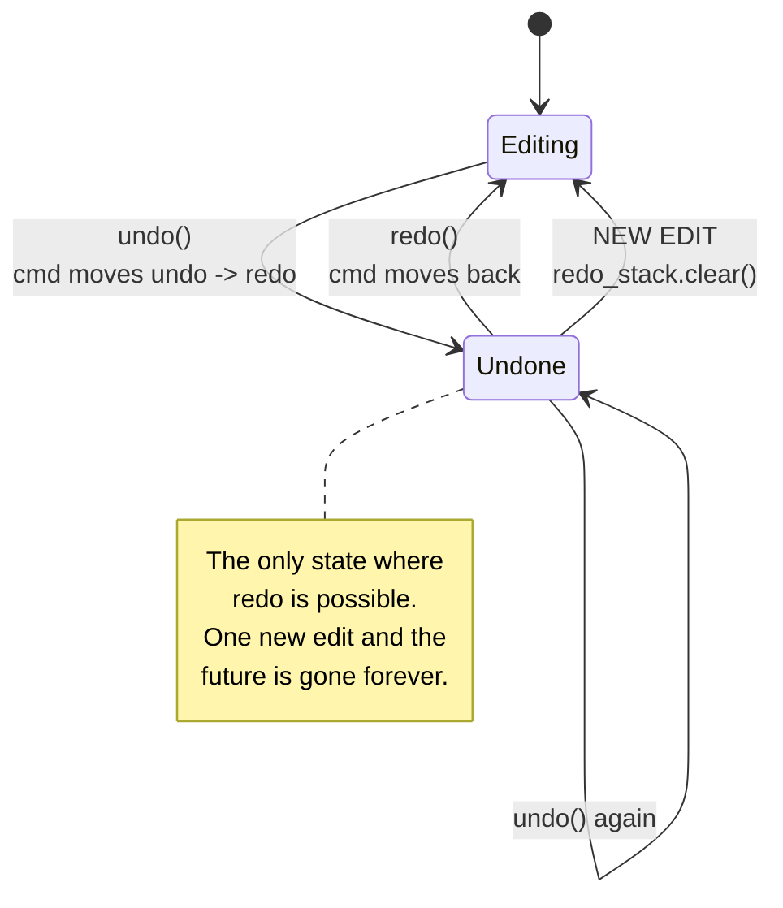
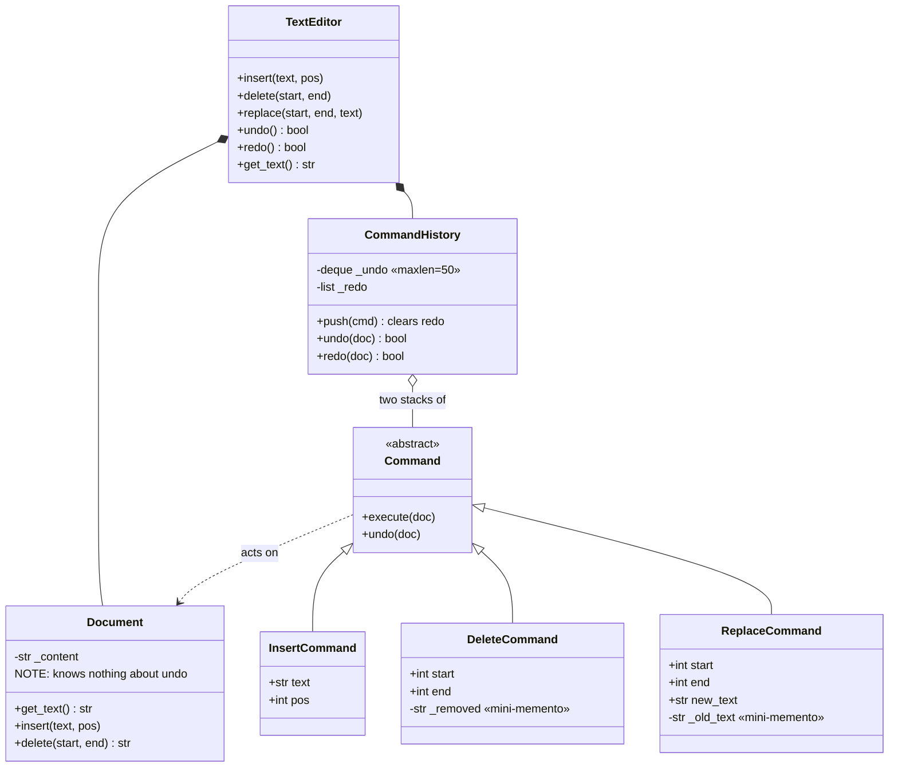

# Text Editor — Diagrams

## 0. THE STATE AT START

```
   Document:    ""                (empty string)

   undo_stack   ┌──────────┐      redo_stack   ┌──────────┐
   (maxlen=50)  │  empty   │                   │  empty   │
                └──────────┘                   └──────────┘
```

## 1. Typing "Hello", then " World", then undo

```
   ── after insert("Hello", 0) ──────────────────────────────
   doc: "Hello"
   undo: [ Insert('Hello'@0) ]              redo: [ ]

   ── after insert(" World", 5) ─────────────────────────────
   doc: "Hello World"
   undo: [ Insert('Hello'@0), Insert(' World'@5) ]
                                            redo: [ ]

   ── after undo() ──────────────────────────────────────────
   doc: "Hello"                             the command MOVED across
   undo: [ Insert('Hello'@0) ]              redo: [ Insert(' World'@5) ]
                                                   ▲ still alive, ready to replay

   ── after redo() ──────────────────────────────────────────
   doc: "Hello World"
   undo: [ Insert('Hello'@0), Insert(' World'@5) ]
                                            redo: [ ]
```

**Commands are never destroyed by undo** — they move between the two stacks. `redo` just calls the
same `execute()` again.

## 2. Why a new edit CLEARS redo

```
   typed A, B, C:        A ──▶ AB ──▶ ABC
                                       ▲ you are here
   undo twice:           A             redo holds: [C, B]
                         ▲ you are here

   now type "X":         A ──▶ AX
                                 ▲ you went a DIFFERENT way

                         AB and ABC never happened on this timeline.
                         Redo into them would produce nonsense.
                         -> redo_stack.clear()
```



## 3. What each command must remember

```
   InsertCommand("hi", pos=5)
        execute:  doc.insert("hi", 5)
        undo:     doc.delete(5, 7)          <- knows everything at construction ✓

   DeleteCommand(start=3, end=8)
        execute:  self._removed = doc.delete(3, 8)   <- CAPTURE first!
        undo:     doc.insert(self._removed, 3)
                       ▲ without this it CANNOT undo — the text is gone

   ReplaceCommand(start=0, end=5, new="Goodbye")
        execute:  self._old = doc.delete(0, 5)       <- capture what we overwrite
                  doc.insert("Goodbye", 0)
        undo:     doc.delete(0, 0+len("Goodbye"))    <- remove the new
                  doc.insert(self._old, 0)           <- restore the old
```

**The subtlety:** `Delete` and `Replace` cannot know the old text when they're *constructed* — they
haven't seen the document yet. They must capture it **inside `execute()`**.

> That captured fragment **is a Memento** — just a tiny one, of only the changed slice instead of the
> whole document. Command and Memento working together.

## 4. Command vs Memento — the memory picture

```
   COMMAND (store the delta)              MEMENTO (store the whole state)

   doc: 10 MB                              doc: 10 MB
   ┌──────────────┐                        ┌──────────────┐
   │ Insert 'a'   │  ~1 byte               │ 10 MB copy   │
   │ Insert 'b'   │  ~1 byte               │ 10 MB copy   │
   │ Delete 3:9   │  ~6 bytes              │ 10 MB copy   │
   │ ...          │                        │ ...          │
   │ x50          │                        │ x50          │
   └──────────────┘                        └──────────────┘
   total: a few KB  ✓                      total: 500 MB  💀
```

**Pick Memento when** an operation can't be cleanly inverted — a complex irreversible transform, a
game save, a checkpoint before a risky batch job. **Pick Command when** you can express the inverse,
which for text edits you always can.

## 5. Class diagram



**Note the separation:** `Document` has no idea undo exists. All history lives in `CommandHistory`.
That's why you can change the undo strategy without touching the document at all.

## 6. The freebie: operations as objects

Because a command is an **object**, you get these without writing them:

```
   LOG      undo_stack is already a readable history of what happened
   MACRO    [cmd1, cmd2, cmd3] -> replay the list
   QUEUE    send commands over a wire, execute them elsewhere
   REPLAY   re-run a session from a saved command list
```

None of that is possible if an "operation" is just a function call that already happened.
