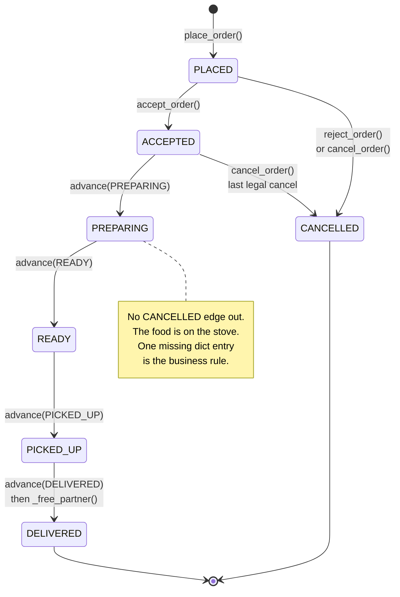
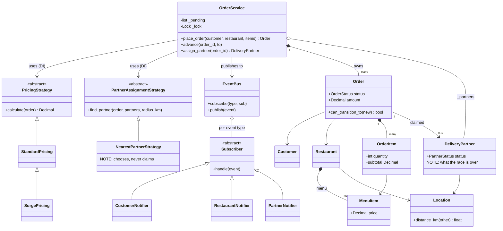

# Food Delivery — Diagrams

## 0. THE STATE AT START

The board before the first move. Every distance below is a real `Location.distance_km`, measured
**from the restaurant** — pickup comes first, so that is the only origin matching ever uses.

Two partners are what the demo actually builds (`near` = p1 Ravi, `far` = p2 Sunil, passed as
`partners=[near, far]`). **p3 Meera is a scenario partner, not in the file** — sections 2 and 5 add
her because the widening-radius retry is a locked requirement (problem.md clarification 5) that a
two-partner board cannot demonstrate: p1 is inside the first ring and p2 is outside all three, so
with the demo's own pool the loop either wins on ring 1 or parks. Her coordinate is picked so the
number stays checkable: `Location(12.9623, 77.6337)` → `distance_km` from Pizza Hut = 3.174.

```
   N ^ km                                      R   Pizza Hut  r1  (12.9352, 77.6245)
   5 |   .    A    .    .    .    .    .   p2  A   Alice      c1  (12.9784, 77.6408)
   4 |   .    .    .    .    .    .    .    .        5.12 km from R — never measured
   3 |   .   p3    .    .    .    .    .    .  p1  Ravi    AVAILABLE  0.10 km   in the demo
   2 |   .    .    .    .    .    .    .    .  p3  Meera   AVAILABLE  3.17 km   SCENARIO ONLY
   1 |   .    .    .    .    .    .    .    .  p2  Sunil   AVAILABLE  8.67 km   in the demo
   0 +--R,p1--.----.----.----.----.----.----.-> km E
       0    1    2    3    4    5    6    7
```

```
   OrderService                                  menu of r1
   -----------------------------------------     ----------------
   pricing      StandardPricing(delivery_fee=50) Pizza  i1  ₹300
   assignment   NearestPartnerStrategy()         Coke   i2  ₹60
   _partners    [p1 AVAILABLE, p2 AVAILABLE]   <- exactly what the demo passes
                (+ p3 Meera 3.17 km — scenario only, sections 2 and 5)
   _orders      { }     <- the order book, empty
   _pending     [ ]     <- nobody parked
   _lock        threading.Lock()   (unheld)

   EventBus._subscribers
       ORDER_PLACED       -> [CustomerNotifier, RestaurantNotifier]
       PARTNER_ASSIGNED   -> [CustomerNotifier, PartnerNotifier]
       every other type   -> [CustomerNotifier]
```

- `PartnerStatus` lives on the **partner**, not the order — that flag is what section 5 fights over.
- `OrderService` holds no notifier references, only the bus: an SMS notifier is one more row in that
  subscriber table and zero edits elsewhere.

## 1. PLACED → ACCEPTED → PREPARING → READY

```
   place_order(alice, r1, [Pizza x2, Coke x1])

   Order a1b2c3d4   status PLACED    partner None
       items    [OrderItem(Pizza,2), OrderItem(Coke,1)]
       amount   Decimal("710")   <- 300*2 + 60*1 + 50 delivery

   _orders {"a1b2c3d4": Order}   _pending [ ]   partners unchanged
   published ORDER_PLACED -> CustomerNotifier, RestaurantNotifier
```

| call | before | after | gate says | published |
|---|---|---|---|---|
| `accept_order(id)` | PLACED | ACCEPTED | legal | `ORDER_ACCEPTED` |
| `advance(id, PREPARING)` | ACCEPTED | PREPARING | legal | `STATUS_CHANGED` |
| `advance(id, READY)` | PREPARING | READY | legal | `STATUS_CHANGED` |
| `cancel_order(id)` **now** | PREPARING | — | **`InvalidTransitionError`** | nothing |

- `amount` is priced **once**, at placement. Swap in `SurgePricing(Decimal("50"), Decimal("3"))` and
  the same order prices at **810** — fee tripled, `OrderService` untouched. `Decimal`, never `float`.
- Every row goes through one gate: `_transition()` asks `can_transition_to()`, which reads
  `ALLOWED_TRANSITIONS`. No `if status ==` anywhere in the service, and the closed cancel window is
  a missing dict entry rather than a branch inside `cancel_order`.

## 2. assign_partner("a1b2c3d4") — the widening rings

What the demo's own pool does. Ring 1 wins and the loop never widens:

```
   distance from the RESTAURANT

   R |=========|===============|==============| . . . . .
     0        2km             5km            8km
     ^p1 0.10                                   ^p2 8.67  outside every ring

   ring r=2  [p1] -> nearest = p1 Ravi -> CLAIM, return   | r=5, r=8 never reached

   after:  order a1b2c3d4  status READY   partner p1 Ravi
           p1 Ravi         status BUSY    <- the claim
           published PARTNER_ASSIGNED (extra: radius_km=2)
```

The loop actually widening — **scenario, with the mid-range partner p3 added to `_partners`.** The
demo's two-partner board can never show this: after p1 at 0.10 there is nothing until 8.67.

```
   R |=========|===============|==============| . . . . .
     0        2km             5km            8km
     ^p1 0.10   ^p3 3.17                        ^p2 8.67

   ring r=2  []      -> None                    <- p1 already BUSY
   ring r=5  [p3]    -> p3 Meera 3.17 -> CLAIM, return
   ring r=8  [] if p3 is BUSY too — p2 sits at 8.67 > 8
             -> _pending.append(order); publish NO_PARTNER_FOUND; return None
```

With the real pool, all three rings miss the moment p1 is BUSY and the order parks — which is
exactly what the demo's `Faraway Cafe` case prints: `status = READY (still alive), pending = 1`.

- `find_partner` **chooses and never mutates**: filter on `AVAILABLE` inside the radius, return the
  `min` by distance. Setting `BUSY` is the orchestrator's job — strategy finds, service claims.
- All three rings sit inside **one** `with self._lock`; releasing between them would be three races.
- The park is guarded by `if order not in self._pending` — a **dedup key** on the queue, so a caller
  that retries `assign_partner` on an already-parked order does not queue it twice.

## 3. PICKED_UP → DELIVERED

```
   advance(PICKED_UP)   READY -> PICKED_UP       STATUS_CHANGED
   advance(DELIVERED)   PICKED_UP -> DELIVERED   STATUS_CHANGED, then _free_partner(order)

   Order a1b2c3d4  status DELIVERED  partner None      <- cleared
   p1 Ravi         status AVAILABLE                    <- back on the board
```

DELIVERED maps to `set()` — terminal. A retried `advance(..., DELIVERED)` raises instead of freeing
the partner twice: under **at-least-once** delivery of these calls, `(order_id, status)` is the dedup
key and the table enforces it for free — **serially**. `_transition` holds no lock, so two retries
that overlap can both read PICKED_UP and both pass the gate. Section 7 is where that bill lands.

## 4. The lifecycle — the table IS the machine



- **Data-vs-behaviour test:** every transition does the same shape of work — validate, change,
  publish. Only *which* edges exist differs, and a set of edges is data → enum + rule map, not State.
- Caveat to say out loud: if PREPARING starts a timer and READY triggers assignment by itself, those
  states own behaviour and the answer flips to State.

## 5. The race — two orders, one AVAILABLE partner

```
   BROKEN — find and claim in separate critical sections

   T1 order a1b2             T2 order 7c3d          p1.status
   -----------------------   --------------------   ---------
   find_partner(2) -> p1                            AVAILABLE
                             find_partner(2) -> p1  AVAILABLE  <- both hold Ravi
   p1.status = BUSY                                 BUSY
   order.partner = p1
                             p1.status = BUSY       BUSY
                             order.partner = p1     ^ lost write, not an error

   one partner, two orders, two customers on the same scooter.
```

```
   FIXED — assign_partner does find + claim in ONE critical section

   T1  with self._lock:       T2  blocked on _lock
         find_partner(2) -> p1
         p1.status = BUSY  <- CLAIM
         order.partner = p1
       release .............  T2 enters
                                find_partner(2) -> None (p1 BUSY)
                                find_partner(5) -> None
                                find_partner(8) -> None (p2 at 8.67 > 8)
                                _pending.append(7c3d); NO_PARTNER_FOUND; return None
```

T2 losing is the point, and it is the demo's stress test in miniature: **200 threads, 1 winner,
199 pending**. In the **scenario** pool with p3 Meera present, T2's second ring is where the widening
retry finally pays — `find_partner(5) -> p3 Meera -> CLAIM` instead of parking. Either pool, T2
never gets p1; that is the invariant the lock buys.

- 7th **check-then-act (TOCTOU)**: exists+save, find+claim, get+set, balance+=, matchmaking,
  check+hold, find+assign. Same fix every time — **push atomicity into the shared store**. Here that
  store is `_partners` under `_lock`; on a cluster,
  `UPDATE partners SET status='BUSY' WHERE id=? AND status='AVAILABLE'` and check rows-affected.
  Demo proof: 200 threads, 1 winner, 199 pending.
- `PartnerStatus` is **materialised**, not derived. Deriving "is Ravi free?" by scanning orders is
  correct but O(orders) on the hot path; the flag is O(1) and can drift — a crash between CLAIM and
  DELIVERED strands him BUSY forever. Fix is the movie-booking one: a **lease with a TTL** that
  self-heals back to AVAILABLE.

## 6. Class diagram



Four patterns, four axes of change: price rules (Strategy), matching rules (Strategy), who-gets-told
(Observer), which-transitions-are-legal (enum + table). None of them knows about the others.

## 7. The pending queue, and the hand-off OUTSIDE the lock

```
   nobody in range     _pending: [ 9f0e ]    publish NO_PARTNER_FOUND
                       9f0e stays READY — alive, never auto-cancelled

   later, a1b2 reaches DELIVERED
     _free_partner(a1b2):
         with self._lock:
             partner = a1b2.partner         <- read INSIDE: the guard is part
             if partner is None: return        of the critical section, or two
             p1.status = AVAILABLE             callers both see the same partner
             a1b2.partner = None
             waiting = self._pending.pop(0) if self._pending else None  <- FIFO, guarded
         # <-- LOCK RELEASED HERE
         if waiting is not None:
             self.assign_partner(waiting.order_id)   <- re-acquires it legally
                 |
                 +-> ring r=2 -> p1 -> CLAIM -> 9f0e has a partner
```

- `threading.Lock` is **not reentrant**. Calling `assign_partner` while still holding `_lock` blocks
  the thread on a lock it already owns — no timeout, no error, parked forever. Same reason
  `EventBus.publish` copies the subscriber list inside the lock and calls `handle()` outside it.
- Both guards earn their keep. `pop(0)` without `if self._pending` raises `IndexError` the first
  time a partner frees up with nobody waiting — and that is the *normal* case, every happy-path
  delivery. `if waiting is not None` is the same guard one line later.
- **The one leak in the otherwise-tidy locking.** `order.partner` is read — and None-checked —
  *before* the lock is taken, and `_transition` takes no lock at all. So two overlapping
  `advance(id, DELIVERED)` calls can both read PICKED_UP, both pass the gate, both see the same
  non-None partner, and both fall through into the critical section one after the other. The first
  frees p1 and hands him to a waiter who re-claims him BUSY; the second then flips that same p1 back
  to AVAILABLE — a partner now riding someone else's order, sitting in the pool as free.
  `cancel_order` reaches `_free_partner` down the identical path. Fix is section 5's fix, one method
  away: move the read inside the lock and re-check `order.partner is not None` there. Read-then-act
  is read-then-act, and the diagram teaching that is on the same page.
- What that does to section 3's dedup claim: `(order_id, status)` is a real dedup key **only because
  `_transition` is the single writer of `status`** — and it is unsynchronised, so the table dedups
  retries that arrive in sequence, not retries that arrive at once.
- The release/re-acquire gap is real: another thread can take p1 first and the waiter re-parks.
  **Correct but not fair** — if starvation matters, hand the freed partner over as a short
  reservation instead of dropping them into the open pool.
- Opposite failure stances, on purpose. Assignment **fails closed**: no partner, park the order,
  never guess. Notification **fails open**: `publish` wraps each `handle()` in try/except, so a dead
  SMS gateway cannot stop an order that is already cooking.
