# Reference architecture diagrams

One diagram per major design scenario. **Learn to draw these from blank**, not to recognise
them — a design round is a whiteboard, and being able to produce the boxes in order is what
buys you the time to talk about trade-offs.

Every box below exists because of a named failure. If you can't say the failure, don't draw
the box.

---

## A - The universal LLM platform skeleton
*Scenarios 1, 2, 9, 10 - `11-multi-model-architecture/`*

#### A1 - entry to admission: cache, gateway, router, buckets

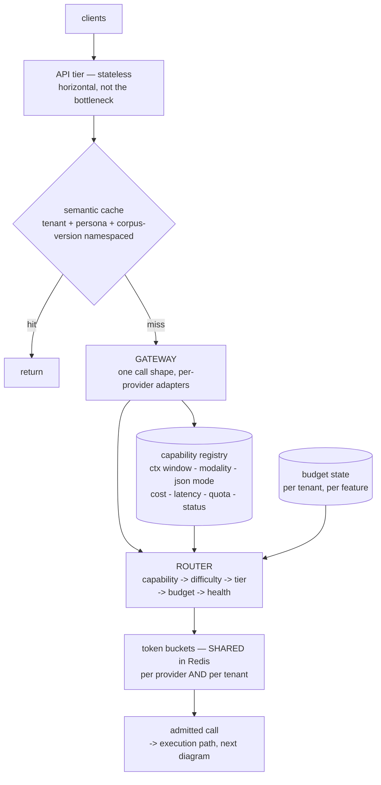

#### A2 - execution to observability: breakers, providers, validate, ledger

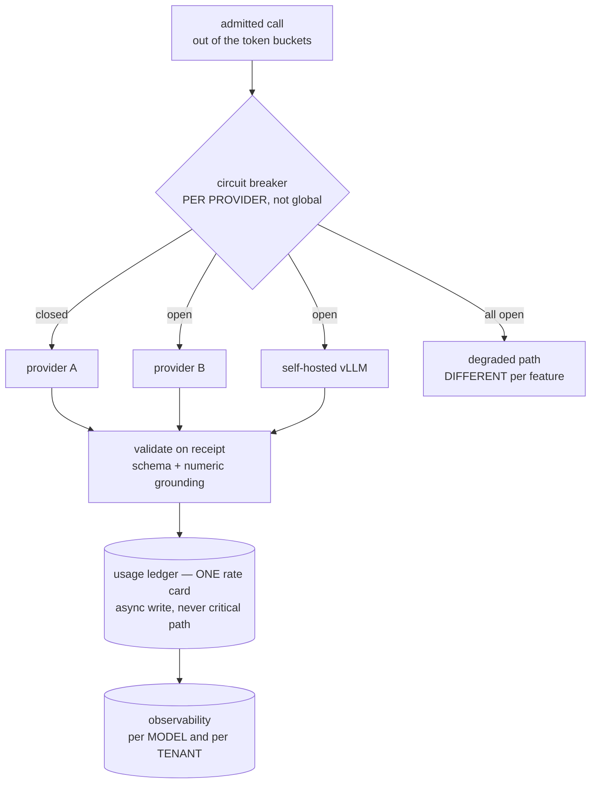

**Draw order to memorise:** clients -> API -> cache -> gateway -> registry+router -> buckets
-> breakers -> providers -> validate -> ledger -> observability.

---

## B - Async path and the bulkhead
*Scenarios 1, 14 - `01-async-vs-celery/`*

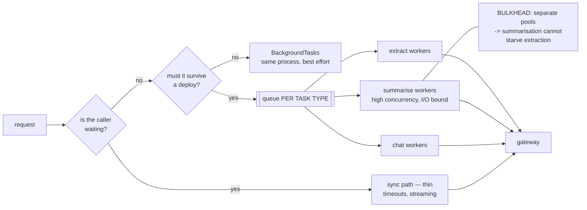

---

## C - Multi-tenant RAG at 500 tenants
*Scenario 3 - `DESIGN-02`*

#### C1 - ingest: the heavy path, breaks FIRST

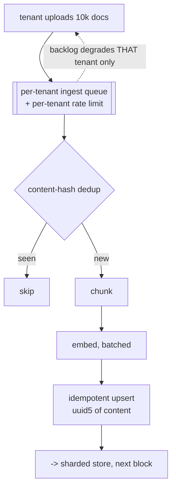

#### C2 - storage: sharded BY TENANT

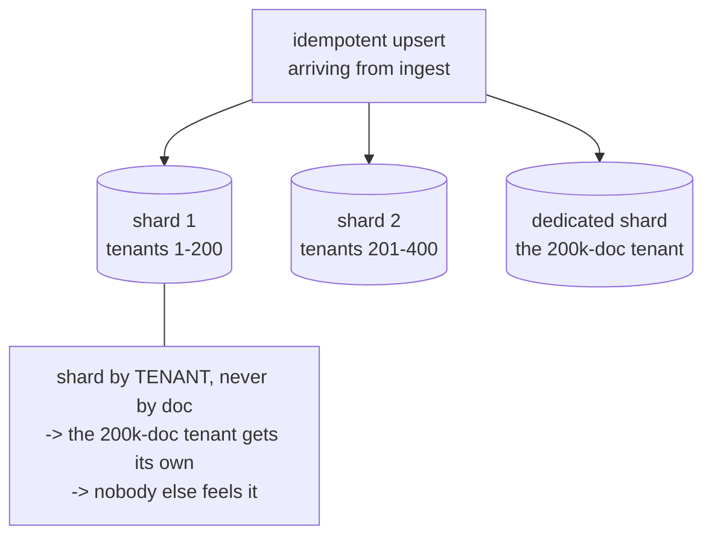

#### C3 - query: scope first, then retrieve

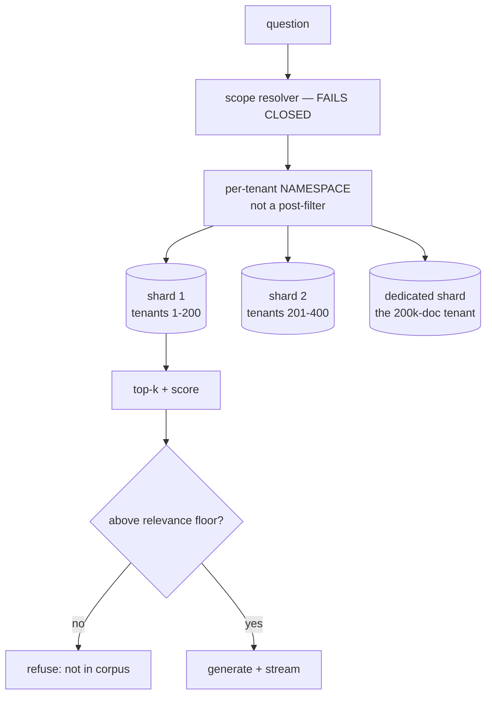

---

## D - Real-time voice, serial budget
*Scenario 6 - `04-voice-custom-llm/hld.md`*

#### D1 - the call path

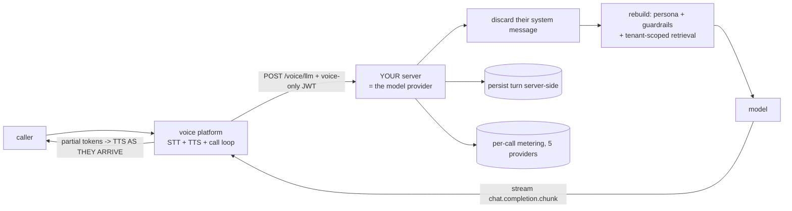

#### D2 - the latency budget is SERIAL

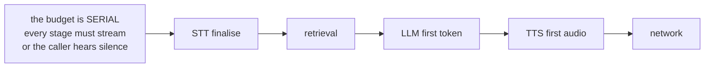

---

## E - Agentic engine with enforced budgets
*Scenario 4 - `DESIGN-03`*

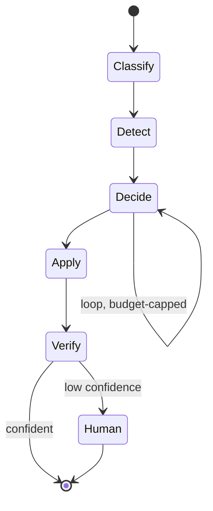

**Enforced in code at `Decide`, never in the prompt:** max-step budget; per-run token/cost cap
plus a breaker; repeat-state detection; per-step and per-run timeout; checkpoint after each
node.

**At `Apply`, because these tools have side effects:** least privilege, tenant-scoped creds;
an idempotency key per call; validate the tool call BEFORE executing it.

---

## F - Prompt / config management with an unavoidable gate
*Scenarios 8, 11 - `DESIGN-04`*

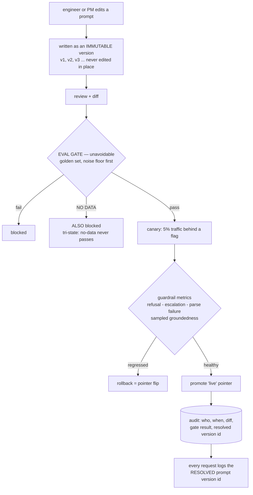

---

## G - Feedback flywheel
*Scenario 12*

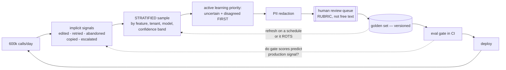

---

## H - Tiered conversation memory
*Scenario 13*

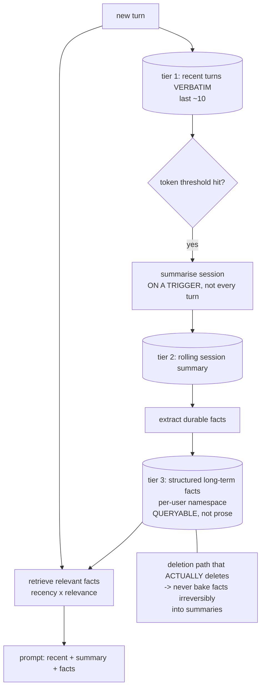

---

## I - Batch processing 10M records in 8 hours
*Scenario 14*

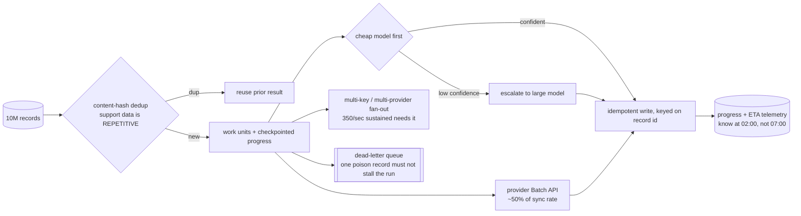

---

## J - Guardrails and PII: two opposite trades
*Scenarios 15, 16*

#### J1 - PII gateway: optimise RECALL

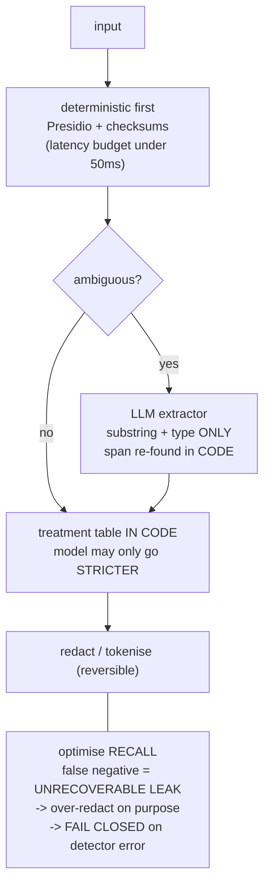

#### J2 - output guardrails: optimise PRECISION

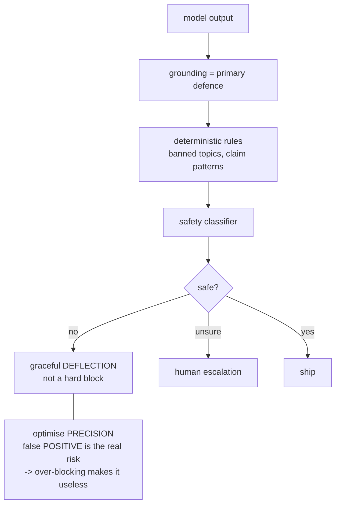

The two sides pull in opposite directions on purpose: input errs towards redacting too much,
output errs towards letting borderline text through. Tuning both to the same threshold is the
mistake.

---

## K - Multi-region with data residency
*Scenario 17*

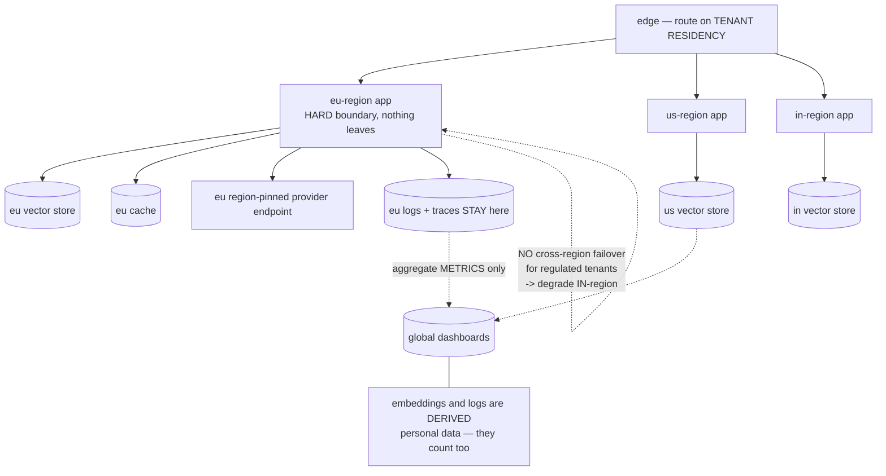

---

## L - Zero-downtime embedding migration
*Scenario 19*

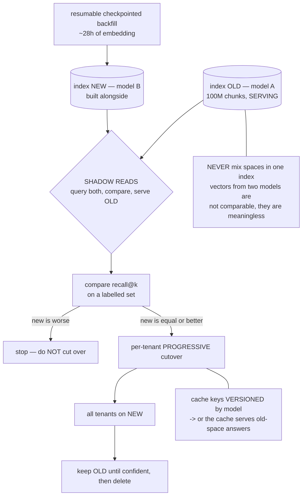

---

## M - Incident triage: "it started fabricating"
*Scenario 20*

```mermaid
flowchart TB
    R["reports: confidently making things up"] --> S1{"is retrieval returning<br/>ANY chunks?"}
    S1 -->|no| F1["empty retrieval -> answers from<br/>general knowledge, sounds confident<br/>MOST COMMON CAUSE"]
    S1 -->|yes| S2{"does the context<br/>REACH the prompt?"}
    S2 -->|no| F2["style REPLACING facts<br/>instead of adding<br/>(the real bug)"]
    S2 -->|yes| S3{"is it TRUNCATED?"}
    S3 -->|yes| F3["300-char cap cutting facts<br/>from 1000-char chunks"]
    S3 -->|no| S4{"did the corpus change?"}
    S4 -->|no| S5{"did the model or<br/>prompt config change?"}
    S5 --> F5["unreviewed config is the<br/>most likely recent change"]
    S4 --> F4["failed ingest / re-index / deletion"]
    R --> SC{"one tenant or all?"}
    SC -->|one| F6["scoping / namespace bug"]
    SC -->|all| F7["shared path"]
    F1 --> MIT["MITIGATE NOW: raise the relevance floor,<br/>let it refuse more.<br/>A refusal is recoverable;<br/>a fabrication is not."]
```

---

## N - Text-to-SQL with guards
*Scenario 21*

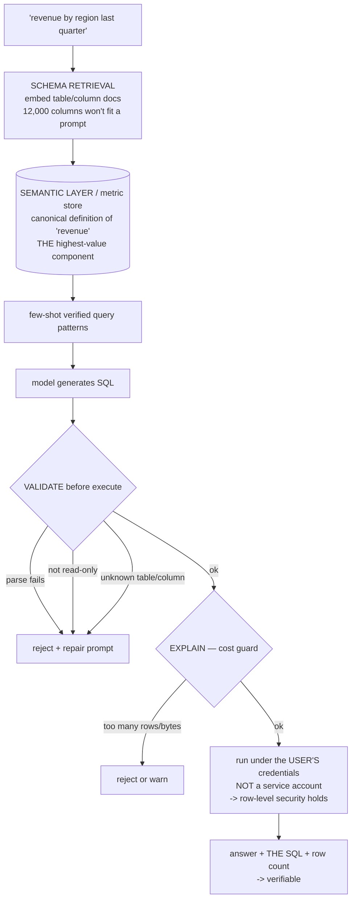

## O - Extraction with an accuracy SLA
*Scenario 22*

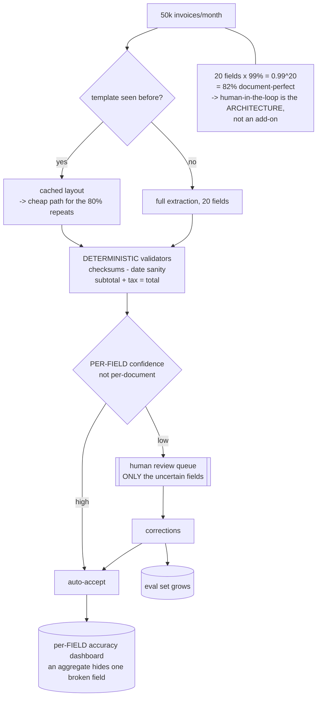

## P - Search: LLM offline, not inline
*Scenario 23*

#### P1 - ONLINE: 200ms budget, NO generation

```mermaid
flowchart TB
    Q[query] --> H["hybrid retrieval<br/>BM25 + vector"]
    H --> R["cross-encoder rerank<br/>top 50-100, distilled, ~10-30ms"]
    R --> LTR["learning-to-rank<br/>+ freshness + business boosts<br/>as SEPARATE features"]
    LTR --> RES[results]
    Q --> CH{"head query?"} -->|yes| CACHE[cached]
    Q --- BUD["ONLINE budget: 200ms<br/>NO generation on this path"]
```

#### P2 - OFFLINE: where the LLM belongs

```mermaid
flowchart LR
    OFF["OFFLINE — the LLM runs HERE<br/>not in the request"] --> L1["query-expansion dictionaries"]
    OFF --> L2["document enrichment:<br/>summaries, keywords,<br/>synthetic questions per doc"]
    OFF --> L3["generate training pairs<br/>for the ranker"]
    L1 -.-> IDX["feeds the ONLINE index<br/>and the ranker"]
    L2 -.-> IDX
    L3 -.-> IDX
```

## Q - Repo-aware code assistant
*Scenario 24*

#### Q1 - index: incremental, on commit

```mermaid
flowchart TB
    C[2M lines / ~25M tokens] --> AST["AST-aware chunking<br/>function/class boundaries<br/>NOT fixed-size"]
    AST --> META["attach file path + language<br/>to the chunk text"]
    META --> SG[("symbol/dependency graph<br/>defs - refs - imports")]
    META --> VEC[(vector index)]
    META --> BM[(BM25 — identifiers are EXACT tokens)]
    C --> HASH{"content hash changed?"} -->|no| SKIP[skip]
    C --- INC["index is INCREMENTAL, on commit<br/>-> never a full rebuild"]
```

#### Q2 - query: scope, hybrid, expand, verify

```mermaid
flowchart TB
    U[question] --> PERM["PERMISSION-SCOPED retrieval<br/>user cannot see repos they can't read"]
    PERM --> HY[hybrid: BM25 + vector]
    VEC[(vector index<br/>from the index build)] --> HY
    BM[(BM25 index<br/>from the index build)] --> HY
    HY --> EXP["expand via dependency graph<br/>-> a call site brings its DEFINITION"]
    SG[("symbol/dependency graph<br/>from the index build")] --> EXP
    EXP --> GEN[generate]
    GEN --> TEST{"suggested a change?"}
    TEST -->|yes| RUN["RUN THE TESTS<br/>-> plausible code that<br/>doesn't compile is caught"]
```

## R - Multimodal document pipeline
*Scenario 25*

```mermaid
flowchart TB
    P[PDF page] --> LA["LAYOUT ANALYSIS first<br/>segment: text / table / figure"]
    LA --> TX[text region] --> CH[chunk + embed]
    LA --> TB[table region] --> ST["extract as STRUCTURED data<br/>not prose — keep row/col relations"]
    LA --> FG[figure region] --> CR["crop + store the image"]
    CR --> CAP["caption with a vision model<br/>AT INGEST, not per query"]
    LA --> SC{"scanned page?"}
    SC -->|yes| OCR["OCR + confidence threshold<br/>-> below threshold: flag,<br/>don't index garbage"]
    CH --> IX[(index with provenance<br/>page + region)]
    ST --> IX
    CAP --> IX
    OCR --> IX
    IX --> QR{"query modality router"}
    QR -->|numeric question| ST
    QR -->|conceptual| CH
    QR --> NG["numeric grounding check<br/>against extracted TABLES"]
    P --- CEIL["if 30% of salient numbers live in<br/>tables/figures, a text-only pipeline<br/>has a HARD 70% numeric-recall ceiling"]
```

## S - RAG over structured + unstructured
*Scenario 30*

```mermaid
flowchart TB
    Q[question] --> RT{"ROUTER / planner<br/>documents? database? BOTH?"}
    RT -->|documents| DOC["vector RAG<br/>policy corpus"]
    RT -->|database| SQL["text-to-SQL<br/>+ all guards from diagram N"]
    RT -->|both| DOC
    RT -->|both| SQL
    DOC --> SY["SYNTHESIS<br/>compose with SEPARATE<br/>attribution per source"]
    SQL --> SY
    SY --> DIS{"sources DISAGREE?"}
    DIS -->|yes| BOTH["SURFACE BOTH<br/>never let the model silently pick"]
    DIS -->|no| ANS["answer + per-source confidence"]
    SQL --- LIVE["NEVER embed database rows<br/>-> query LIVE<br/>-> you cannot SUM a vector search"]
    RT --- ACC["routing accuracy DOMINATES<br/>end-to-end quality"]
```

## T - Incident: cost spiked 5x
*Scenario 31*

```mermaid
flowchart TB
    S["spend x5, nothing deployed"] --> D["FIRST: divide spend by call count<br/>-> splits the problem in two"]
    D --> V{"volume up, or<br/>cost-per-call up?"}
    V -->|volume| V1["which tenant / feature?"]
    V1 --> V2["retry storm? agent LOOP?<br/>scraper? backfill?"]
    V -->|cost per call| C1["prompt got longer?<br/>more chunks retrieved?<br/>a prompt edit?"]
    C1 --> C2["router shifted to an expensive model<br/>because a cheap provider circuit-broke<br/>-> bill rises with NO code change"]
    S --> CA{"cache hit rate collapsed?"}
    CA -->|yes| CA2["a re-index or key-version change<br/>silently multiplies cost"]
    S --> PR["provider price change?<br/>config flip?"]
```

## U - Incident: p99 blew up, p50 flat
*Scenario 32*

```mermaid
flowchart TB
    O["p99: 3s -> 25s, p50 UNCHANGED"] --> K["KEY OBSERVATION, say it first:<br/>not capacity. Scaling out fixes NOTHING.<br/>something affects a SUBSET"]
    K --> SL["slice: one provider? model?<br/>tenant? endpoint?"]
    SL --> T1{"timeouts changed?"}
    T1 -->|"raised/removed"| A1["a fast failure became a 25s hang"]
    SL --> T2{"retries changed?"}
    T2 -->|yes| A2["3 retries x 8s = your 25s"]
    SL --> T3{"new SYNC call in<br/>the request path?"}
    T3 -->|yes| A3["added validation / logging write"]
    SL --> T4{"retrieval config?"}
    T4 -->|"chunk count or<br/>numCandidates up"| A4["more recall, more latency"]
    SL --> T5{"blocking call inside<br/>an async def?"}
    T5 -->|yes| A5["freezes the event loop<br/>-> shows up EXACTLY as a tail problem"]
    A5 --- MOST["most likely: a retry/timeout<br/>config change, or A5"]
```
