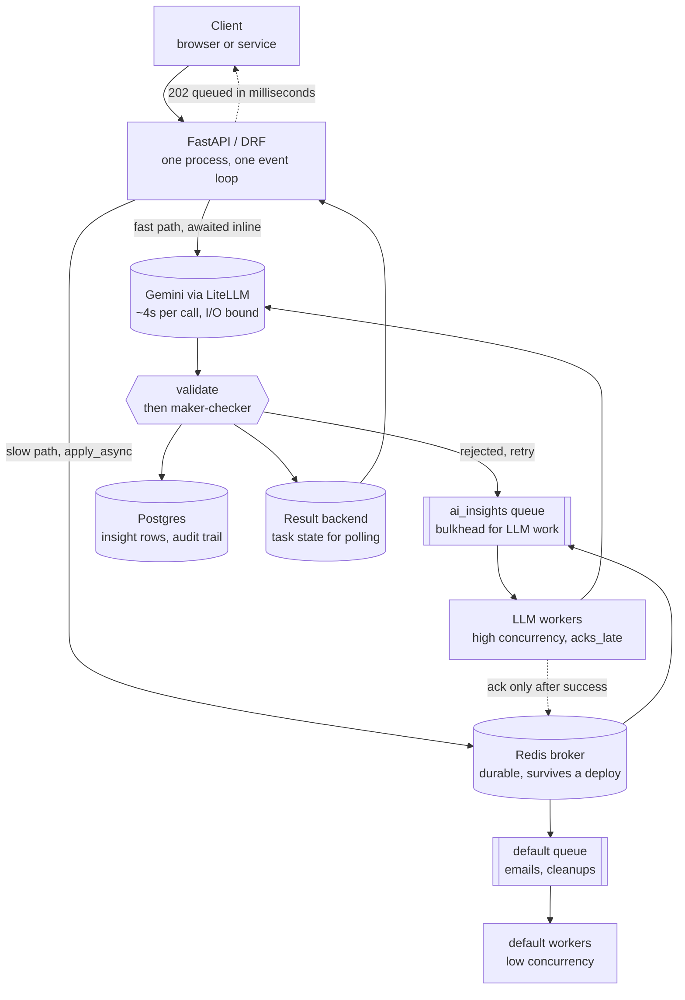
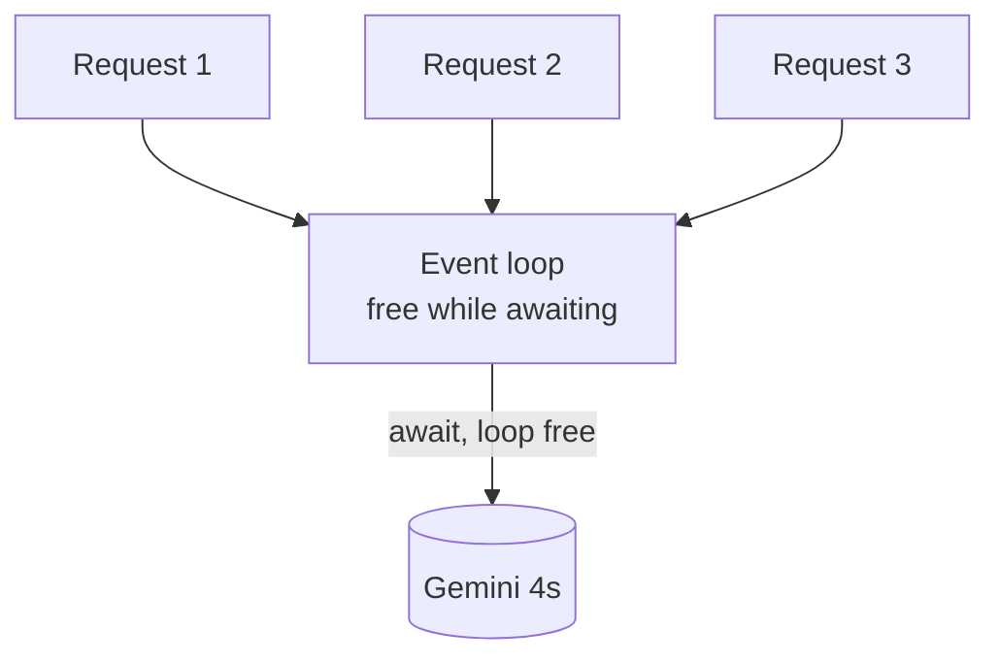
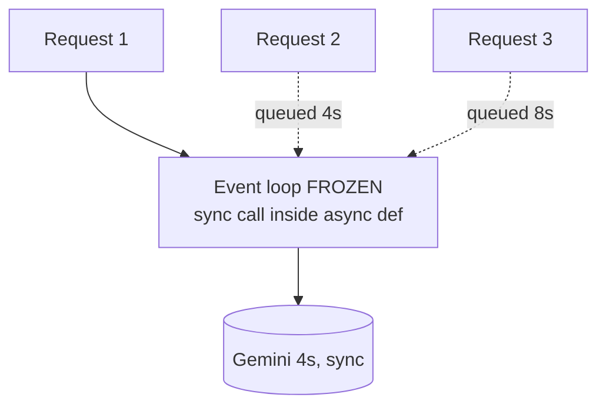
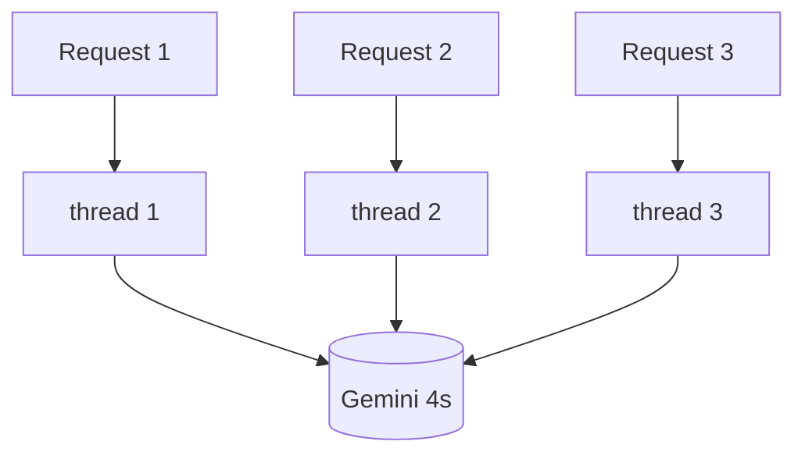
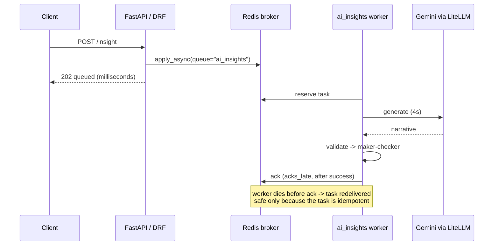
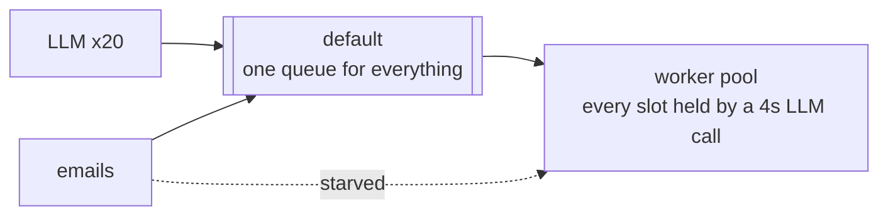
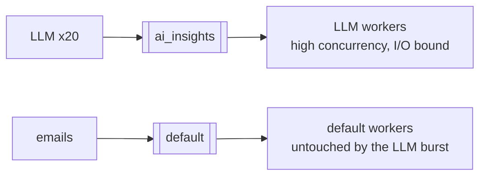
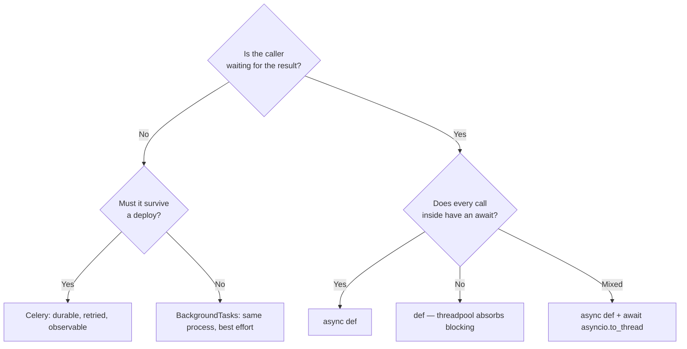

# async vs Celery — diagrams

## 1. The whole system, end to end

Two exits from the API: the fast path keeps the caller on the line and pays for it
with a held connection; the slow path hands the work to Redis and answers in
milliseconds. Everything after the broker is durable, retried and observable.

## 2. Where the waiting happens

#### async def + await — one process

Three requests overlap inside one process; all finish in roughly 4s.

#### async def + BLOCKING — the bug

One sync call inside `async def` serialises the whole process. Request 3 waits 8s
for work it never asked to queue behind.

#### def — threadpool

A plain `def` handler is pushed to the threadpool, so blocking is absorbed —
correct, but bounded by the pool size rather than by memory.

## 3. Celery — the caller stops waiting

## 4. The bulkhead — why a dedicated queue

#### One shared queue

Twenty LLM tasks occupy the pool and the emails sit behind them. Nothing is
broken, but the cheap work inherits the slow work's latency.

#### Bulkheaded

Separate queues and separate worker pools: an LLM burst can only exhaust its own
capacity.

## 5. The decision tree

