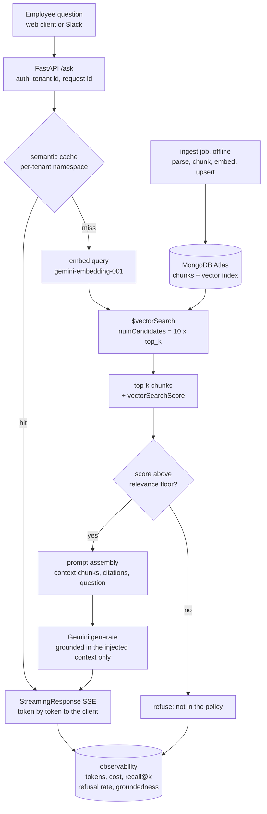
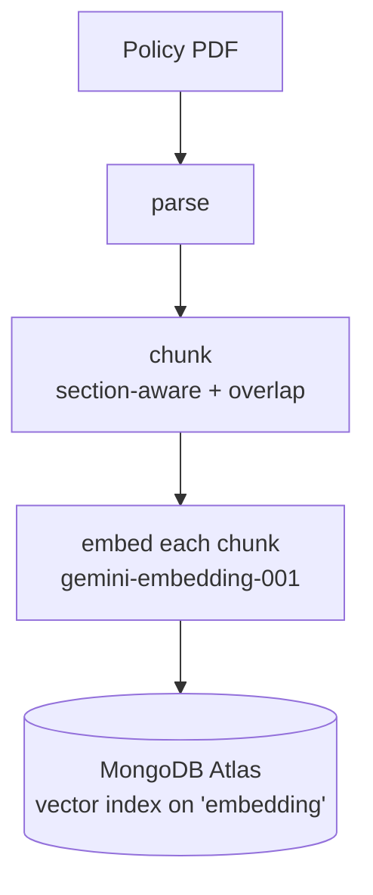
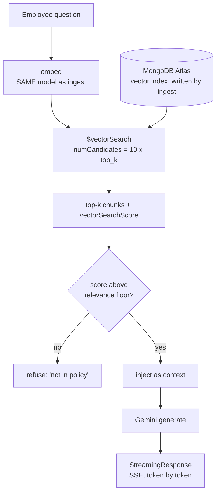
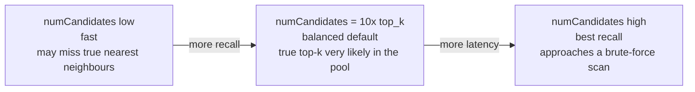
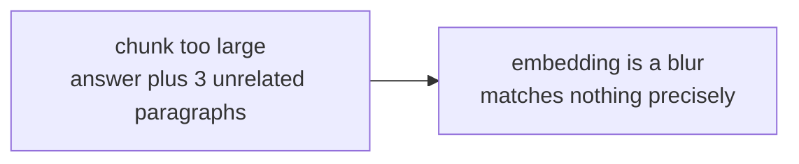
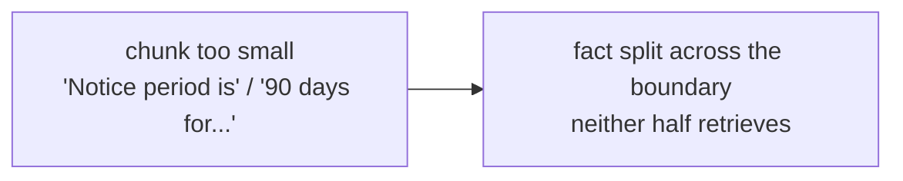
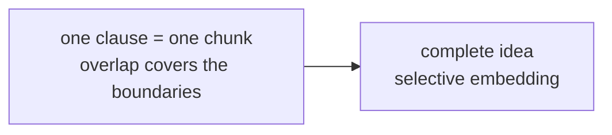
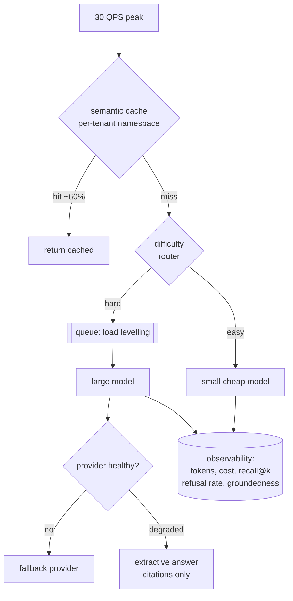

# RAG — diagrams

## 1. The whole system, end to end

One store, two paths: the ingest job writes chunks and embeddings offline, the
query path reads them. Every section below zooms into one box of this picture.

## 2. Ingest vs query

#### Ingest — offline, per document

#### Query — online, per question

The two paths meet at one place only: the vector index. They must embed with the
same model — a mismatch does not error, it silently destroys recall.

## 3. The recall/latency dial

## 4. Where chunking goes wrong

#### Chunk too large

#### Chunk too small

#### Section-aware + overlap — the right size

## 5. Scaling to 1M — what you add and why

