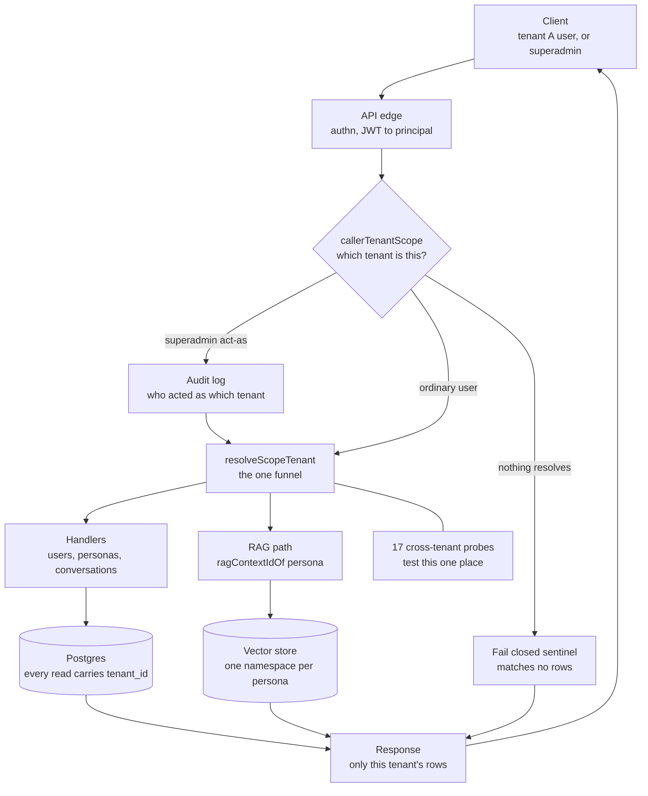
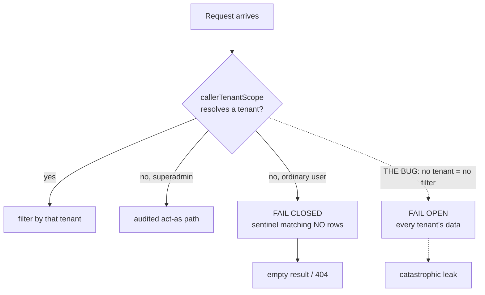
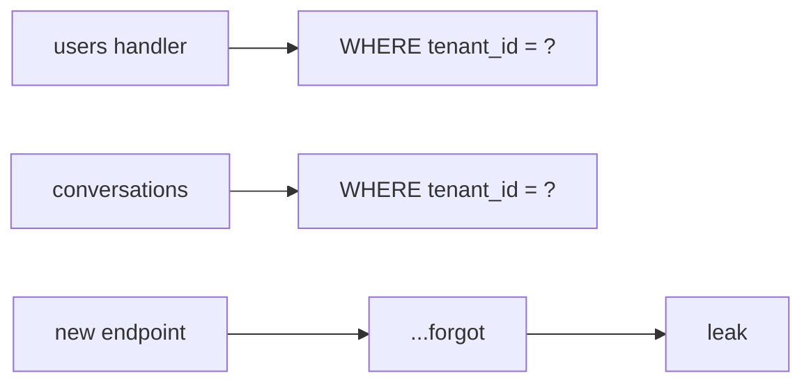
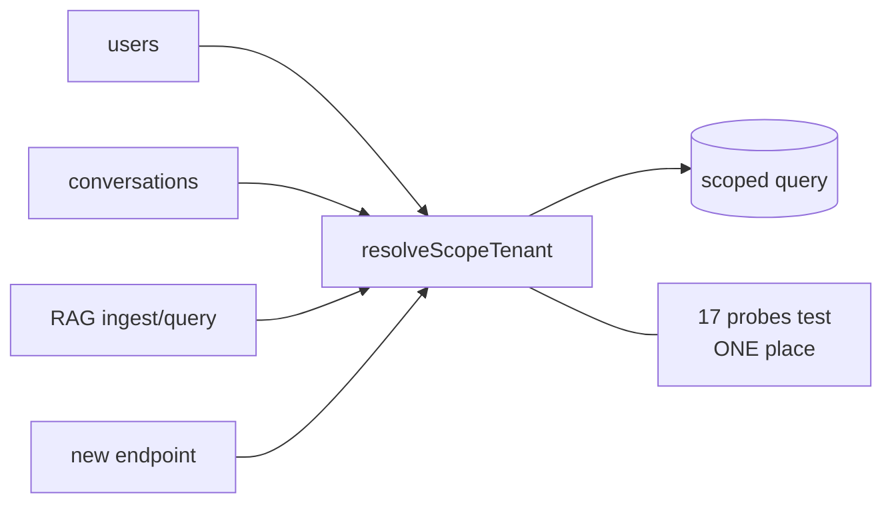
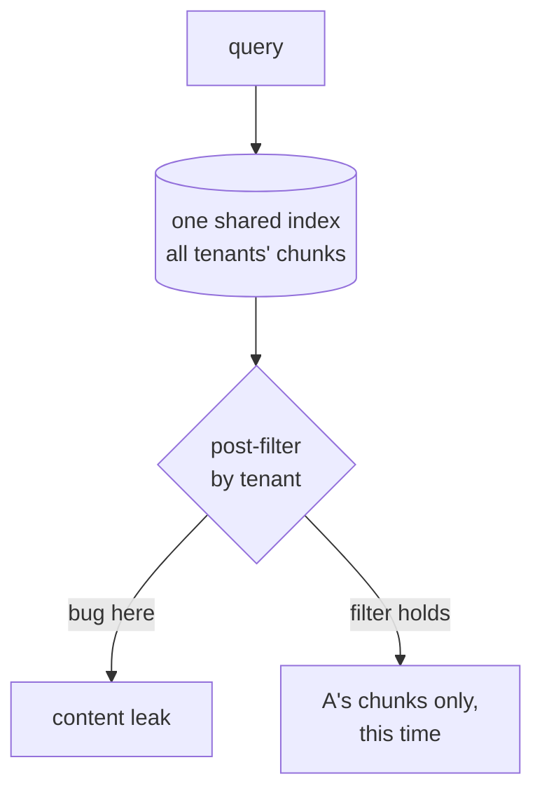
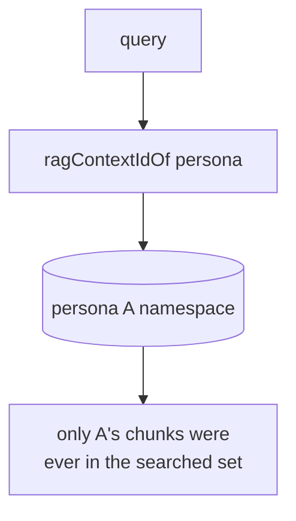
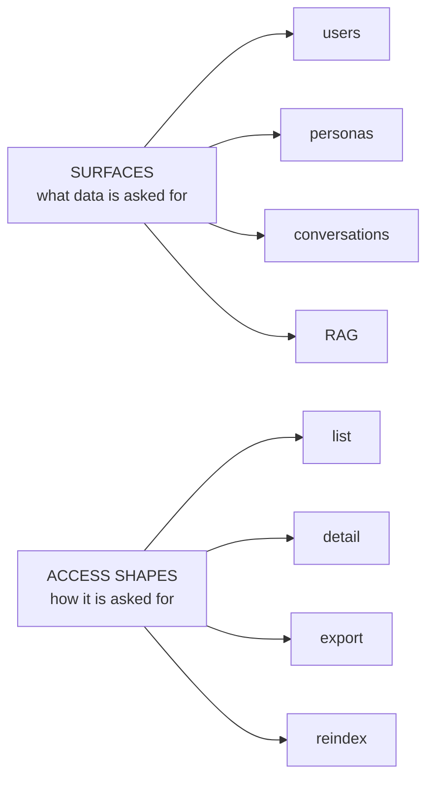
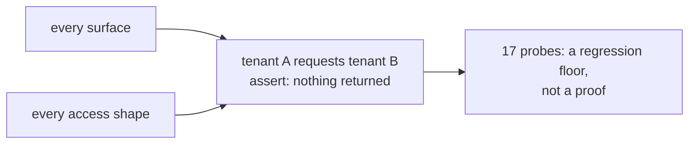

# Multi-tenancy — diagrams

## 1. The whole system, end to end

Everything below is a zoom into one part of this path. The two load-bearing
claims: tenant resolution happens once at the edge, and no handler is trusted to
remember the filter — it asks the funnel.

## 2. Fail closed vs fail open

## 3. One funnel, not scattered filters

#### Scattered — relies on memory

#### One primitive

The scattered version fails on the endpoint nobody remembered. The funnel version
has exactly one place to get right, and therefore exactly one place to test.

## 4. RAG isolation is structural

#### Filtered — weaker

#### Namespaced — structural

Filtering is one forgotten predicate away from a leak, because another tenant's
chunks were in the searched set. Namespacing removes the set, so there is nothing
to filter out.

## 5. The probe matrix

#### The two axes

#### What every cell asserts

Export and reindex are the cells teams forget: they are read paths that do not
look like reads.
