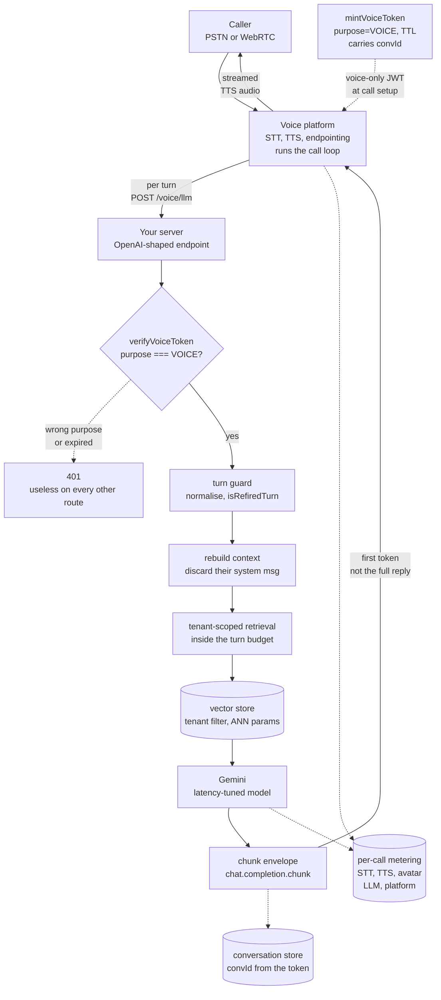
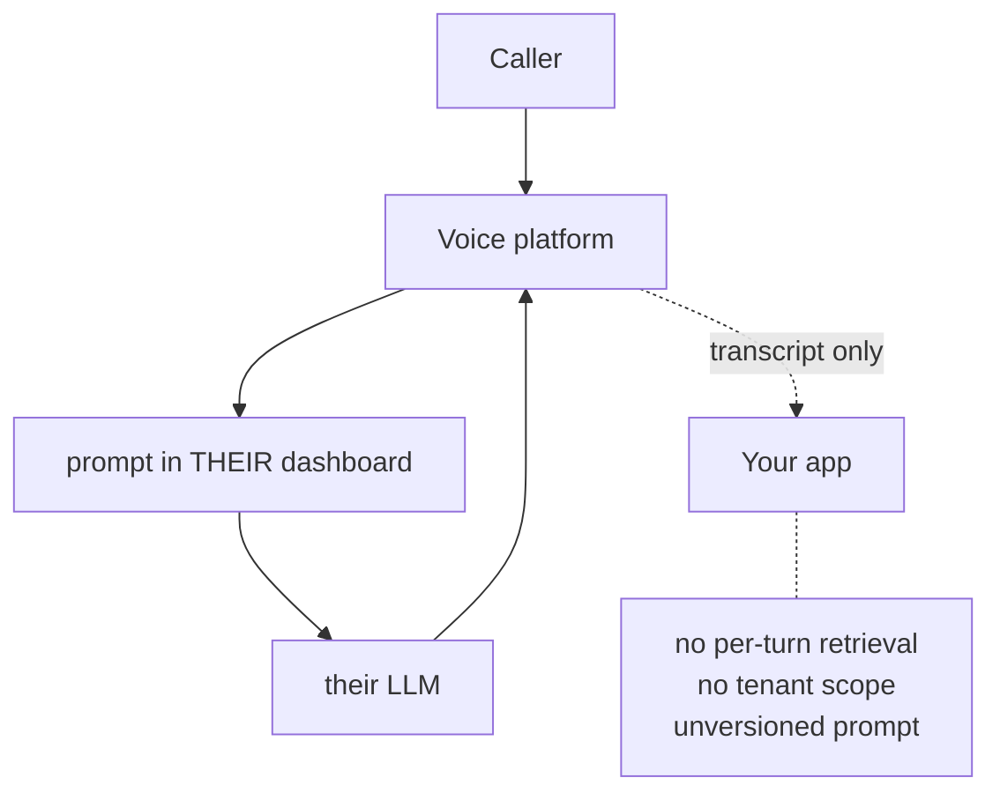
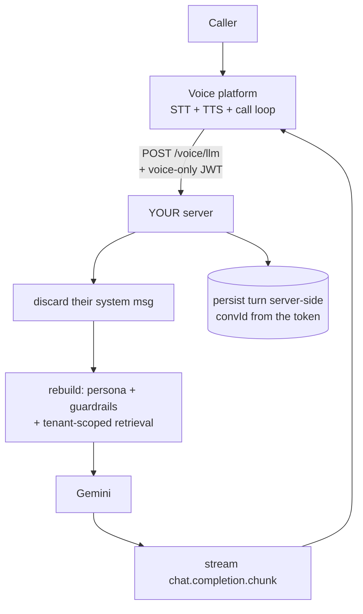
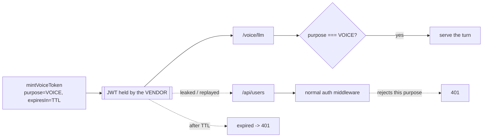
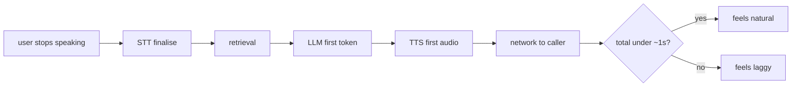
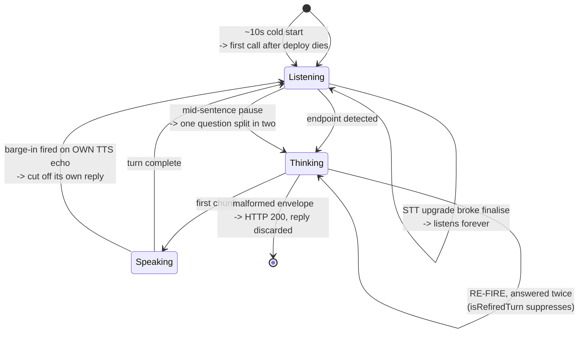

# Voice — diagrams

## 1. The whole system, end to end

One extra hop in the real-time loop, and it is yours. Everything that makes the twin *the
twin* — persona, guardrails, tenant scope, versioning — lives in the boxes between
`verifyVoiceToken` and the chunk envelope. The vendor keeps STT, TTS and turn detection and
never holds the prompt. Two things to notice on the return path: chunks go back the moment
the model produces them, because that whole chain is serial inside one sub-second budget;
and the dotted edges are the parts the caller never sees — the persisted turn, and the
metering that makes per-tenant caps possible at scale.

## 2. The inversion

#### Default — the vendor owns the brain

#### Inverted — you are the model provider

Same caller, same platform. The only thing that moved is **where the prompt lives** — and
with it grounding, tenancy, versioning and cross-surface consistency. In the first diagram
your app is a spectator holding a transcript; in the second it is the brain.

## 3. The token boundary

The dotted edges are the point: not "how do we keep it secret" but "what is the blast radius
when it leaks". One endpoint, for minutes.

## 4. The serial latency budget

Nothing here is parallel, so every stage must stream. Waiting for any one of them to finish
blows the budget on its own.

## 5. Six turn-taking failure classes

None are algorithmically hard. They are invisible until you are on a live call, and each one
needed its own regression test.
