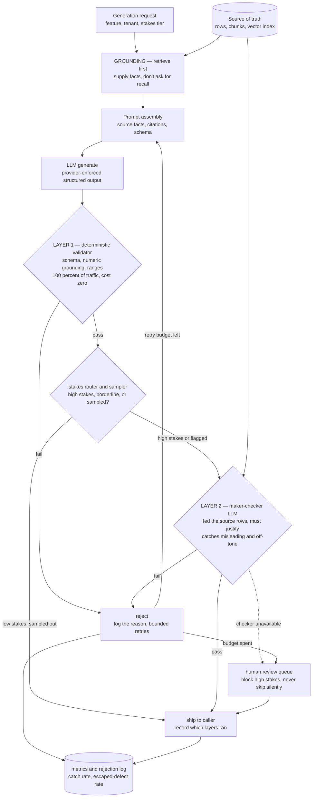
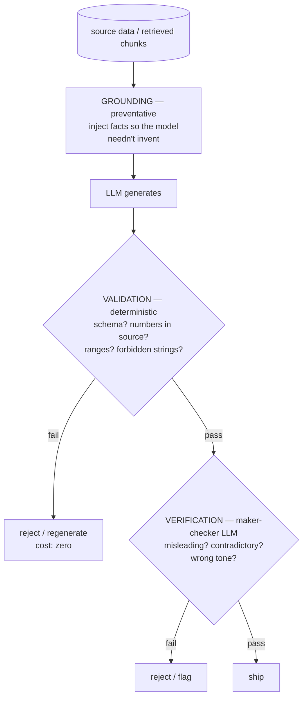
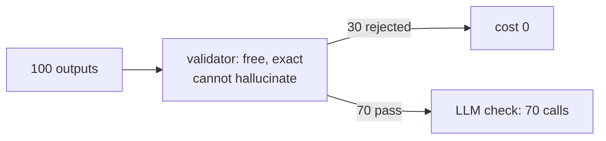
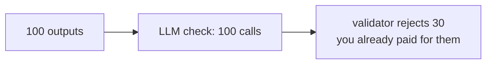
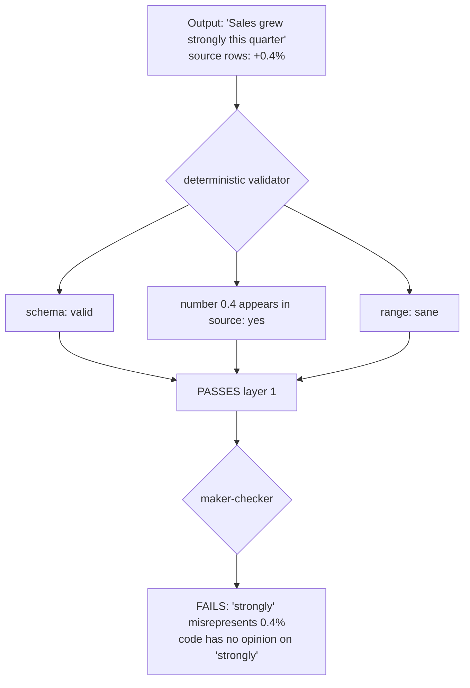
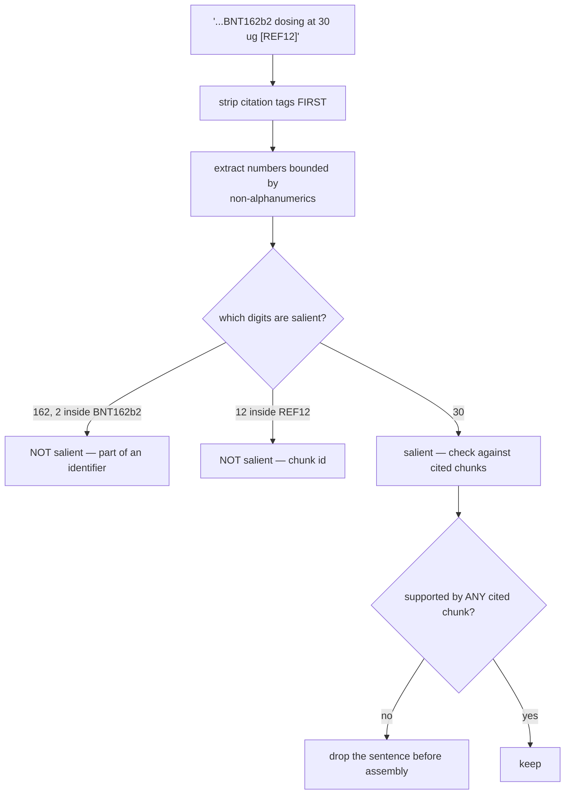

# Hallucination defence — diagrams

## 1. The whole system, end to end

Three defences on one path: grounding before generation, free deterministic
checks on everything, and a model only on what survives and is worth the tokens.
The rejection log is not decoration — a rejection nobody reviews is just a bin,
and a *drop* in the validator's rejection rate usually means the validator broke.
Every section below zooms into one box of this picture.

## 2. Three layers, three jobs

## 3. Why this order

#### Right — cheap infallible layer first

#### Wrong — expensive fallible layer first

Same 30 rejections either way. The order decides whether you bought 70 model
calls or 100 — and it decides whether a regex gets to overrule a judgement you
already paid for. At 600k generations a day that gap is the whole cost argument.

## 4. What only a model can catch

## 5. Numeric grounding — the false-positive trap

