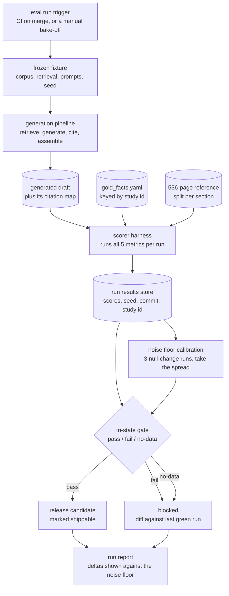
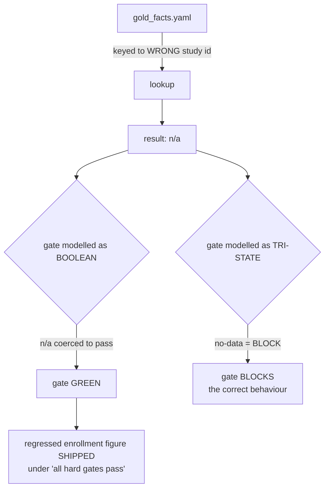
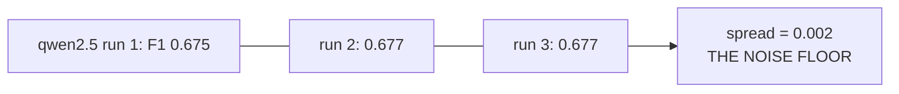
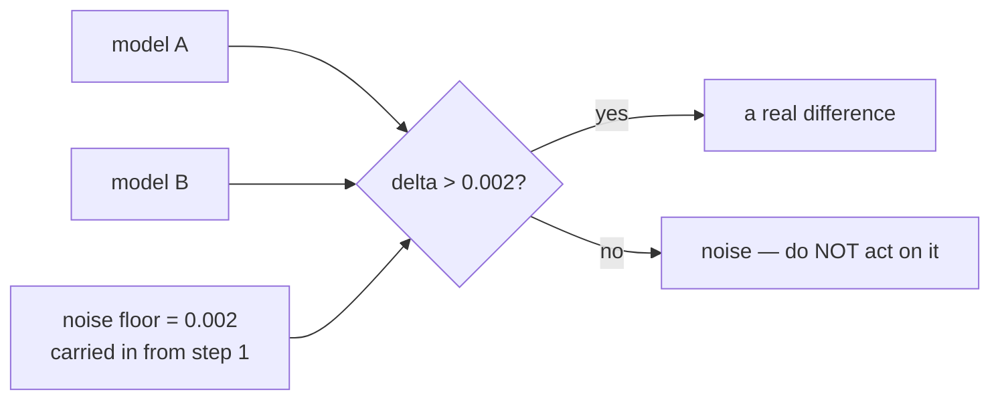
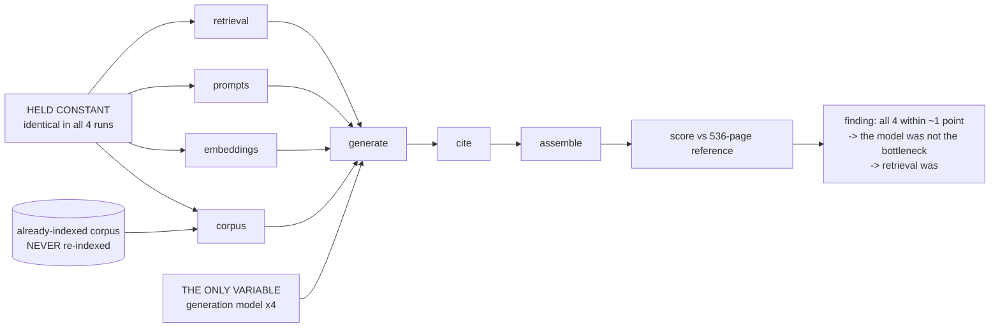
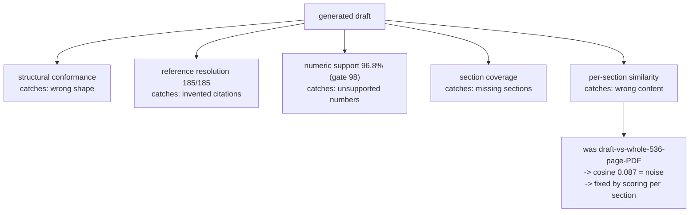

# Evaluation — diagrams

## 1. The whole system, end to end

Read the two dangerous joins: `gold_facts.yaml -> scorer` (a key mismatch there
produces n/a, not an error) and `results -> gate` (n/a must reach the gate as a
third state, never as a boolean). Everything else is plumbing.

## 2. Why the gate failed open

## 3. Noise floor before comparison

#### Step 1 — null change, three runs

Nothing changed between the three runs. Whatever moved is the harness talking to
itself, not the system.

#### Step 2 — compare models against that floor

Step 1 has to be run first. Without the floor, step 2's diamond has no threshold
and every wobble looks like a result.

## 4. Controlled bake-off — one variable

Four inputs pinned, one swapped. Re-indexing the corpus between runs would have
made the whole comparison meaningless.

## 5. Five metrics, five failure modes

