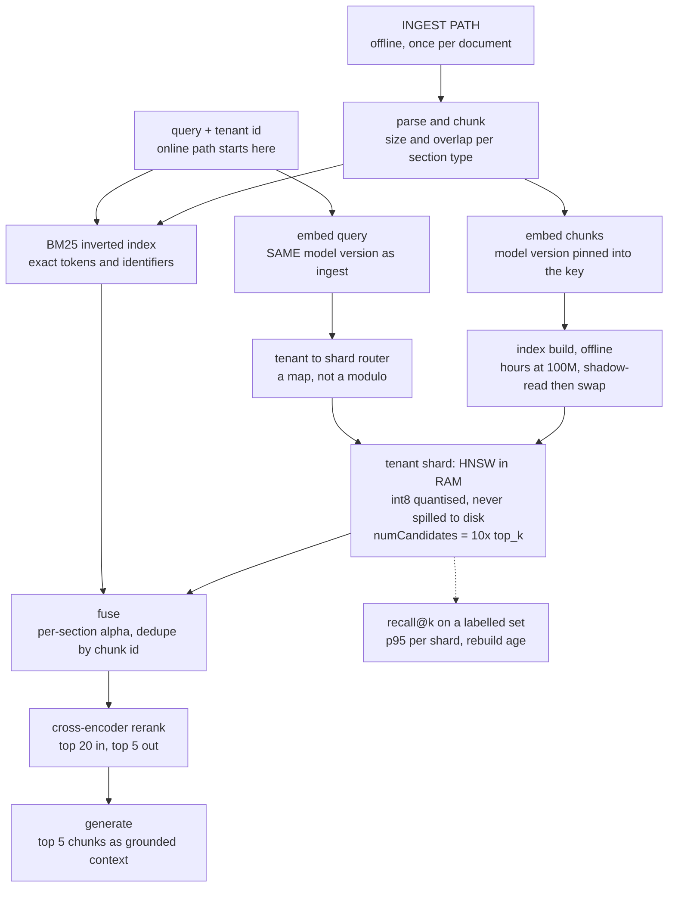
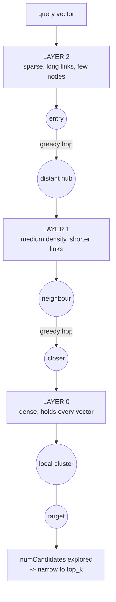
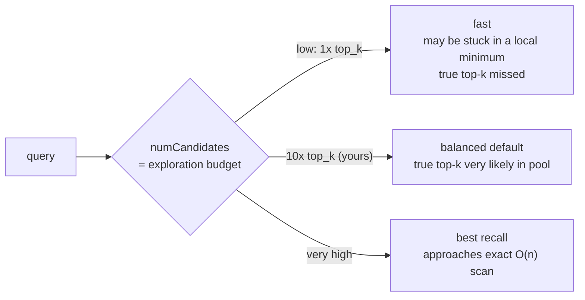
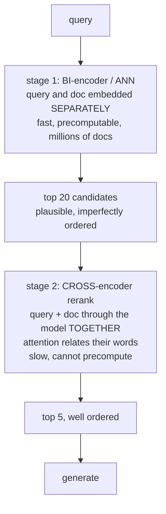
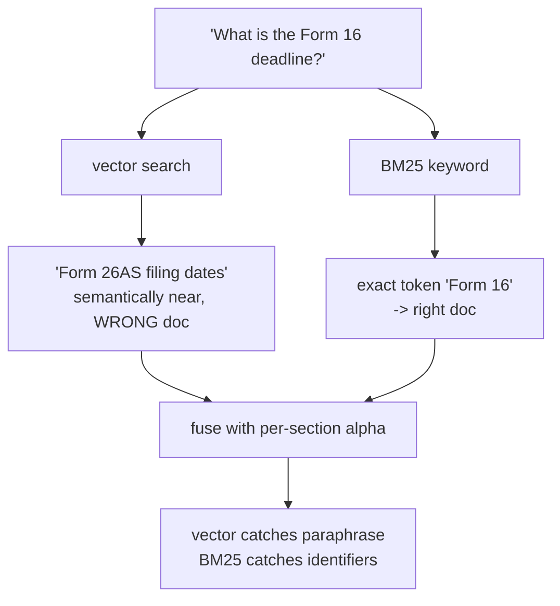

# Vector search — diagrams

## 1. The whole system, end to end

What to notice, left to right:

- The two paths meet only at the index. Ingest is slow and batched; serving is
  hot and memory-bound.
- One model version spans both sides. A mismatch throws no error, it just
  quietly returns the wrong neighbours.
- The router runs *before* the shard, so one query touches one shard and never
  fans out to pay the slowest.
- `numCandidates` is the only dial in the picture that trades latency for recall
  at query time (see 3). Everything else is a build-time decision.
- The dotted line is the only thing that catches silent recall decay.

## 2. HNSW: coarse to fine

Each layer restarts the greedy walk where the layer above stopped. The top
layers cover distance cheaply on a thin graph; layer 0 is the only complete one
and does the fine sorting. Approximate because the walk is greedy — it can
settle in a local minimum and never see the true nearest neighbour.

## 3. The recall/latency trade

## 4. Two-stage retrieval

## 5. Why hybrid

