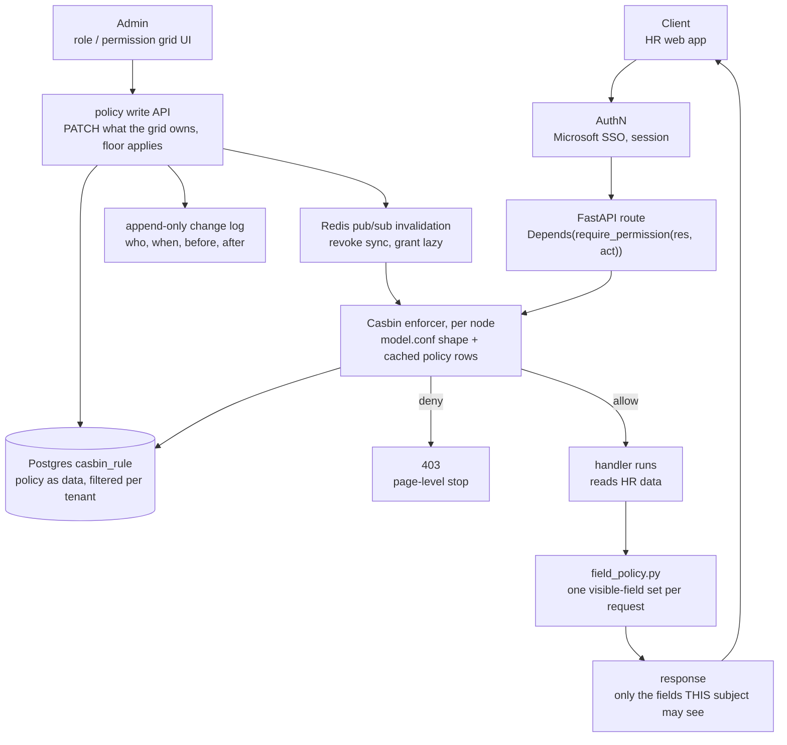
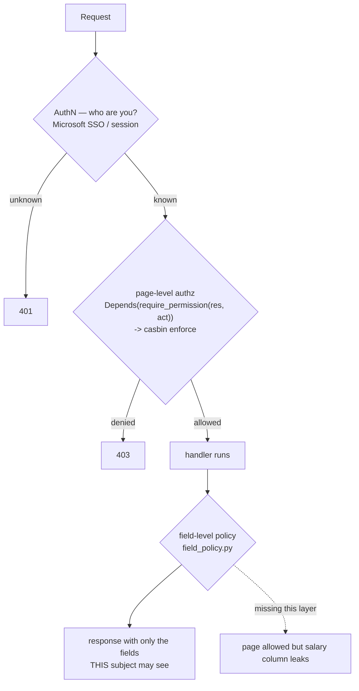
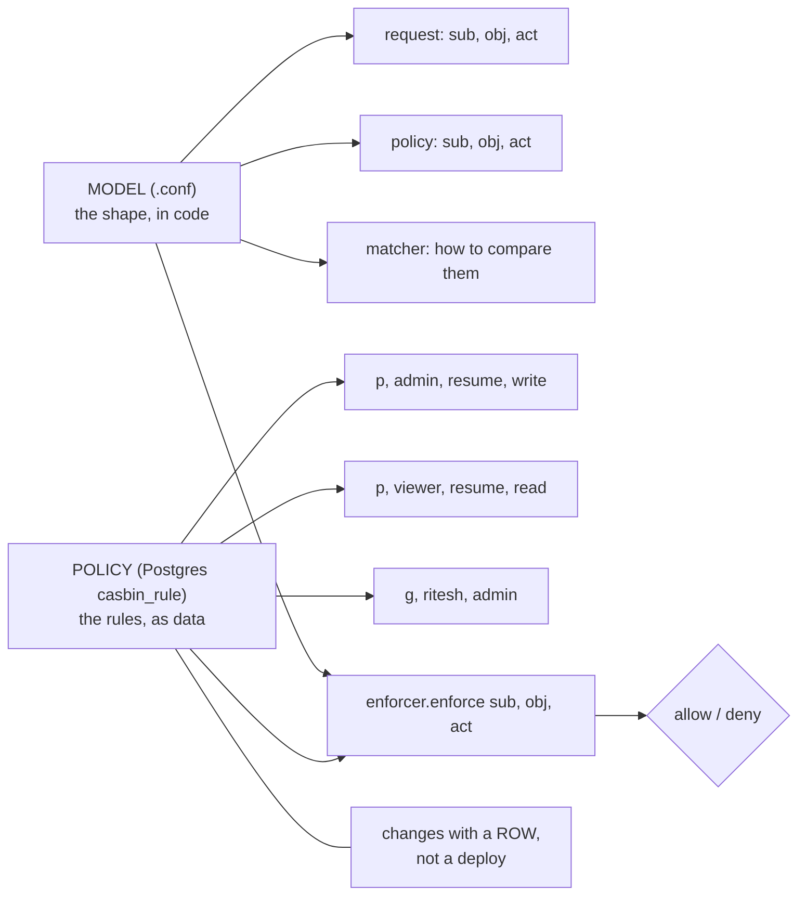
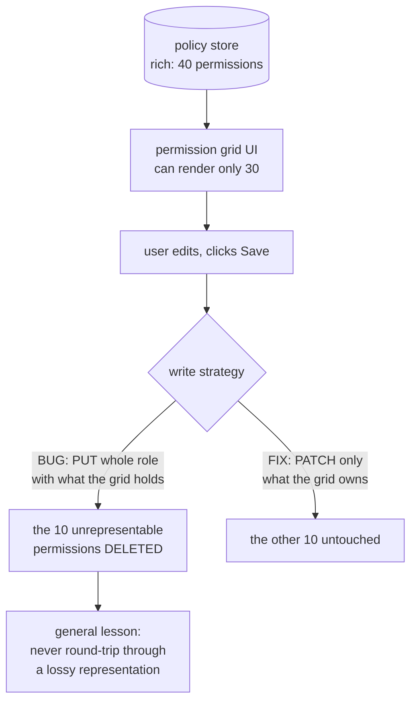
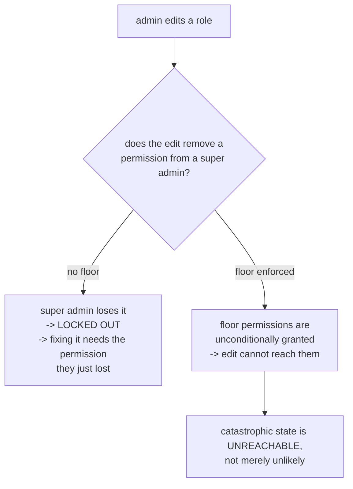

# Authorisation — diagrams

## 1. The whole system, end to end

Two paths through one policy store: the request path (top) and the administration path (bottom).

## 2. The layers

## 3. Casbin: model vs policy

## 4. The lossy round-trip bug

## 5. The permission floor

