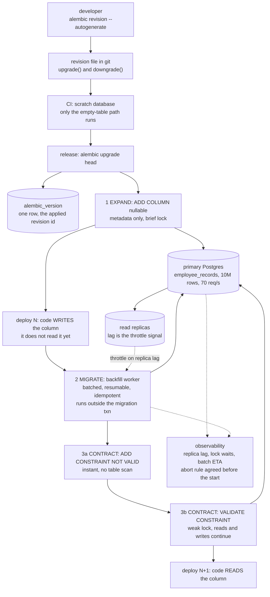
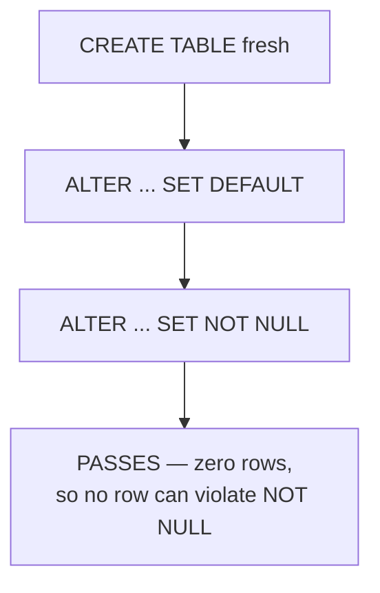
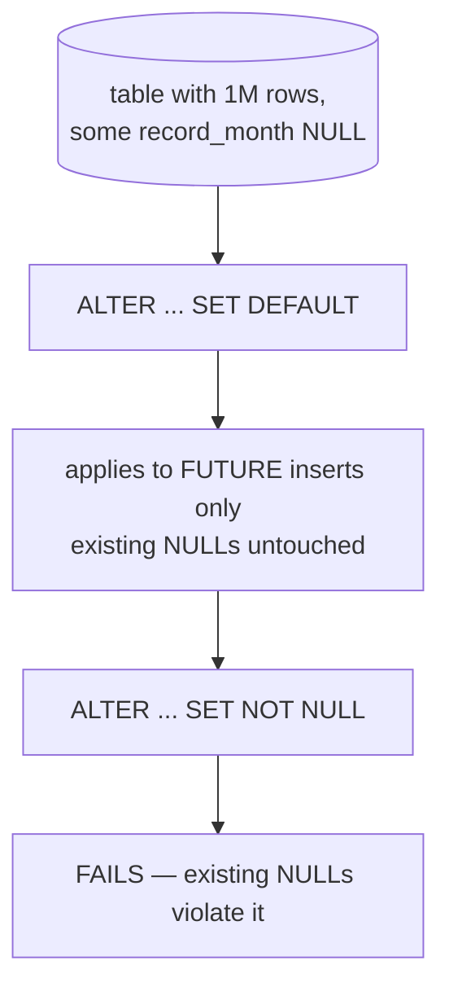
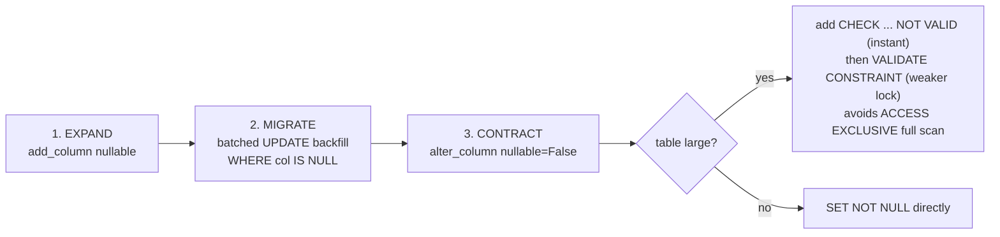
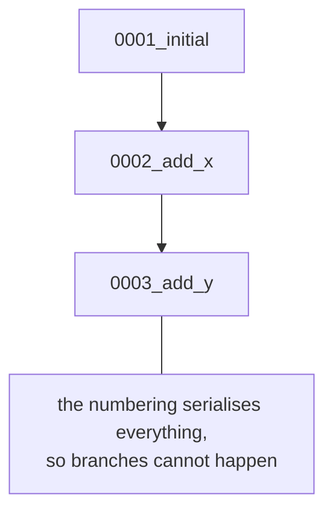
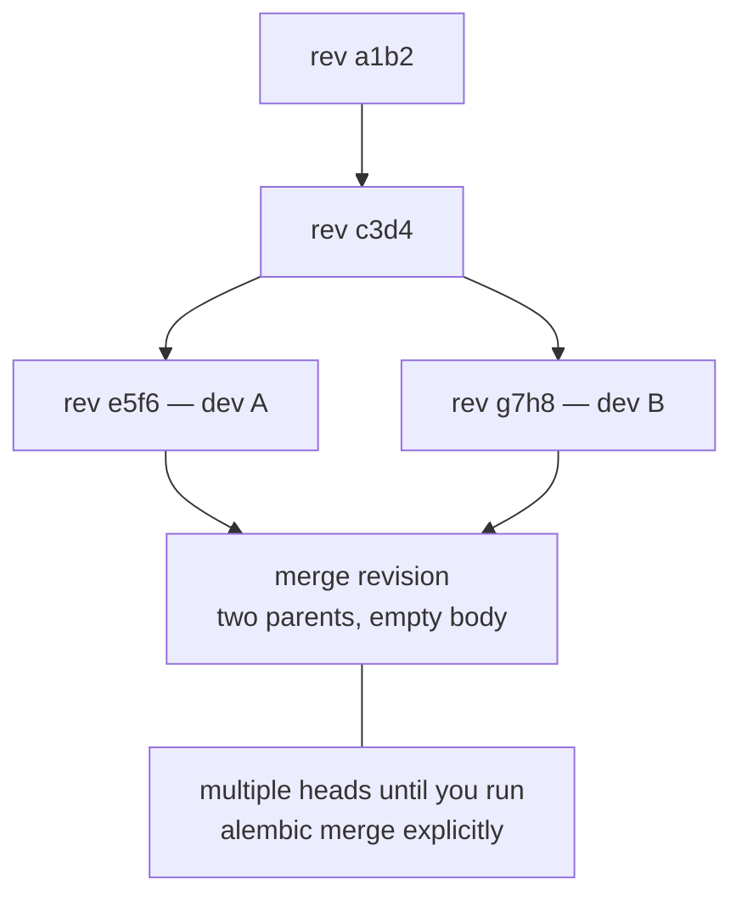
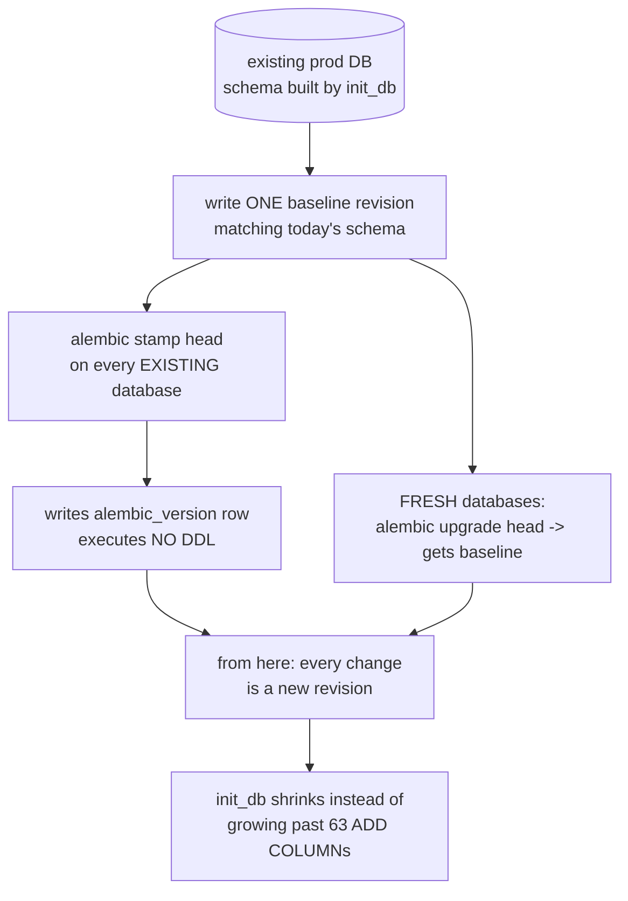

# Migrations — diagrams

## 1. The whole system, end to end

One schema change, from the developer's laptop to a NOT NULL column on a live
10M-row table. Everything below in this file is a fragment of this picture.

Two deploys, not one: code and schema move in separate steps so each step is safe
on its own. The only operation that ever takes an `ACCESS EXCLUSIVE` lock here is
the metadata-only `ADD COLUMN`.

## 2. Why it passes CI and fails in production

Same two statements, same order, in both diagrams. The only difference is whether
the table already has rows.

#### CI — scratch database

#### Production — populated

The test suite structurally cannot catch this: the table is always new.

## 3. Expand → migrate → contract

## 4. Django's sequence vs Alembic's graph

#### Django — numbered, serialised

#### Alembic — linked list, can branch

Alembic makes the branch visible instead of preventing it. Django's numbering
prevents it, and pays for that with a strictly serial history per app.

## 5. Adopting migrations on a legacy DB

