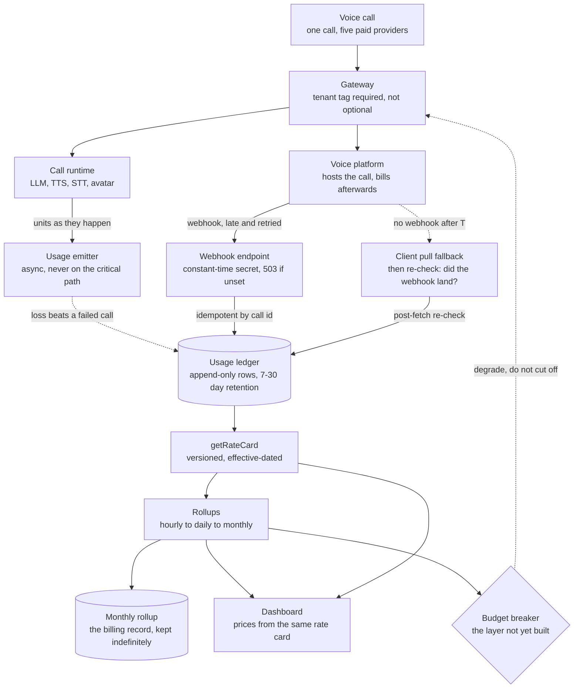
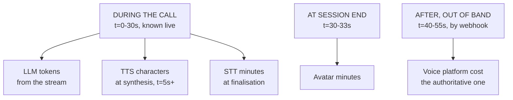
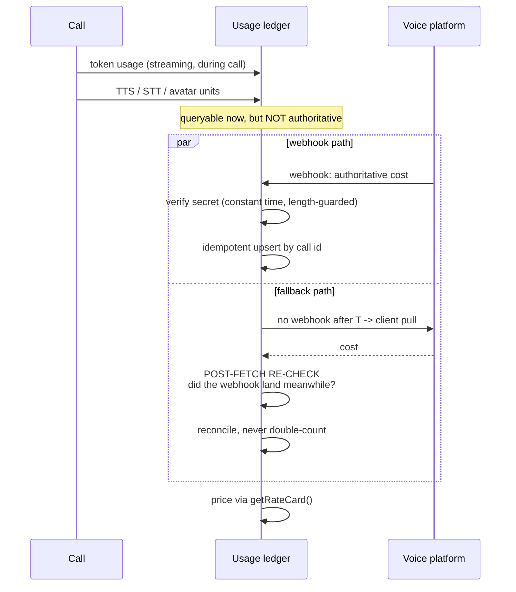
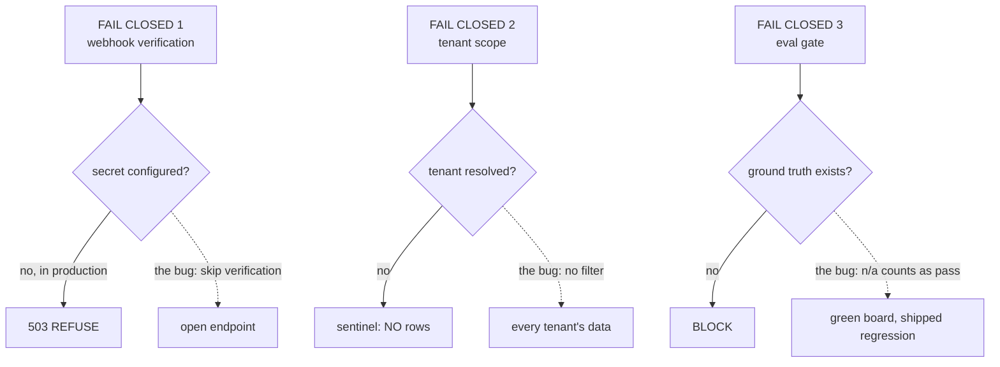
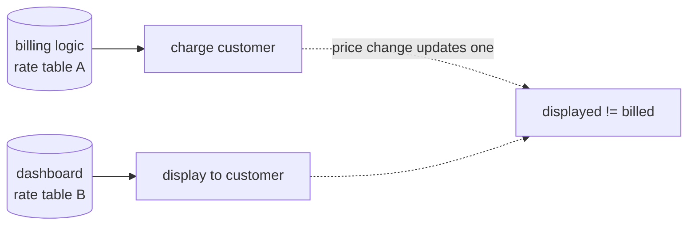
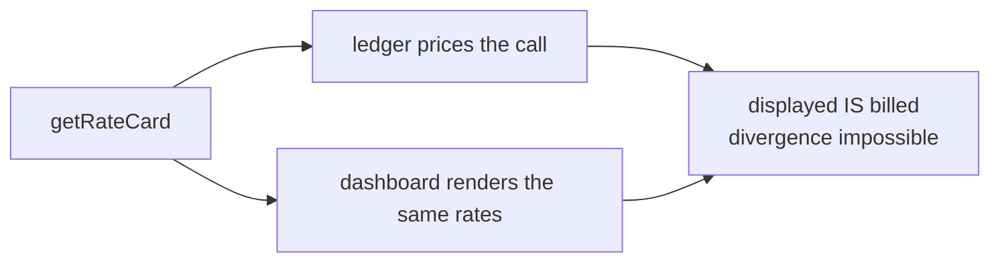

# Cost attribution — diagrams

## 1. The whole system, end to end

Three paths reach the ledger and only one of them is authoritative: live units from the
emitter, the provider webhook, and the pull fallback. The ledger is queryable before the
authoritative number lands. Attribution is enforced at the gateway, because an untagged call
is unbillable and invisible.

## 2. Five providers, five timelines

The engineering problem is the gap between lane one and lane three, not the multiplication.

## 3. Reconciliation with a race

## 4. Fail closed — the same habit, three places

Solid arrows are what the code does; dashed arrows are the plausible shortcut and what it
costs. Same shape three times over: when the answer is unknown, deny. A habit, not a one-off.

## 5. One rate card

#### Two copies — always diverge

#### One source

One card makes that class of bug impossible, not unlikely.
