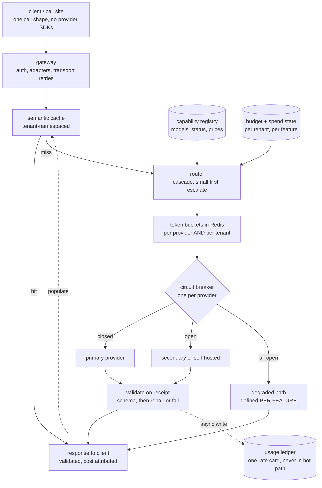
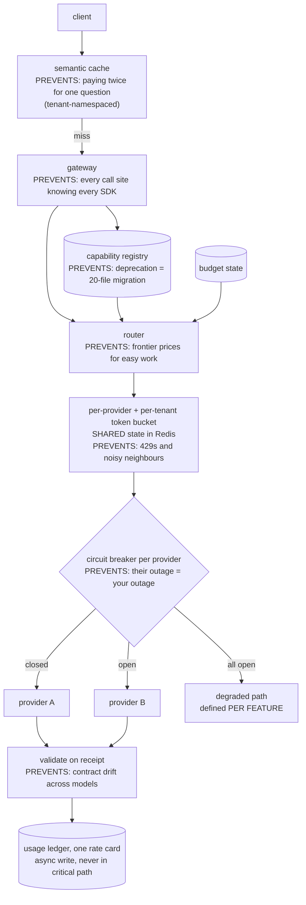
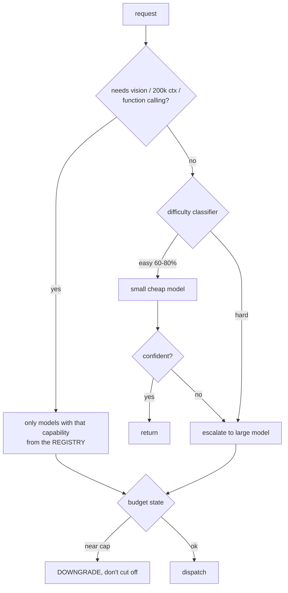
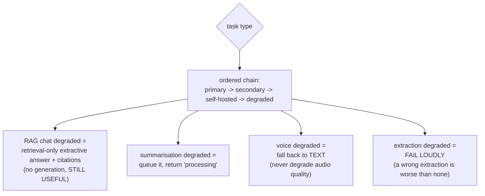
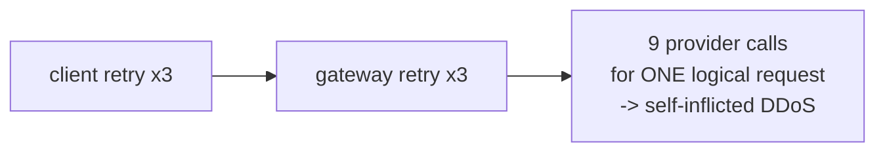
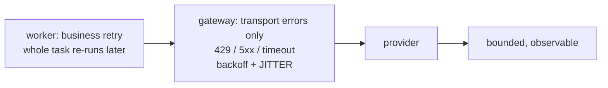
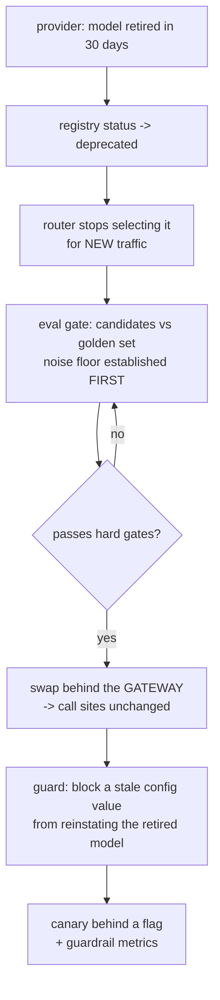
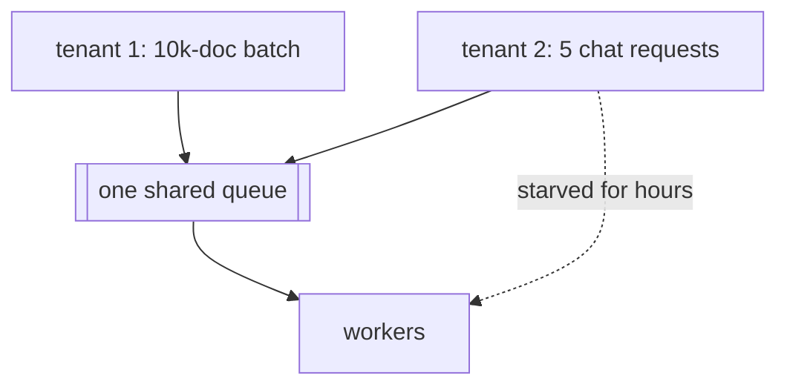
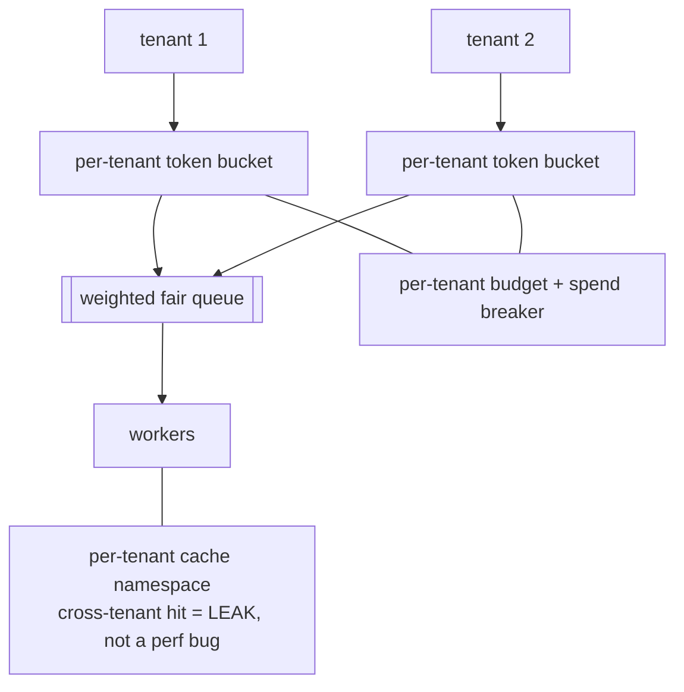

# Multi-model architecture — diagrams

## 1. The whole system, end to end

Read it as one request: cache lookup, then a routing decision fed by the
registry and the budget, then admission control, then a provider chosen by
breaker state, then validation before anything reaches the caller. The ledger
write is the only branch that must never block the response.

## 2. The layers, each named by the failure it prevents

## 3. The router: cascade, don't jump to the big model

## 4. Fallback chain, and what "degraded" means per feature

## 5. Retry amplification — the trap

#### Retries in BOTH places

#### One place per concern

The multiplication is what kills you: retry counts at two layers multiply, they
do not add. Transport retries live in the gateway only; the worker re-runs the
whole task, and never the individual call.

## 6. Model deprecation — the lived one

## 7. Multi-tenant fairness

#### Global limits only

#### Per-tenant everything

A global limit is satisfied by one tenant consuming all of it. Fairness needs
per-tenant buckets, a weighted queue, a per-tenant spend breaker, and a
per-tenant cache namespace — all four, or the batch tenant still wins.
