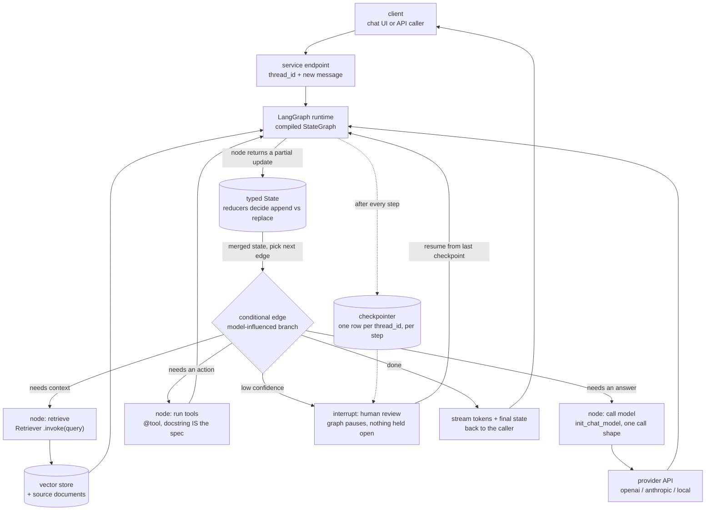
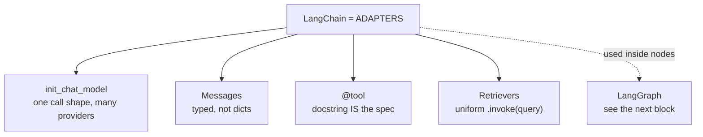
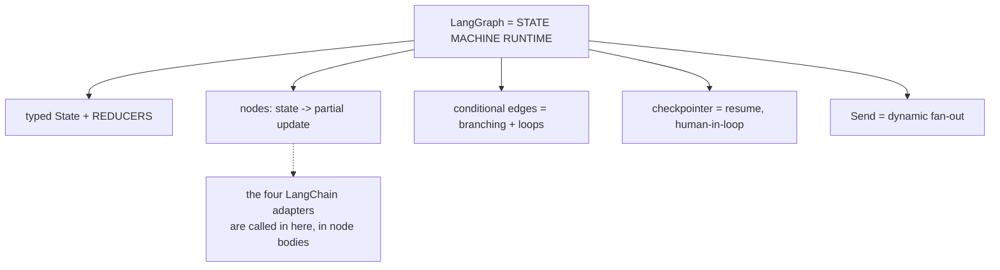
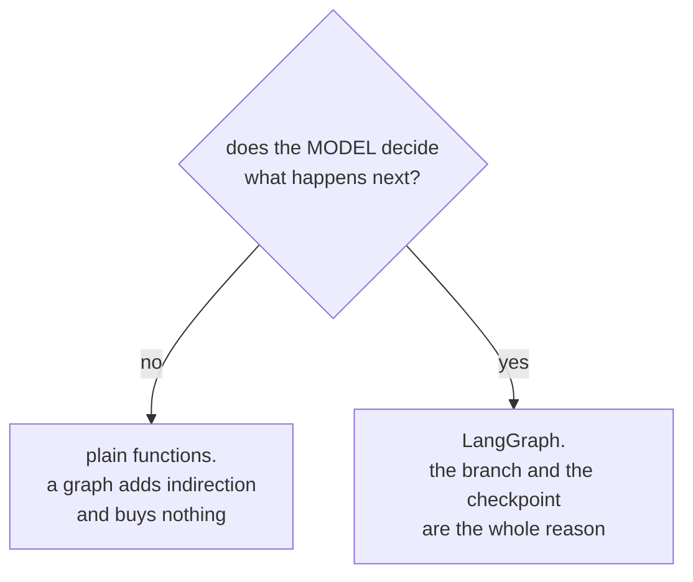
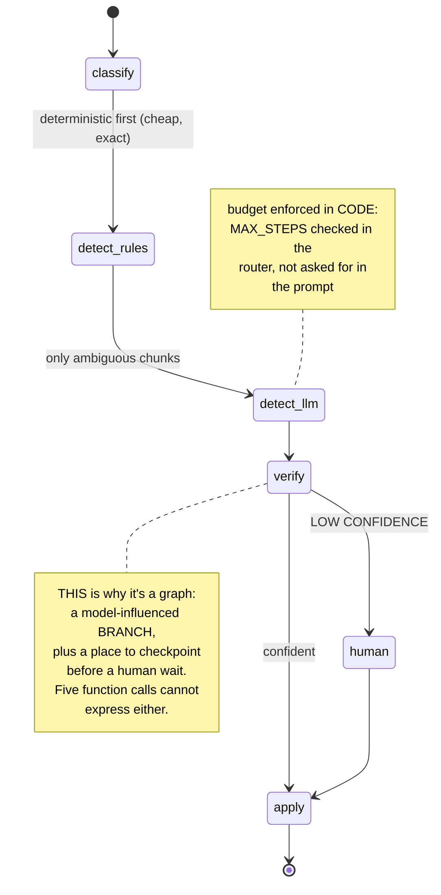
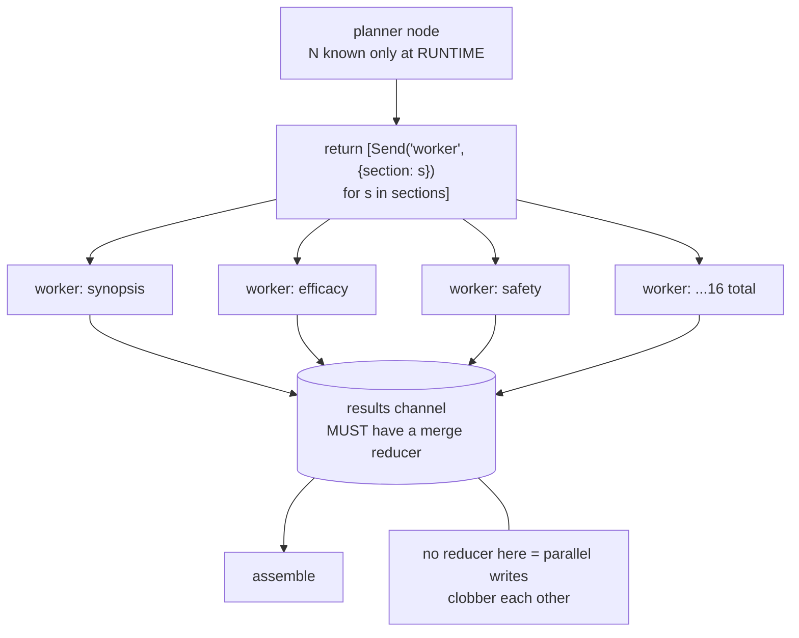
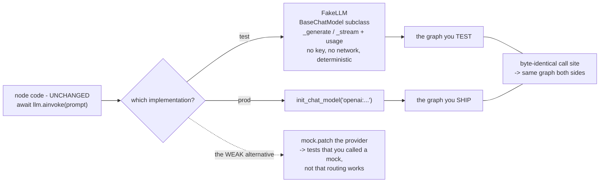

# LangChain & LangGraph — diagrams

## 1. The whole system, end to end



What to notice in that path:

- LangChain owns exactly two edges — `MOD -> LLM` and `RET -> VS`. Swapping a
  provider or a store touches nothing else in the picture.
- LangGraph owns everything between `API` and `OUT`: the state, the branch, the
  checkpoint. That is control flow, not calls.
- The loop `GR -> ST -> RT -> node -> GR` is the whole runtime. A node never
  calls the next node; it returns an update and the router decides.
- `CP` is what makes `HL` cheap. The process exits at the interrupt; a human
  answers hours later and the graph resumes from the stored state.
- Tracing/usage wraps every node in this loop — per node, per model call — which
  is why cost regressions are attributable to a node rather than to "the app".

## 2. What each library is for

#### LangChain — the adapter layer



#### LangGraph — the state machine runtime



#### Which one do you actually need



## 3. Reducers — the concept that matters most

```mermaid
flowchart TB
    S0[("state: findings=['a'], verdict='x'")] --> N1[node A returns<br/>findings=['b']]
    S0 --> N2[node B returns<br/>verdict='y']
    N1 --> R1{"'findings' has a reducer<br/>Annotated[list, add]"}
    R1 --> O1["APPENDED -> ['a','b']"]
    N2 --> R2{"'verdict' has NO reducer"}
    R2 --> O2["REPLACED -> 'y'"]
    O1 --> PAR["under PARALLEL nodes:<br/>two branches writing a<br/>reducer-less key = one<br/>SILENTLY wins"]
    O2 --> PAR
```

## 4. The PII filter as a graph (why a graph, not five calls)



## 5. `Send` — dynamic fan-out



## 6. The fake-model seam — how you test a graph offline


