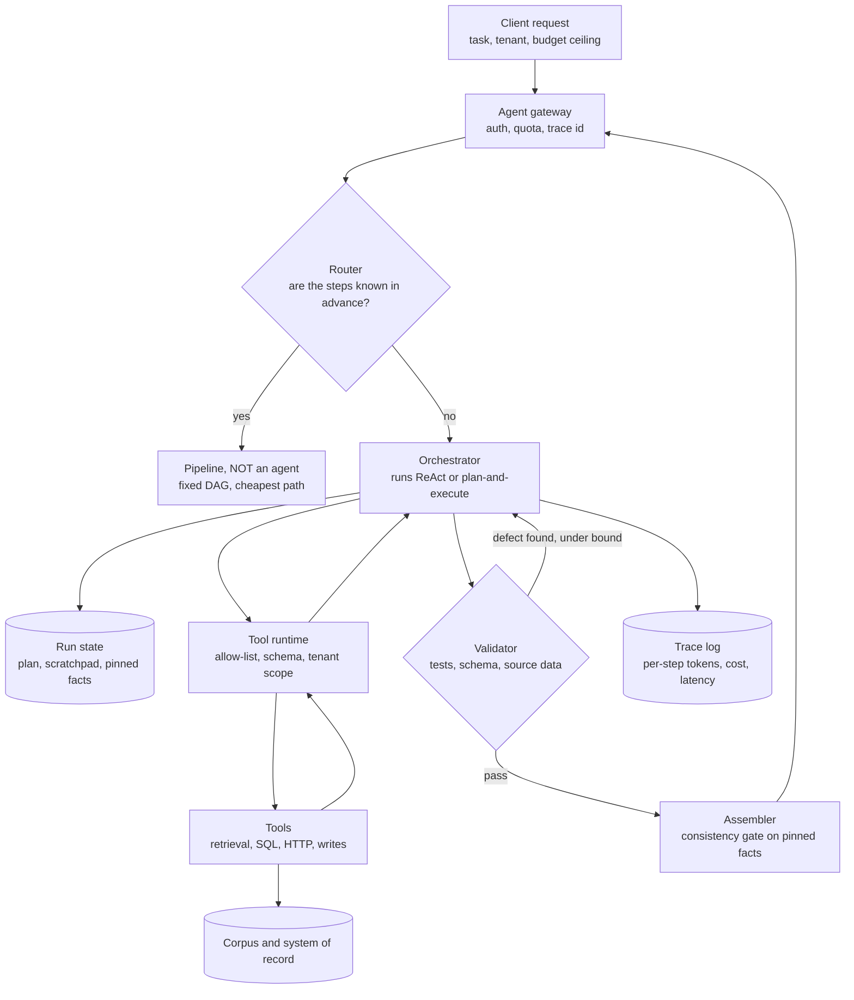
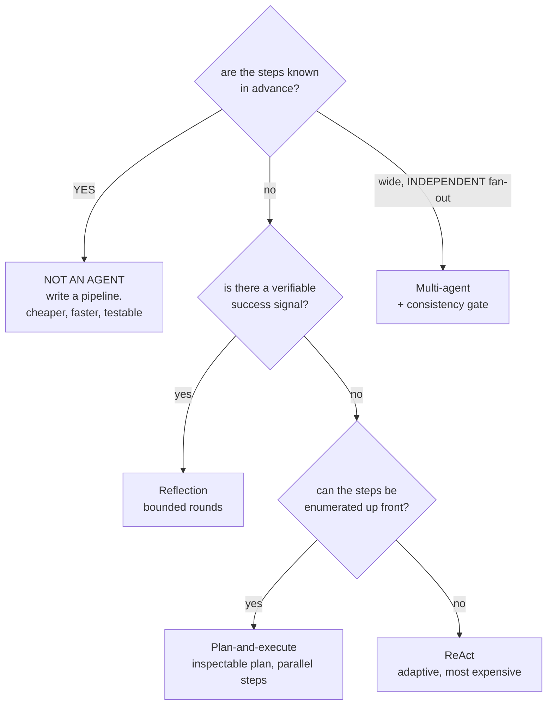
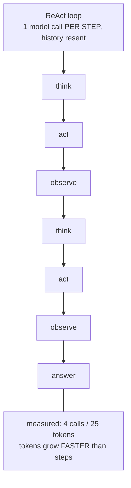
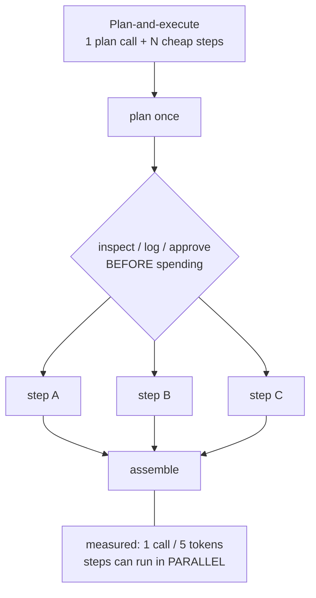
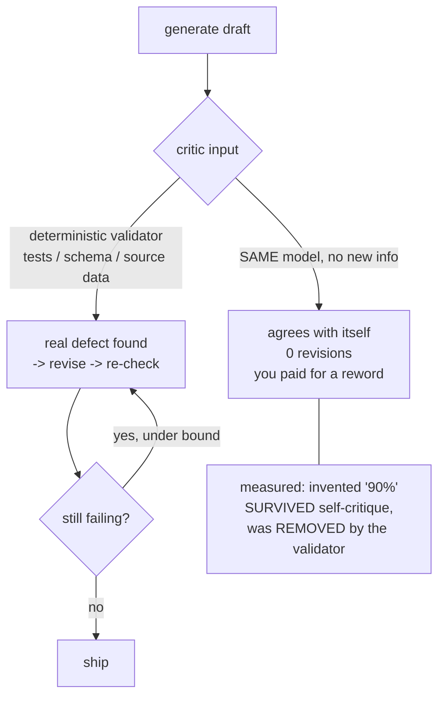
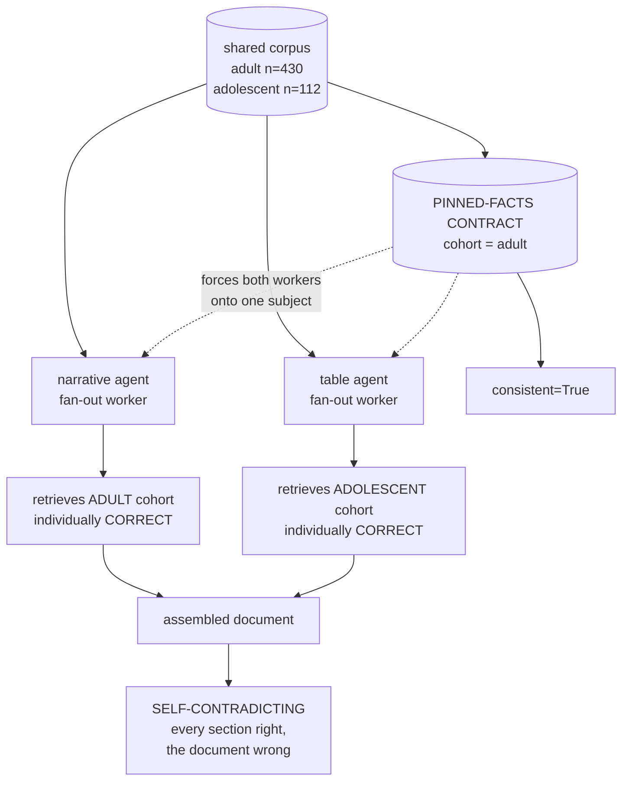
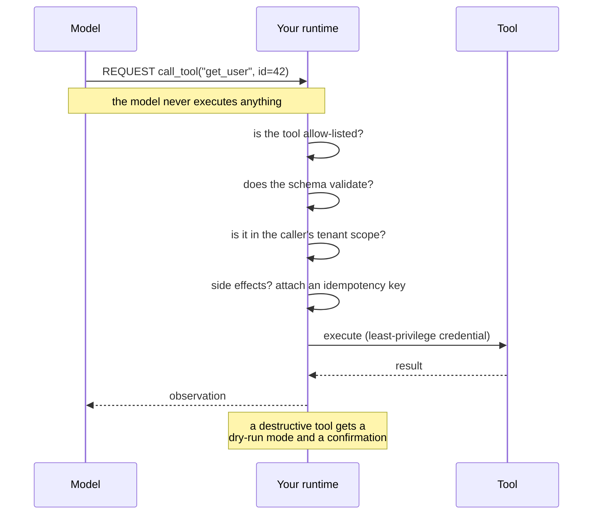

# Agent patterns — diagrams

## 1. The whole system, end to end

One request through a production agent. The rest of this file zooms in on
individual boxes; this is where they sit relative to each other.

The two edges that matter: the validator loops back into the orchestrator
(that is reflection, and it is only worth paying for when the validator is
external), and every tool call is brokered by your runtime, never executed by
the model.

## 2. The question that picks the pattern

## 3. ReAct vs plan-and-execute — the cost shape

#### ReAct — one model call per step

#### Plan-and-execute — one plan, then N steps

Same task, same tools. ReAct pays a model call per step and resends the whole
transcript each time, so tokens grow faster than steps. Plan-and-execute pays
once up front, and the plan is inspectable before you spend anything on it.

## 4. Reflection only works with an external signal

## 5. The multi-agent failure nobody mentions

## 6. Tool use — the model requests, your code decides

