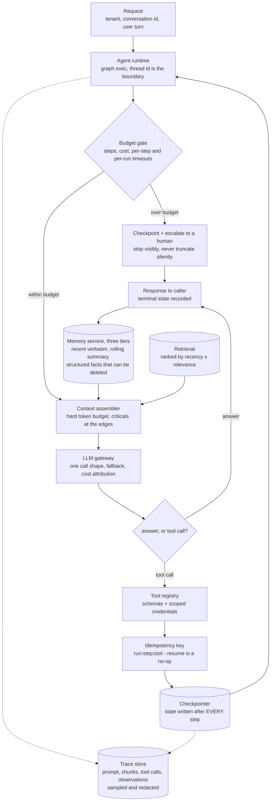
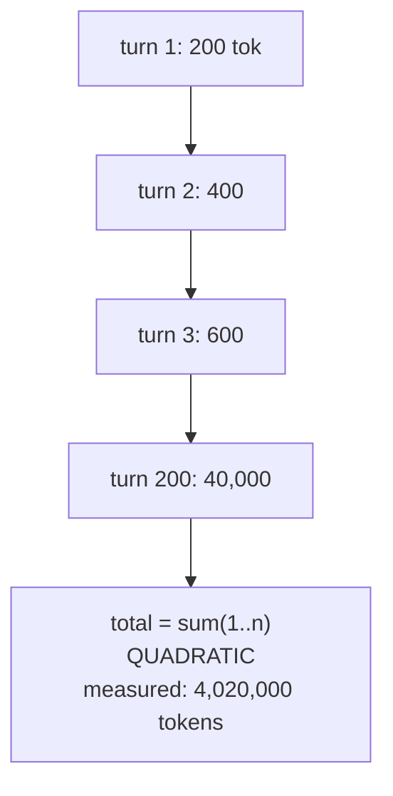
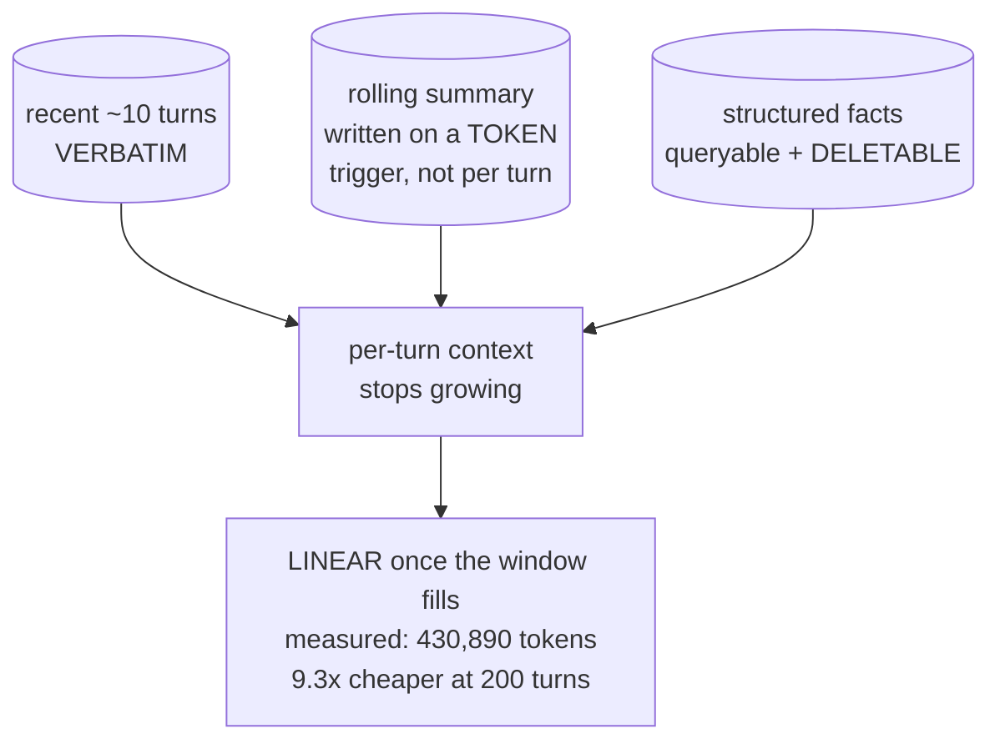
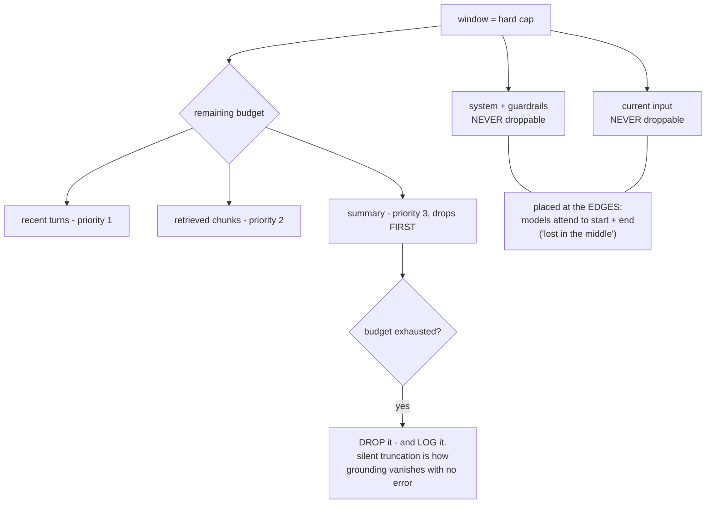
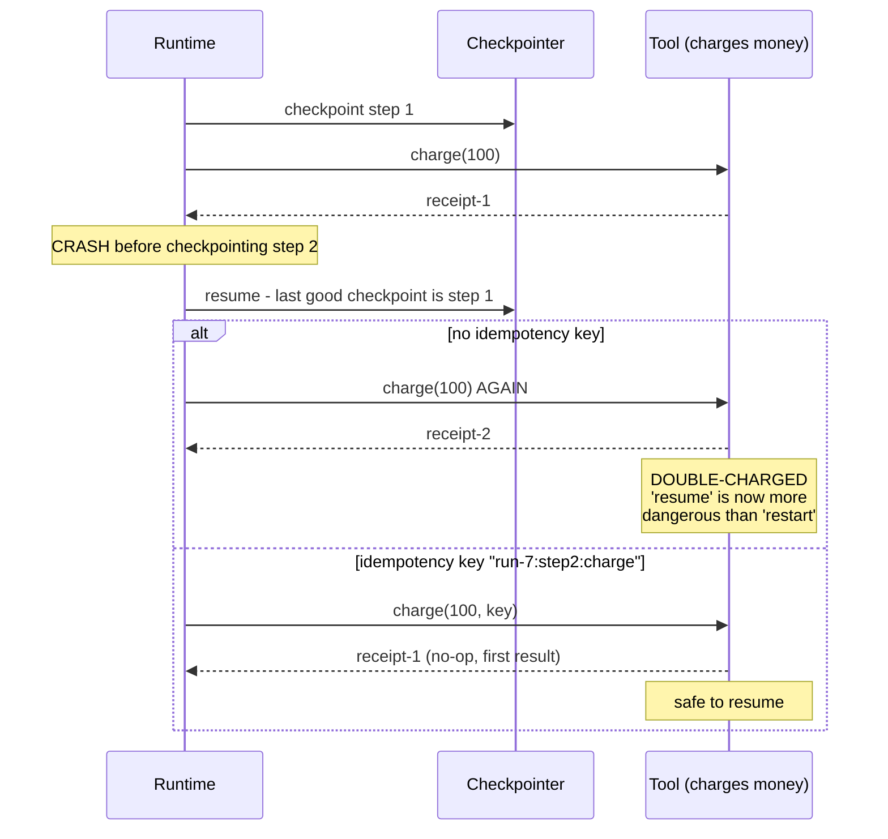
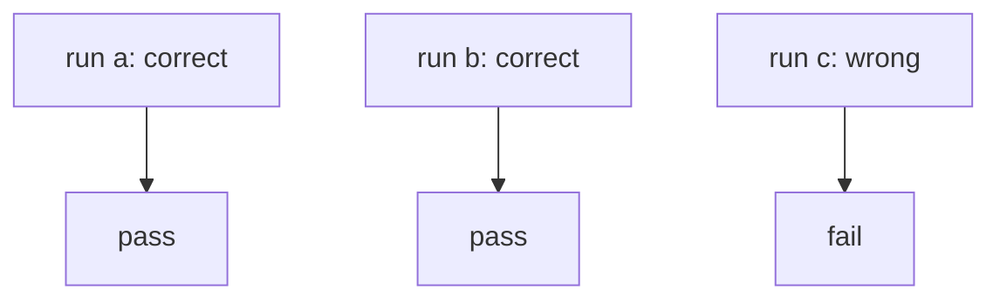
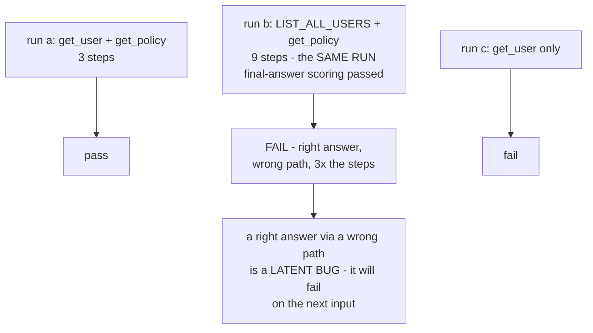
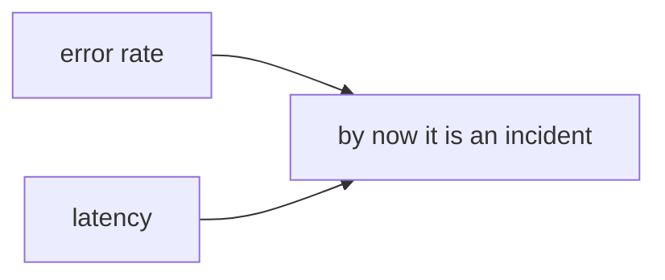
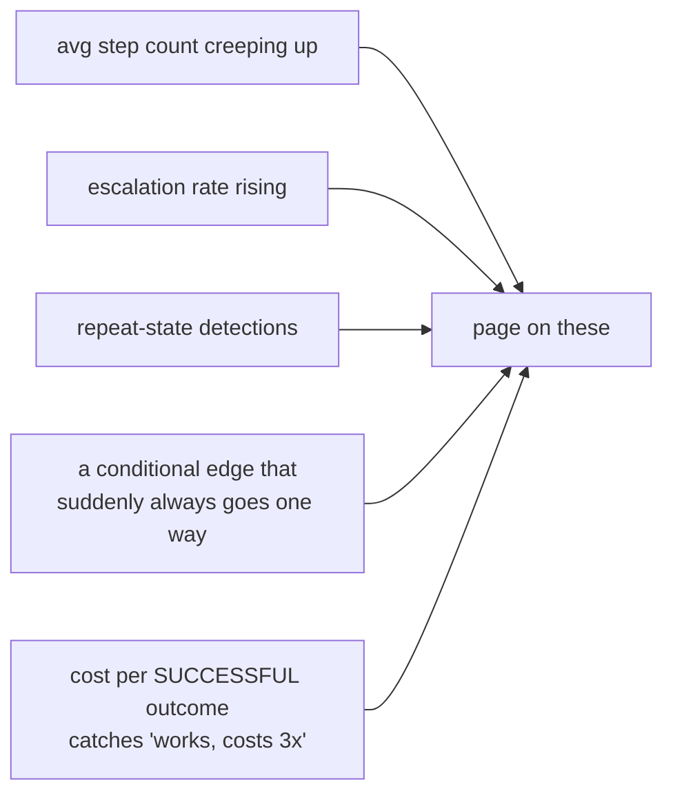

# Agent production — diagrams

## 1. The whole system, end to end

Four systems a demo does not have, on one path: an explicit context budget at
the assembler, tiered memory so cost does not grow quadratically, a checkpoint
after every step with an idempotency key on every side-effecting call, and a
trace store that makes step 3 replayable instead of guessable. The loop
`CP --> RT` is the run; everything hanging off it is what makes the run
survivable. Every section below zooms into one box of this picture.

## 2. Tiered memory — why naive resend goes quadratic

#### Naive — resend the whole history

#### Tiered — bounded per-turn context

Same 200 turns, same conversation: 4,020,000 tokens against 430,890. The whole
difference is whether per-turn context is allowed to keep growing. The third
tier earns its place twice — structured facts are queryable *and* deletable, so
right-to-erasure stays possible; a fact baked into a summary paragraph is
neither.

## 3. The context budget and its drop order

## 4. The partial-side-effect problem

## 5. Trajectory vs final-answer evaluation

#### Final-answer scoring — 67 percent, looks acceptable

#### Trajectory scoring — 33 percent, the real picture

Run b is the single disagreement between the two blocks, and it is the whole
argument: final-answer scoring called it a pass, trajectory scoring called it a
failure. Measure the p95 of the step-count distribution, not the mean, or run b
averages away.

## 6. What to alert on

#### Lagging — users already suffered

#### Leading — move first

Error rate and latency are the two an agent degrades *without* moving. The five
leading signals all come off the trace store in section 1 — which is why the
trace store is not optional instrumentation, it is the alerting substrate.
