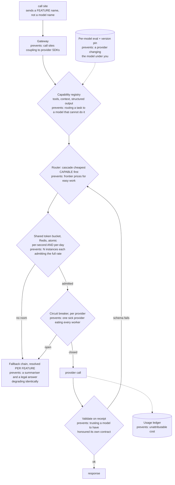
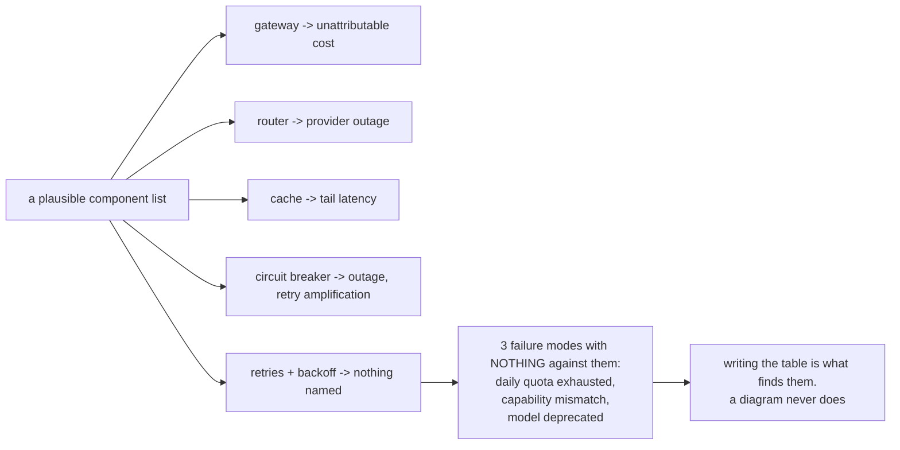
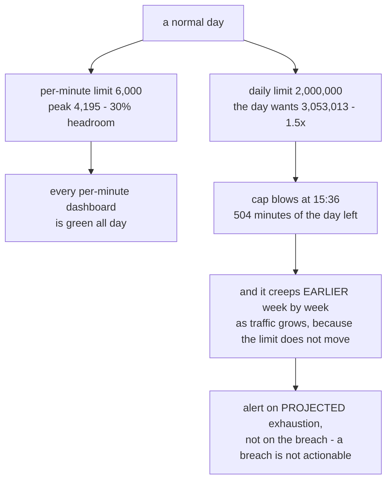
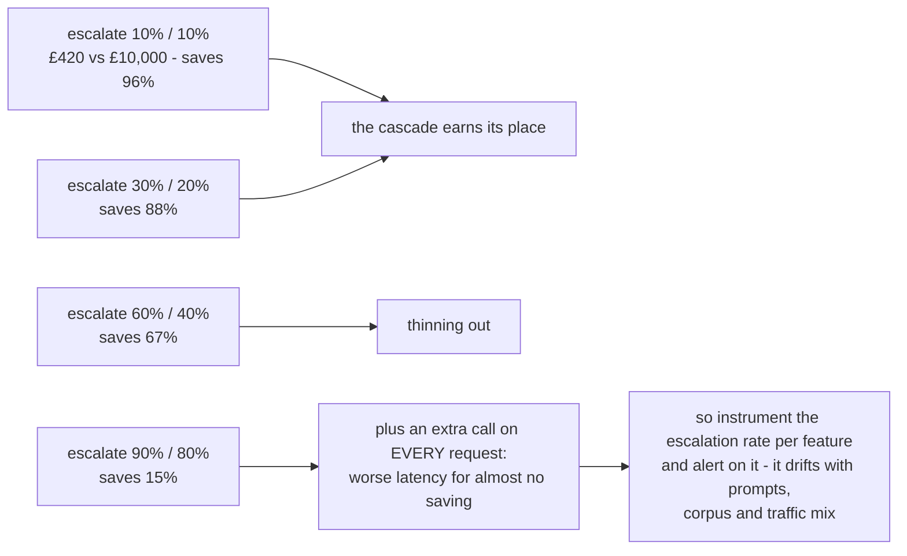
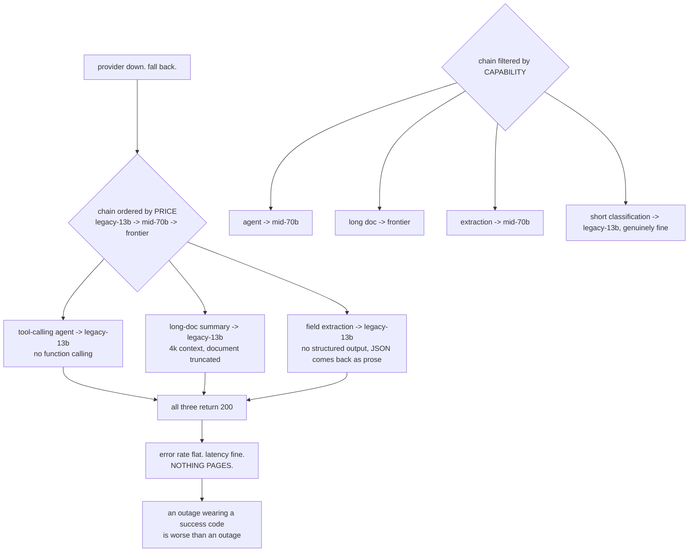
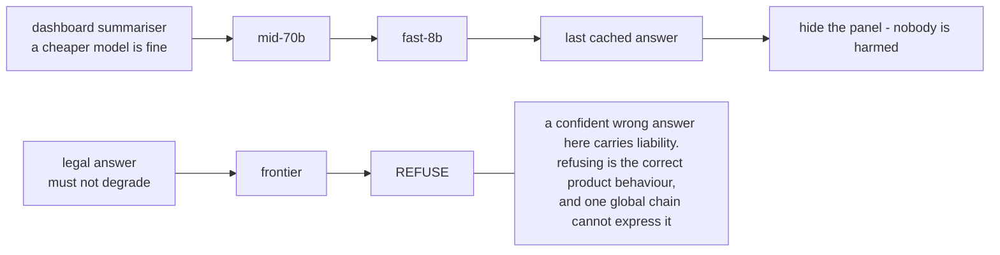

# Multi-model platform — diagrams

## 1. The path, with each component's job

Every box names the failure it prevents. That mapping *is* the design — a diagram of the same
boxes without it is the trap.

---

## 2. The trap, made visible

---

## 3. What breaks first is a quota, not capacity

---

## 4. A cascade is a bet on the escalation rate

---

## 5. A fallback that cannot do the job

---

## 6. Degradation is per feature, and refuse is a rung

