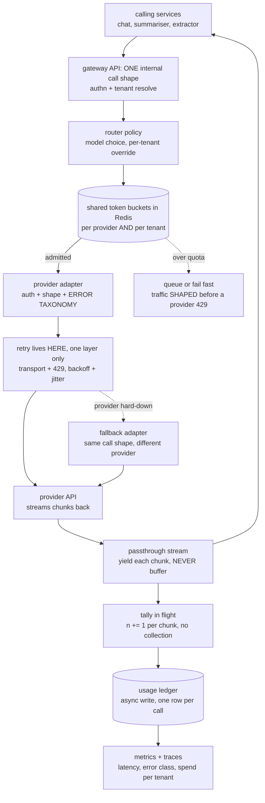
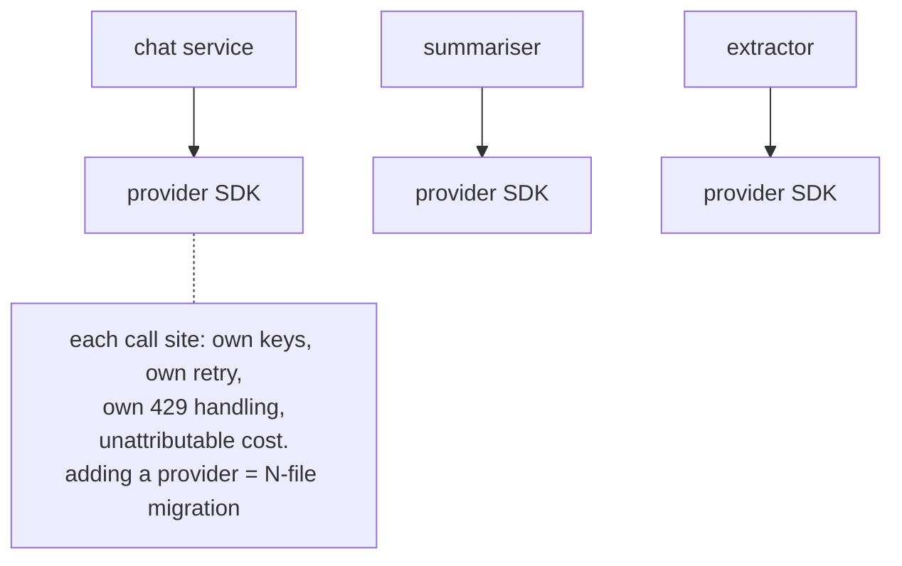
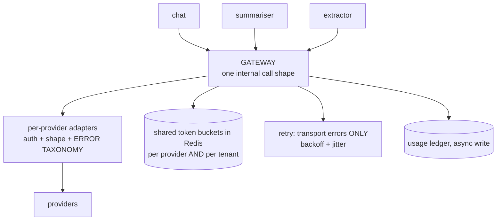
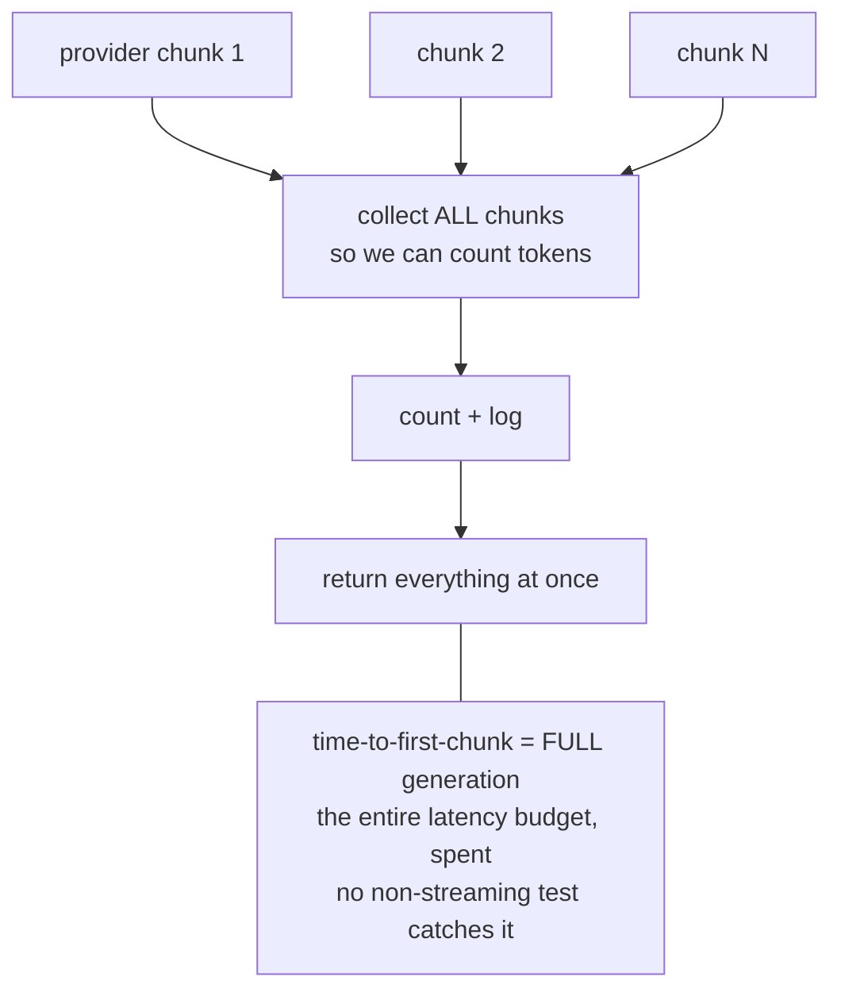
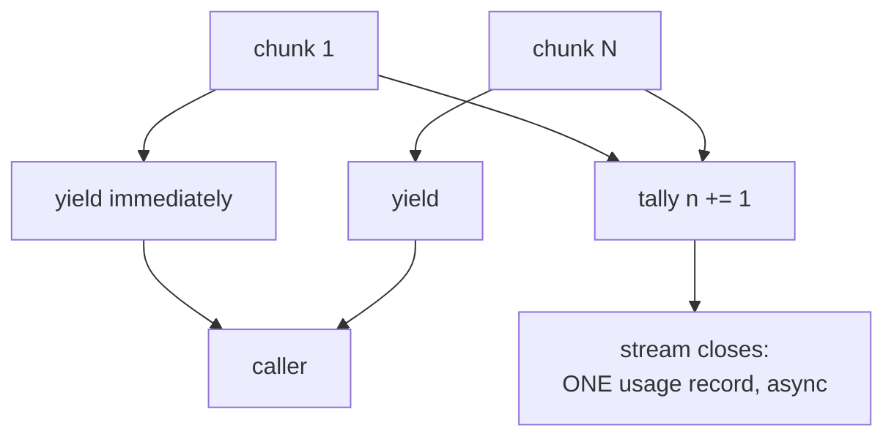
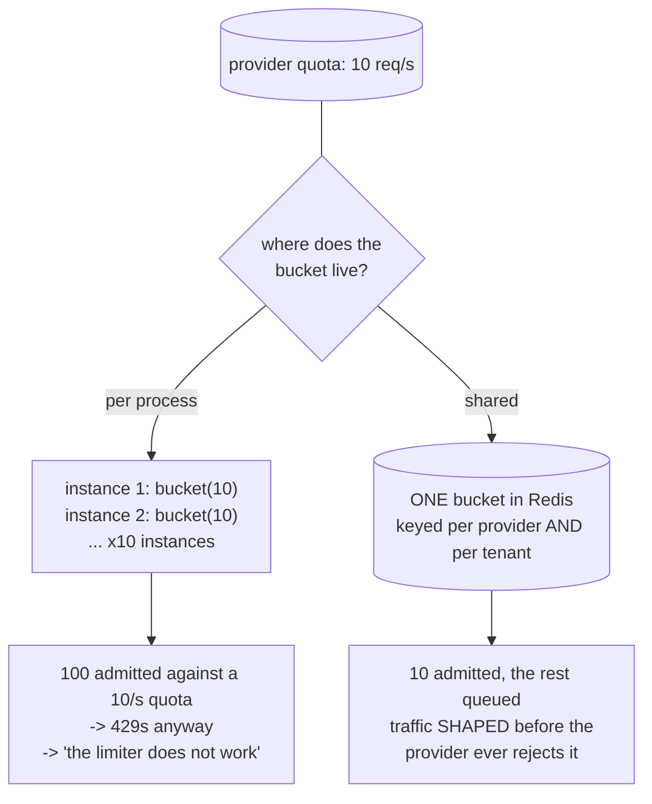
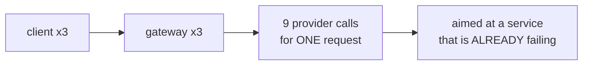
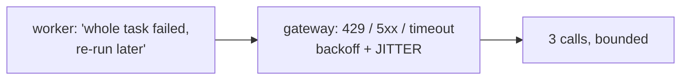

# LLM gateway — diagrams

## 1. The whole system, end to end

Read it as one request: caller in at the top, chunks back out to the caller from
the passthrough stream, and everything else — quota, retry, fallback, accounting
— hanging off the same single path. The sections below zoom into four points on
it that are usually got wrong.

## 2. What the gateway owns, and what it prevents

#### Without a gateway — N call sites, 7 problems each

Every problem in that note is repeated once per call site, and nothing in the
system can answer "what did tenant X spend last week".

#### With a gateway

Adding a provider is now one adapter, not an N-file migration.

## 3. Streaming: the bug and the fix

#### Buffered — the common bug

#### Passthrough — the fix

Same accounting, same one usage record — the counter just rides alongside the
yield instead of gating it.

## 4. Why rate state must be shared

## 5. Retry amplification

#### Retries in two layers

#### One layer per concern

The worker retries the task, the gateway retries the call. Multiply the two and
you get the block above it.
