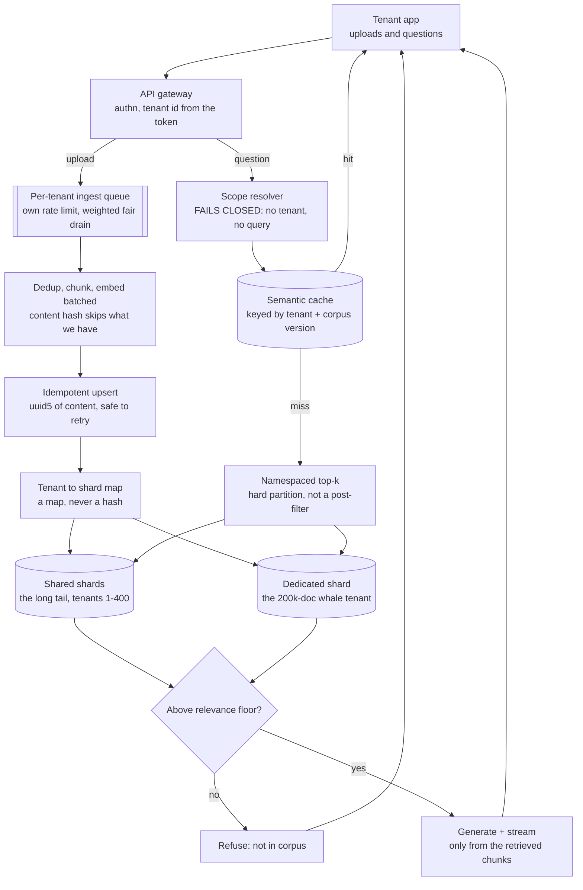
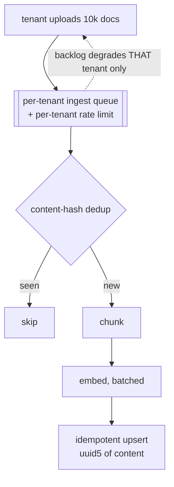
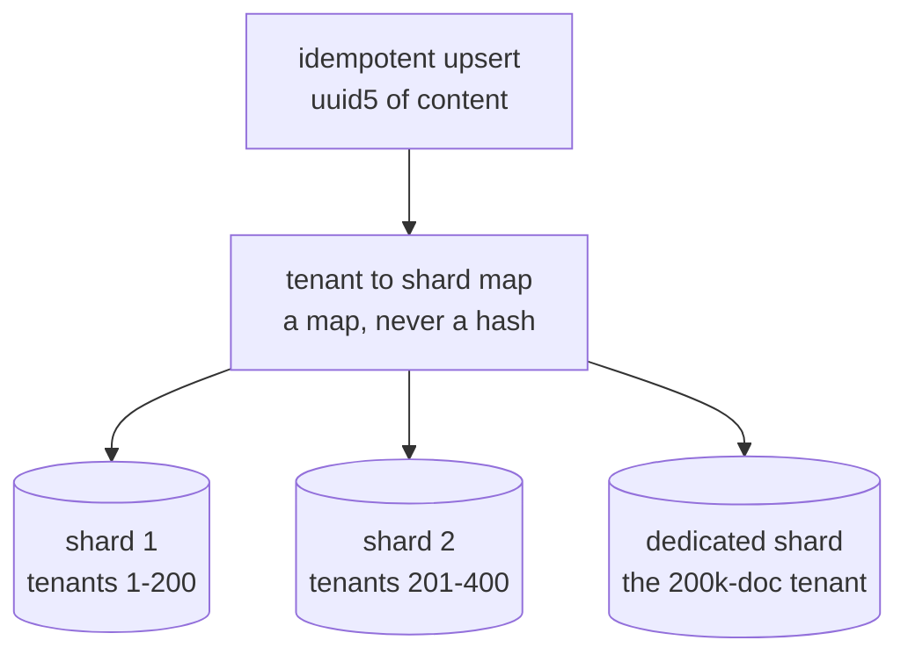
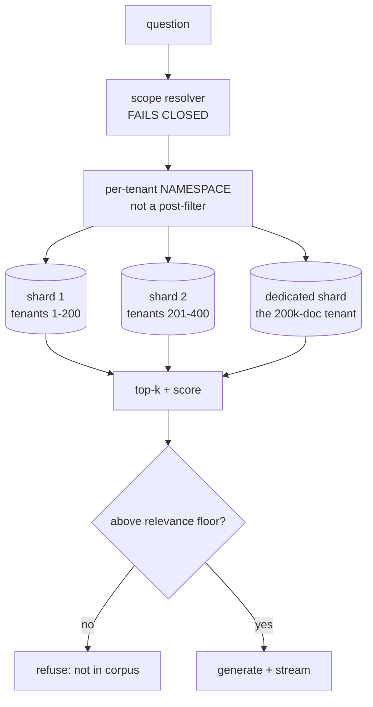

# Multi-tenant RAG platform — diagrams

## 1. The whole system, end to end

One tenant's request, from the token at the edge to the streamed answer. Ingest runs down
the left, query down the right; they meet only at the shards.

What to notice: the tenant id is resolved **once**, at the edge, and every hop downstream
inherits it. The cache is namespaced by tenant *and* corpus version — a cache shared across
tenants is a cross-tenant leak with a nice hit rate. Query is cheap and namespaced; ingest is
the contended resource, which is why it gets a queue of its own.

---

## 2. Ingest — the heavy path, breaks FIRST

The dotted edge is the whole point of the per-tenant queue: a bulk onboarding backs up its
own queue and nobody else's. Without it, tenant 1's 200k-document import is tenant 2's
outage — and tenant 2 is the one who calls. Embedding throughput is the first real wall.

---

## 3. Storage — sharded by tenant

A map, not a hash: a hash fans every query across every shard. The long tail shares shards,
whales get their own, and a tenant that grows 10× must be movable between them without
downtime.

---

## 4. Query — fails closed

Two refusals, both deliberate. The scope resolver fails closed — an unresolved tenant returns
nothing rather than everything. The relevance floor refuses on weak retrieval rather than
letting the model improvise. A namespace is a hard partition; a post-filter is a bug waiting
for the day someone forgets the `WHERE`.

---
