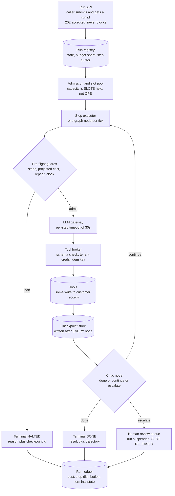
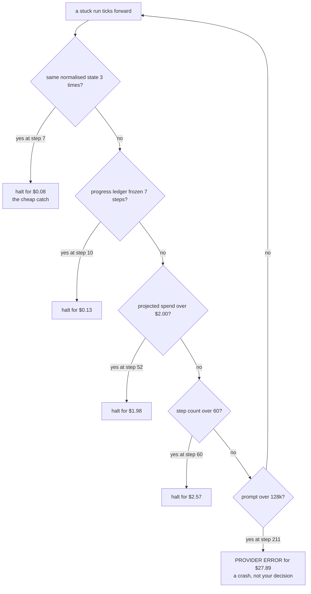
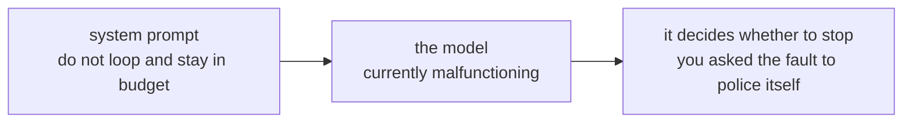
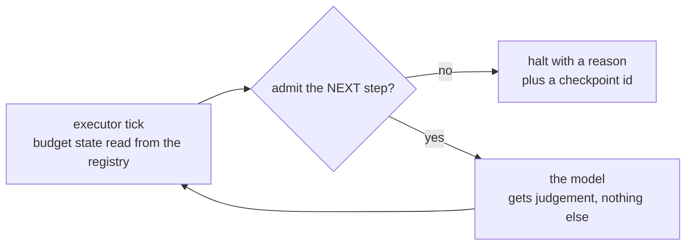
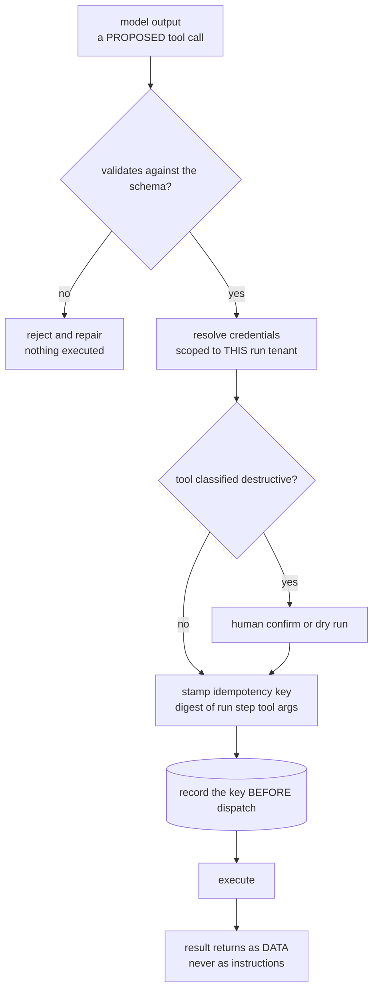
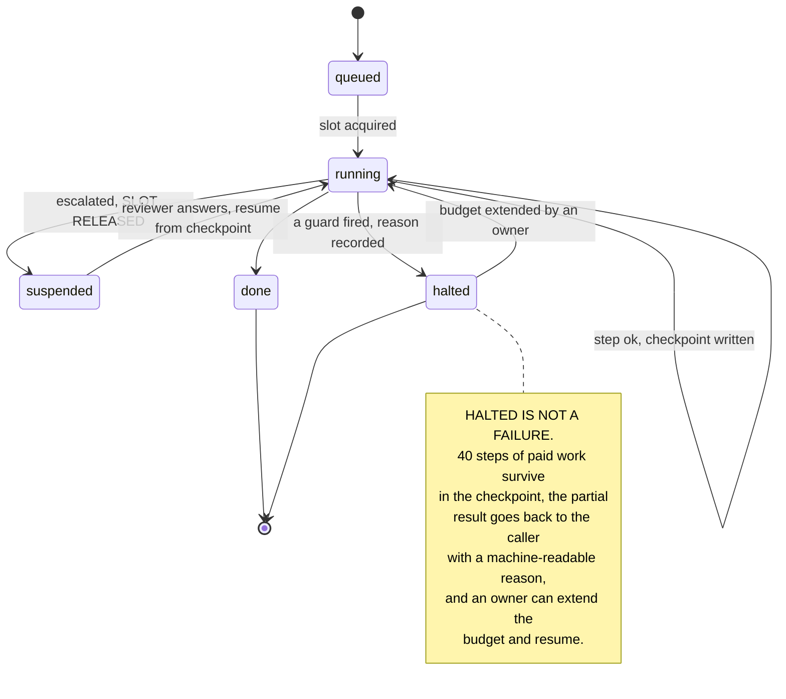

# Agentic workflow engine — diagrams

## 1. The whole system, end to end

Read it as one run. The loop is `EXEC → GUARD → LLM → BROKER → CKPT → VERIFY → EXEC`, and the
guard sits **inside** that loop, before the spend, not around the outside of it. Three terminal
states, all of them ledgered: done, halted with a reason, and escalated to a person. A run that
is waiting on a human has released its slot — otherwise a reviewer's lunch break is a capacity
incident.

---

## 2. The ladder of stops, in the order they fire

Every branch is the same bug caught at a different price. The caps are backstops; the detectors
are the policy. If your step cap is the guard that usually fires, the detectors above it are not
working — and the bottom box is what you get with none of them.

---

## 3. Where the budget lives

#### The trap — enforcement inside the prompt

#### The answer — enforcement in the executor

Note *which* step is priced. Admission projects the cost of the step about to run, because a
transcript-resending agent makes the last step the dearest one — check spend-so-far instead and
you overshoot the cap you were defending, every time.

---

## 4. The tool broker — one chokepoint, four jobs

Trace an injected *"delete account 4471"* through it: it has to survive schema validation,
tenant-scoped credentials, and a destructive-tool confirmation. Three of those hold even if the
model is fully compromised — which is the only test of a defence worth having. `record the key
BEFORE dispatch` is the box that decides whether a crashed worker creates one customer record or
two.

---

## 5. Run lifecycle — why halted is a pause

The two edges that matter are the ones back into `running`. Without a checkpoint after every
node, `suspended` cannot exist (you cannot park a stack frame for a human) and `halted` is a loss
rather than a decision.
