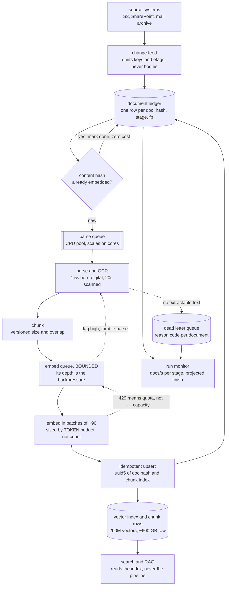
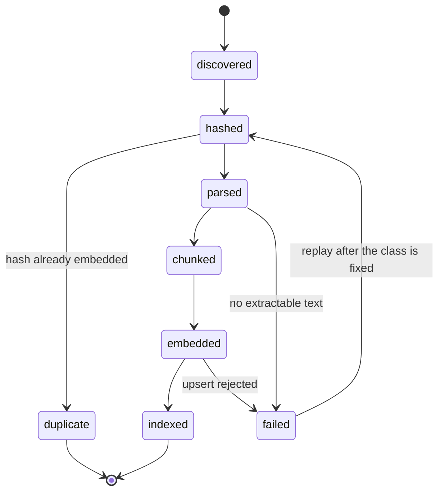
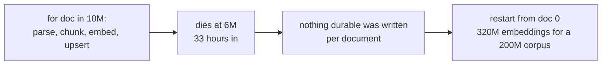
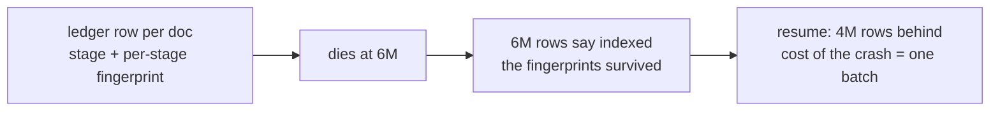
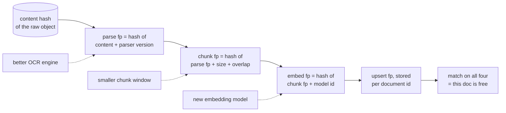
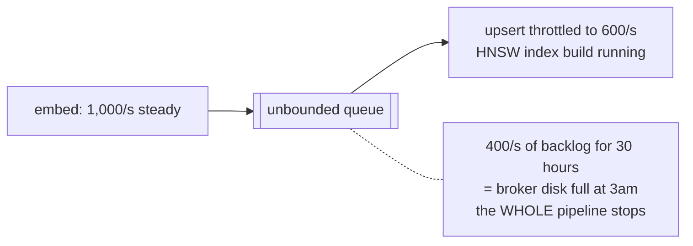
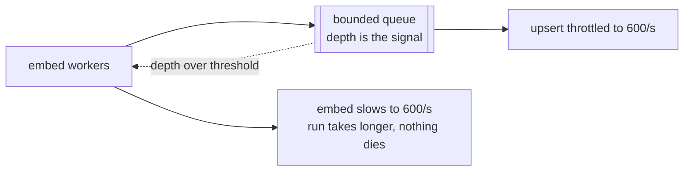
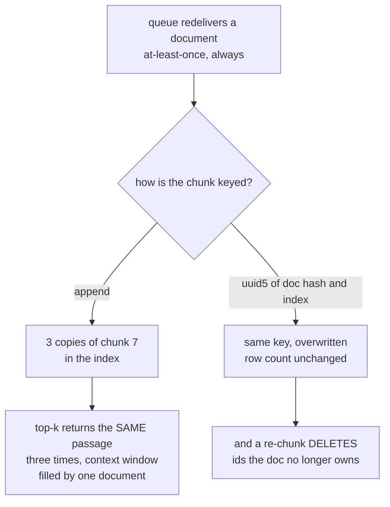

# Document ingestion at 10M — diagrams

## 1. The whole system, end to end

Read it as one document: discovered by the change feed, written to the ledger
*before* any work, dedup-checked, then pushed through four stages that are bound
by four different resources. Two edges carry the whole design — `UPS --> LEDG`
(the fingerprint is written after the work, so a restart knows) and the dotted
`Q2 -.-> PARSE` (a pipeline that cannot slow down can only fall over).

---

## 2. One document's state machine — this is what makes it resumable

The unit of resumability is this diagram, not the run. A restart is a query —
"give me rows not in `indexed` or `duplicate`" — and `failed` is a state you can
replay from, which is why the DLQ carries a reason code rather than a stack trace.

---

## 3. Crash at 60%

#### One job, one loop — the restart is from zero

#### Staged, with a ledger — the restart is a scan

The two runs do identical work per document. The only difference is that one of
them wrote down what it had done, at a granularity smaller than "the job".

---

## 4. The fingerprint chain — how far back a change replays

Each stage skips itself when the stored fingerprint matches. A model swap enters
at `EFP` and reuses every CPU-hour of OCR; a chunker change enters at `CFP` and
reuses the same. The test of the whole scheme is `DONE`: re-running a finished
pipeline must cost **zero**.

---

## 5. Backpressure between embed and upsert

#### Unbounded — the broker becomes the outage

#### Bounded — the slow stage sets the pace

Unbounded queues do not absorb a mismatch, they postpone it and then convert a
slow stage into a total outage. Bounding the queue is how you choose which of
those two you get.

---

## 6. Duplicates are a retrieval bug, not a storage bug

The storage waste is the boring half. The half that reaches users is a top-k that
spends three of its five slots on one passage — and the orphan ids left behind by
a re-chunk keep matching queries long after the text they describe is gone.
