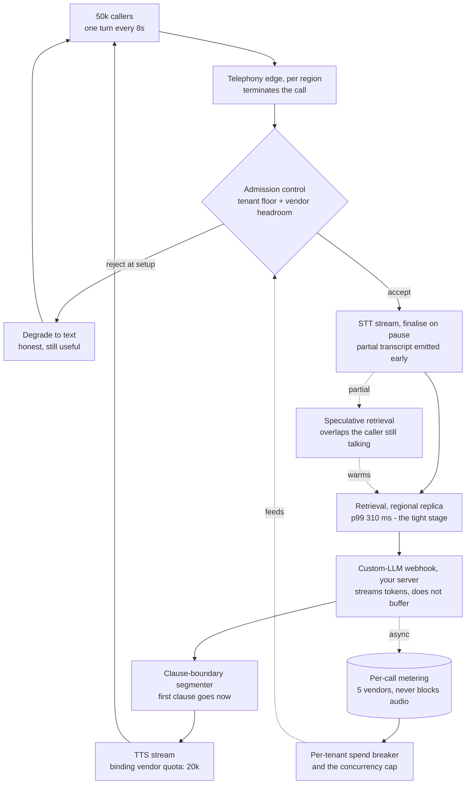
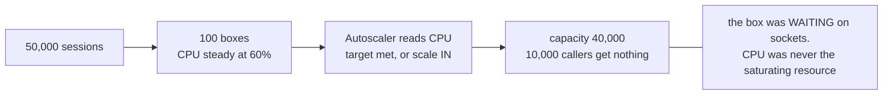
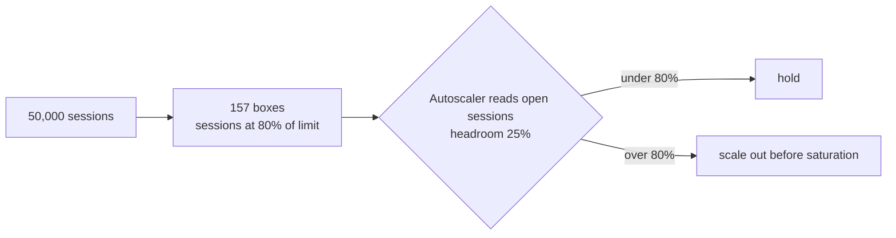
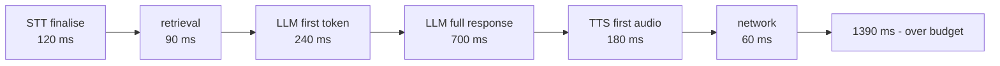
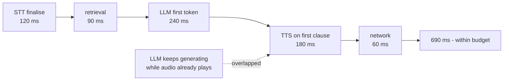
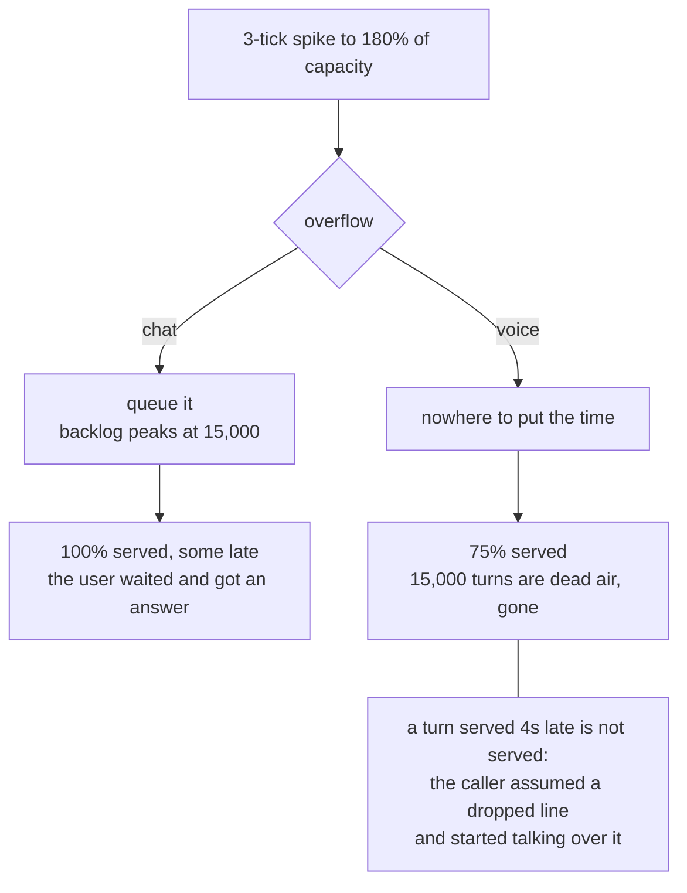
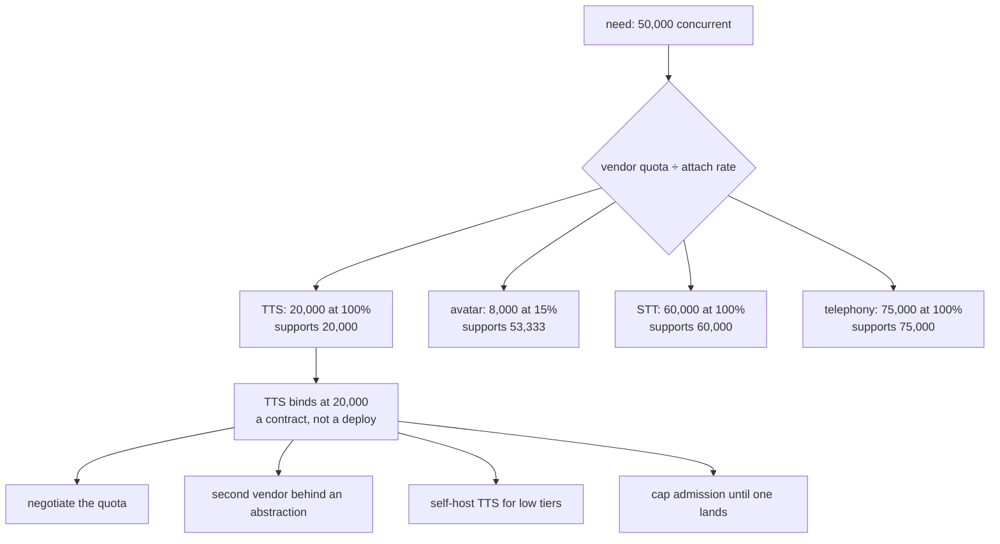
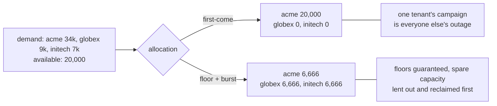

# Real-time voice at 50k — diagrams

## 1. The whole system, end to end

The whole diagram is one turn. Everything on the solid path is inside a 1,000 ms budget and
runs **serially**. Everything dotted is off the critical path and must stay there — a metering
write that blocks is a dropped call.

---

## 2. Why the autoscaler scales the wrong way

#### On CPU: the normal state looks like an idle fleet

#### On sessions: measure the thing that runs out

Same fleet, same instant: 60% CPU and 125% of the session limit. Holding a non-binding metric
at target tells you nothing, and here it actively fires scale-in during an outage.

---

## 3. The serial budget, and what streaming buys

The only stage removed is the wait for the last token. 700 ms, for plumbing. Note what is
*not* removable: every remaining box is in the path, every turn, and they add rather than
overlap.

---

## 4. Why a queue rescues chat and destroys voice

Total capacity across the window exceeded total demand — the spike was survivable. Chat pays
in latency and recovers fully; voice has no latency to spend. This is the *favourable* case for
queueing: against a sustained shortfall, the queue serves no more than voice does and merely
hides the deficit in an unbounded backlog.

---

## 5. The real ceiling is somebody else's quota

Divide by attach rate before ranking. The avatar's 8,000 looks like the tightest number on the
page and is not the constraint, because it rides on only 15% of calls.

---

## 6. Per-tenant caps as blast-radius control

Enforced at **admission**. Rejecting a call at setup is a product decision the caller can act
on; dropping one at ninety seconds is an outage.
