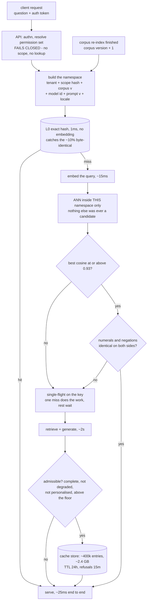
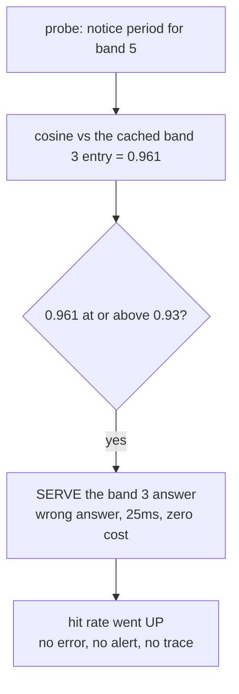
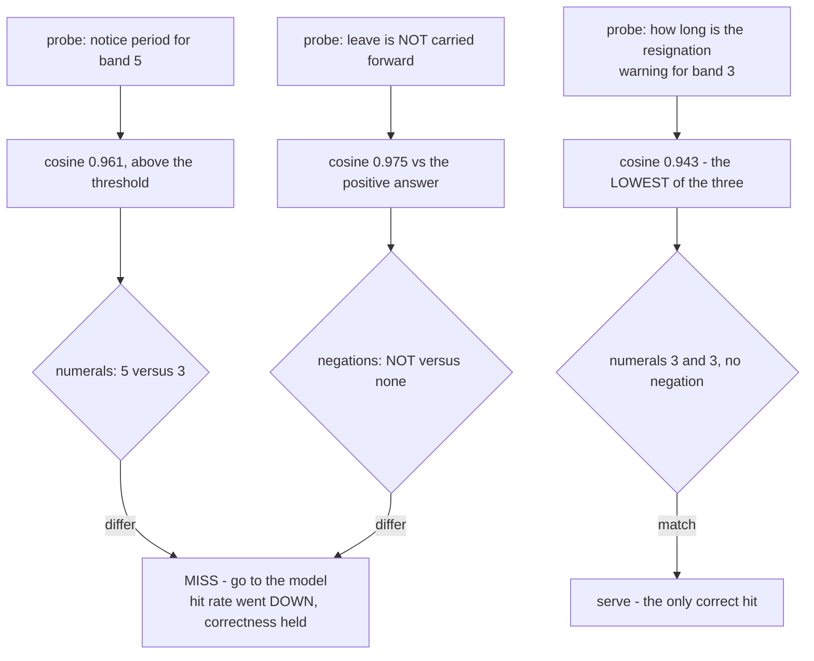
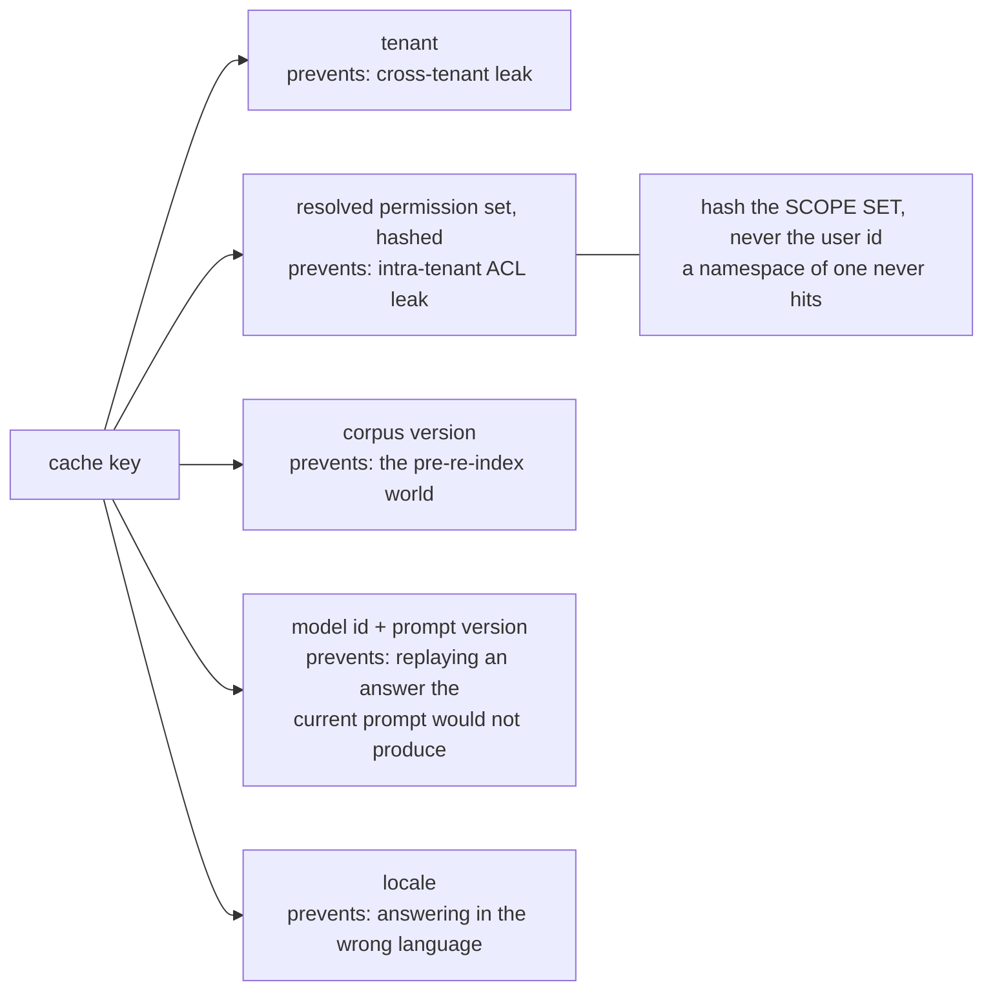
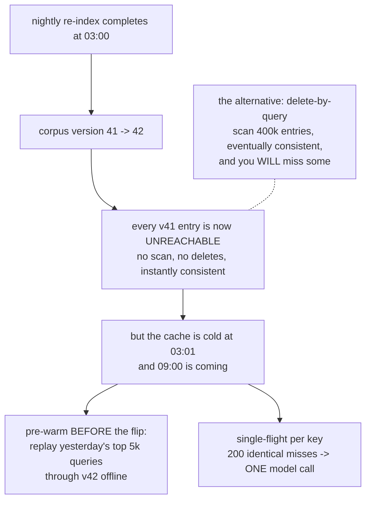
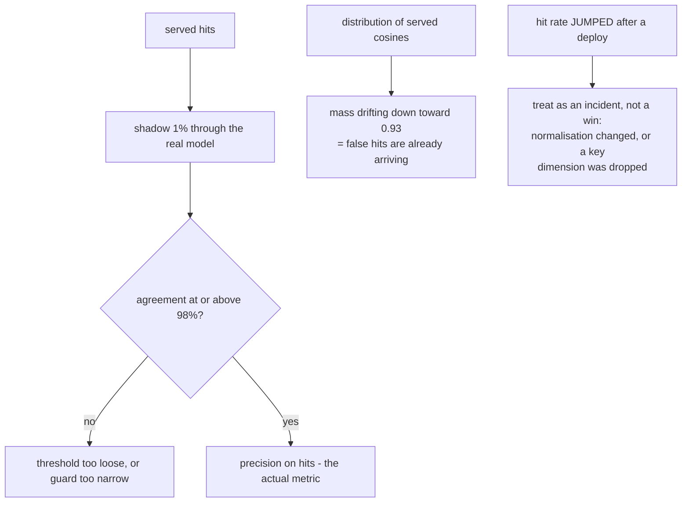

# Semantic cache — diagrams

## 1. The whole system, end to end

Read it as one request. Authentication and scope resolution happen **before** the cache is
touched, because the resolved scope is an input to the key — a cache in front of auth serves
across tenants. Two gates decide a hit, not one: the threshold picks a candidate, the guard
decides whether it may be served. The re-index event feeds the key builder, not a delete job.

## 2. The false hit — why the threshold cannot do this alone

#### Threshold only

#### Threshold plus the discriminative-token guard

The genuine paraphrase scores **lower** than both wrong answers. That is the whole point: there
is no threshold anywhere on the number line that admits 0.943 and rejects 0.961 and 0.975.
Recall comes from the vector, precision comes from the lexical comparison.

## 3. The key, dimension by dimension

Each dimension buys a correctness property and costs hit rate. Corpus version is free in steady
state and costs 100% on the day it changes — which is the next diagram.

## 4. Invalidation, cold start, and the 09:00 problem

Version-in-key turns invalidation into a config change. What it does not solve is the cold
window it creates, so pre-warm before the flip and never bump in business hours — a cold cache
at peak presents as a provider rate-limit incident, not as a cache problem.

## 5. What you measure, and what it hides

Three signals, only one of which is the hit rate. The shadow sample is the ground truth; the
cosine distribution is the leading indicator; a sudden hit-rate improvement with no product
change is the alarm most teams have wired up as a celebration.
