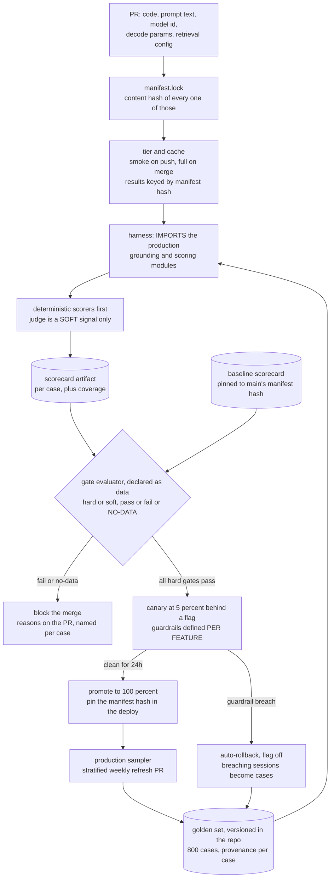
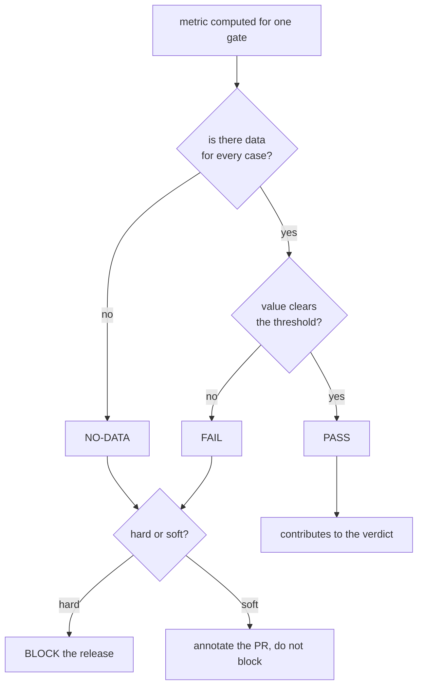
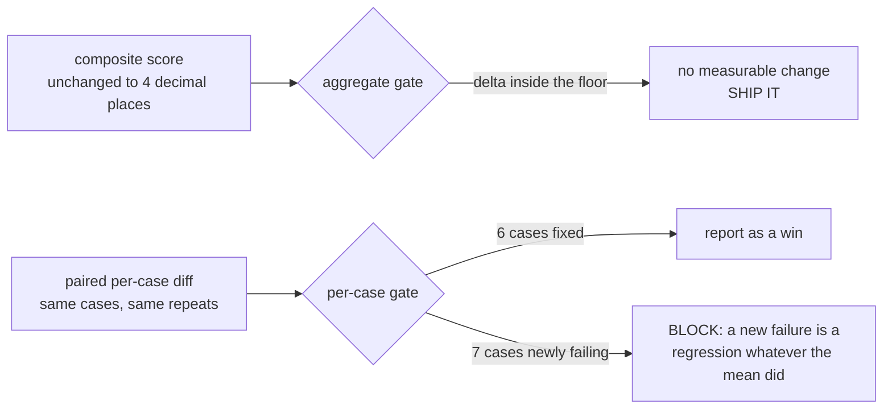
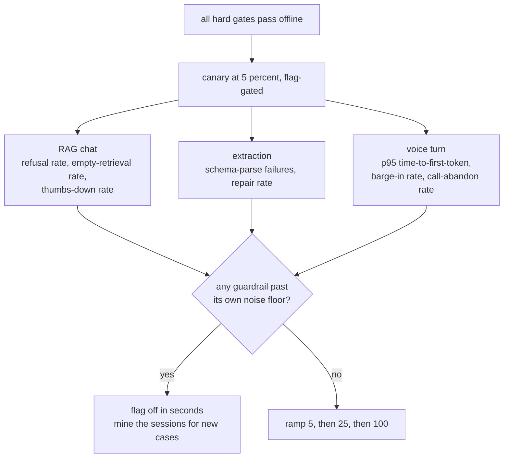
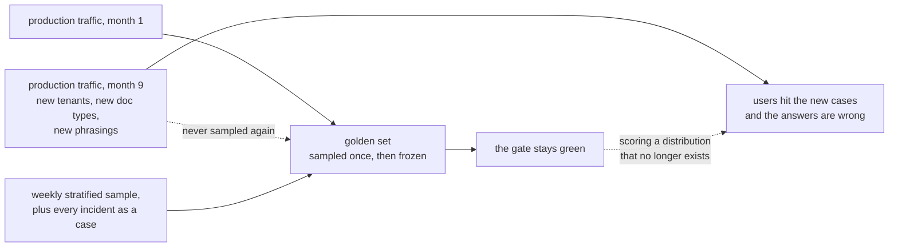
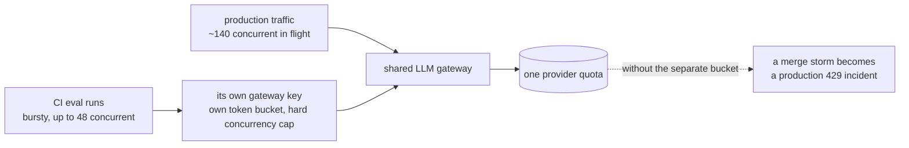

# Eval and release gates — diagrams

## 1. The whole system, end to end

Read it as one change: a prompt edit enters at the top and is hashed *before* anything is
scored, because the hash is what the gate keys on — a text file with no code diff still
triggers a full run. Two loops close back onto the golden set: the weekly production sample,
and every canary rollback. Without those the set is a snapshot, and a snapshot rots.

---

## 2. The gate evaluator — three states, and no-data blocks

The whole design is in the first diamond. Model this as a boolean and "no data" must collapse
into pass or fail — and the comfortable default makes every un-evaluable gate silently green.
That is the bug that once shipped a regressed enrolment figure under *"all hard gates pass"*.
Same instinct as fail-closed tenant scoping: when the answer is unknown, take the restrictive
default.

---

## 3. Why the aggregate is blind

`solution.py` runs exactly this. Six fixes cancelling seven breaks is invisible to a mean and
obvious to a paired diff. Notice also that the two gates need different noise floors — averaging
60 cases shrinks noise by root-60, so a threshold borrowed from the composite would flag half
the set as regressed.

---

## 4. Offline gate to online canary — guardrails differ per feature

Naming a *different* guardrail set per feature is what separates this from "add a canary".
Extraction fails as a parse error you can count; voice fails as latency and people talking over
the model; chat fails as a refusal or a shrug. One dashboard of "error rate" catches none of them.

---

## 5. Golden-set rot — the thing that breaks first

This is first in the break-order because every other failure here is loud and this one is
silent, and it fails in the direction of a green board. The leading indicator is not a metric on
the gate at all: embed a rolling sample of production queries, embed the golden set, and watch
the distance between the two distributions widen.

---

## 6. Where the eval traffic goes

The gate is a load generator. It arrives in bursts, it competes for the same quota, and a
nightly full run overlapping a merge is the worst case. Give it its own bucket and run the
nightly off-peak, or the thing protecting your releases will page the on-call.
