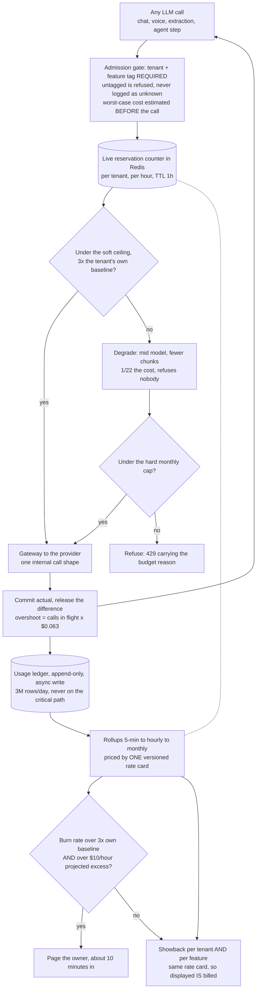
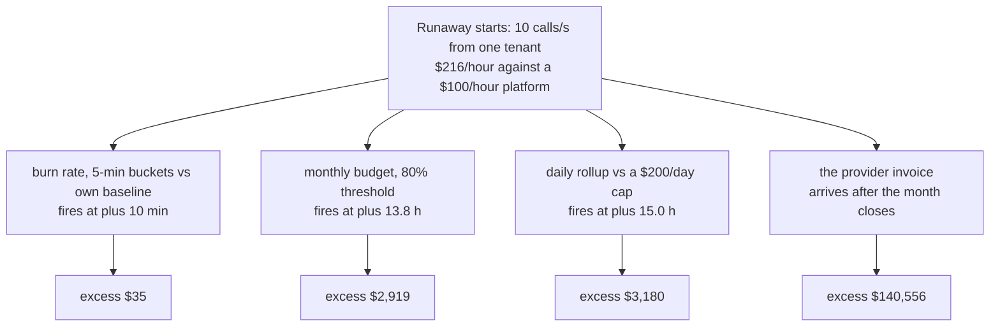
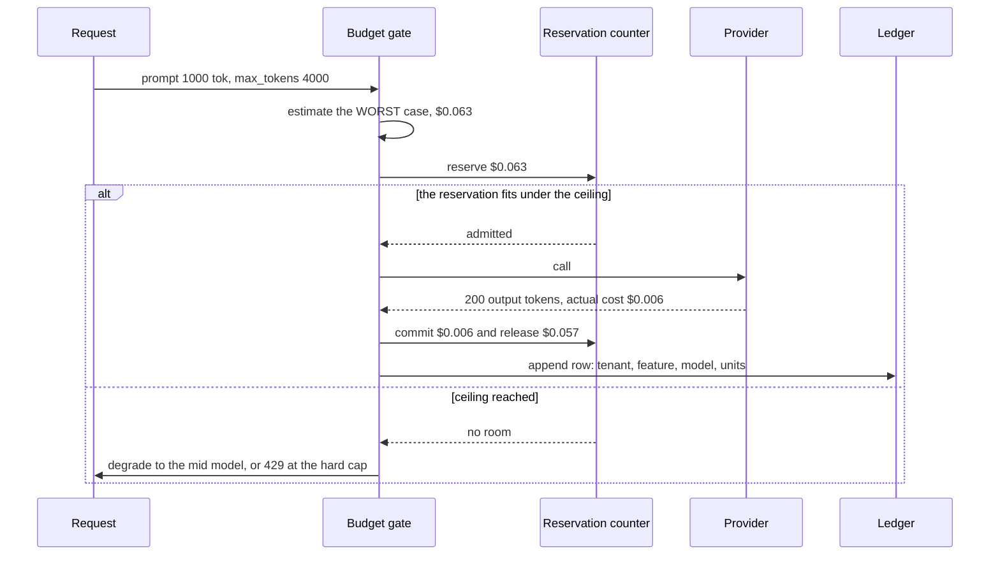
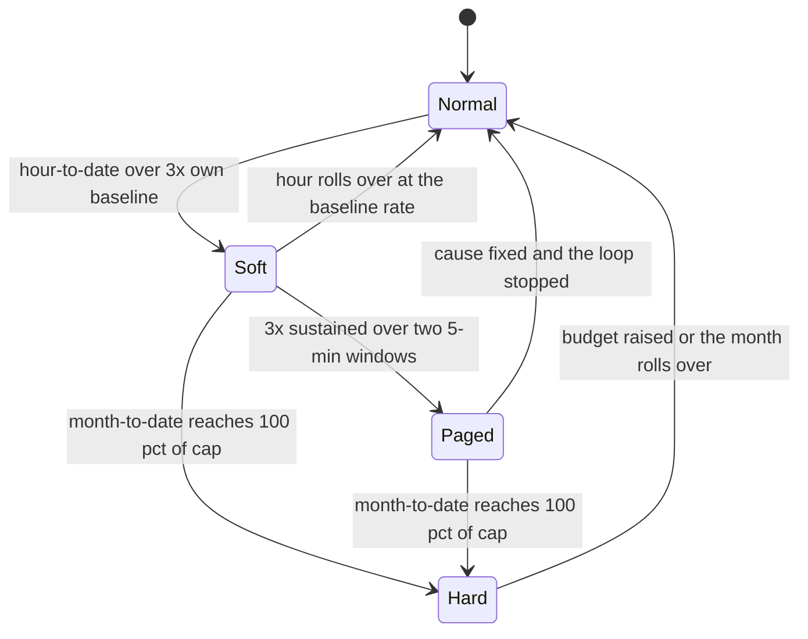
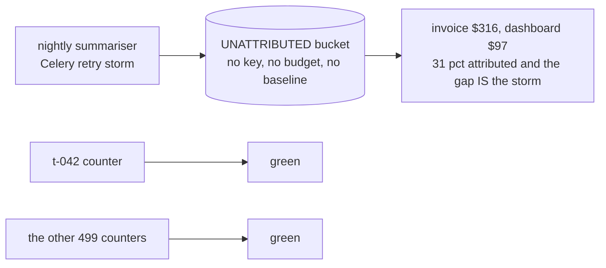
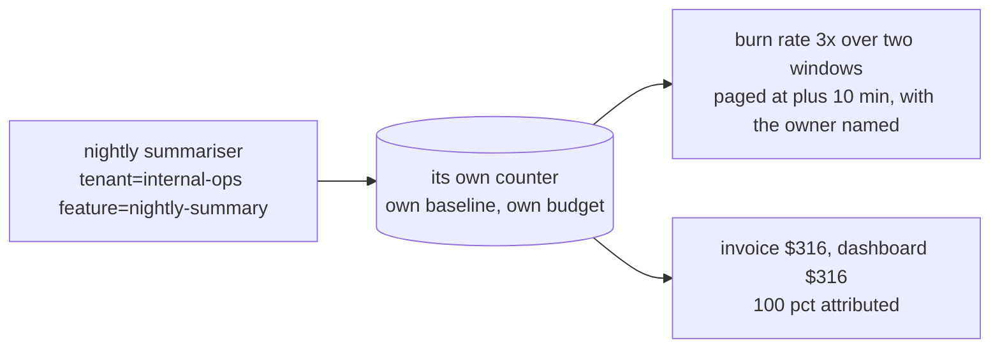

# Cost governance at 500 tenants — diagrams

## 1. The whole system, end to end

Read it as one call. The tag is enforced at the top because an untagged call is unbillable
*and* invisible; the cost is estimated before the provider is touched because you cannot cap a
number you only learn afterwards; and the gate reads the **live** reservation counter, not the
rollup, because the rollup is minutes stale and a runaway spends $3.60 in every stale minute.
The dotted line is reconciliation — the rollup corrects the counter, it does not replace it.
Nothing on the enforcement path waits for the ledger write.

---

## 2. Detection latency is the whole design

Every detector is correct and every one of them names the right tenant. The only variable is
**when**, and it is worth $140,521. Notice also that the two "proper" budget controls land 72
minutes apart and cost about the same: a monthly window cannot see an hourly burn, however
carefully you set its threshold.

---

## 3. Reserve worst case, commit actual, release the difference

The estimate is deliberately pessimistic because it is the only bound available pre-flight.
Reserving the prompt-only cost instead — the version that lets the ledger reconcile later —
over-admits by 11×, since the gate is counting $0.003 while the calls average $0.033. The
release step is what stops the pessimism becoming a self-inflicted outage.

---

## 4. Three tiers, three time constants

**Soft** is automatic and costs nothing to be wrong about — it degrades and self-clears on the
hour. **Paged** is the only tier that needs a human, which is why the $10/hour floor on the
alert matters. **Hard** is contractual and refuses. A design with only the hard tier is an
outage generator; a design with only the soft tier degrades a broken retry loop forever.

---

## 5. Where a runaway hides

#### Untagged — the storm has no owner

#### Tag required at admission

Both dashboards are honest about what they can see. The first one just cannot see 69% of the
bill, and every per-tenant budget in it is intact while the spend triples. Background jobs,
retries and internal tooling are the usual occupants of that bucket — and they are exactly the
things that loop.
