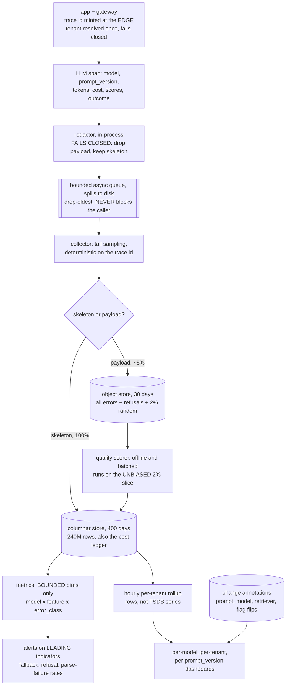
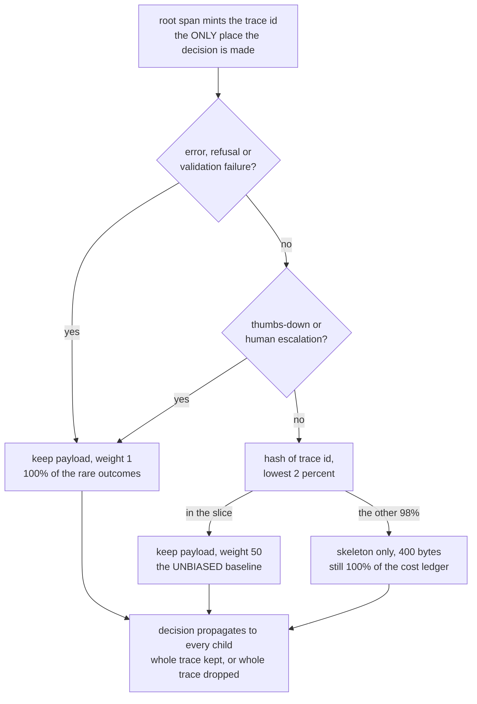
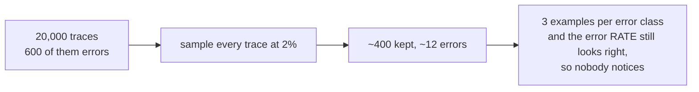
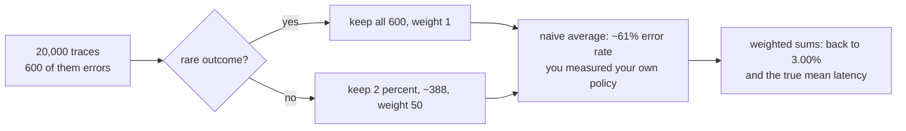
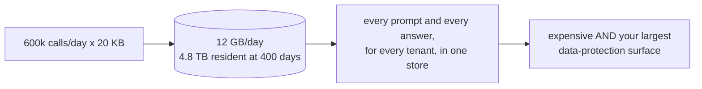
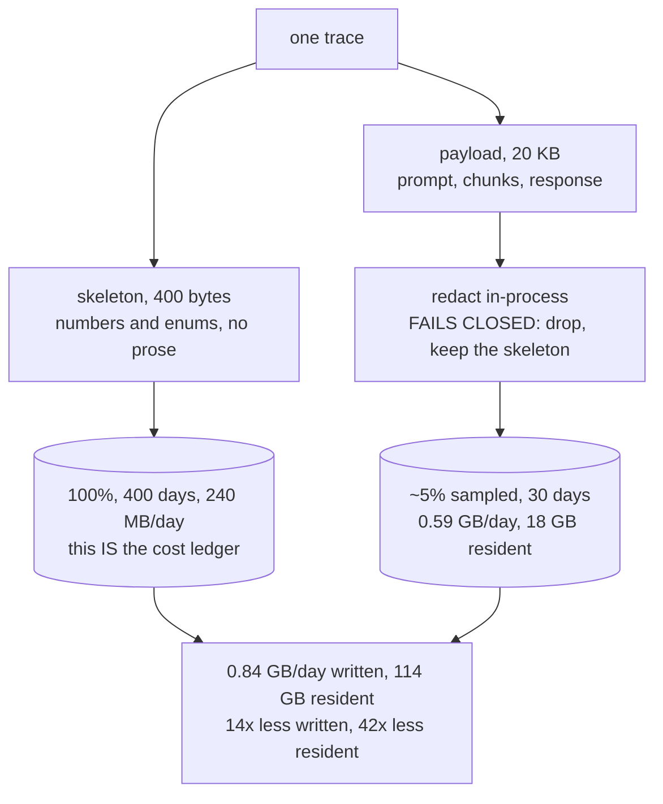
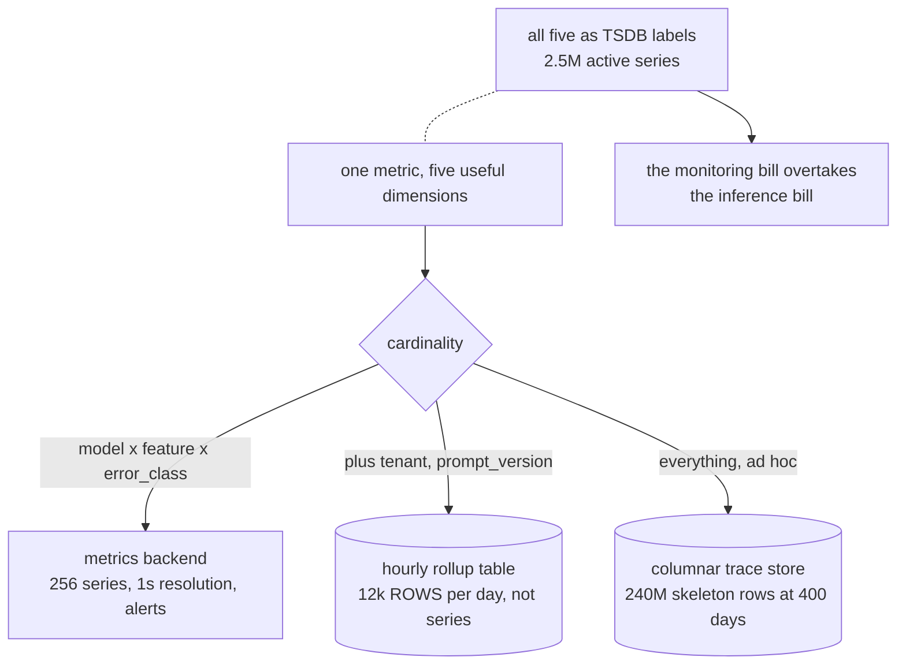
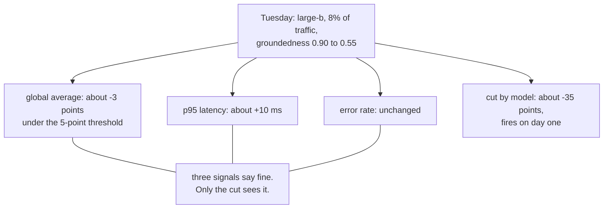

# LLM observability — diagrams

## 1. The whole system, end to end

Read it as one span's life: emitted with the tenant already attached, redacted before it leaves
the process, buffered so the application never waits on the collector, then split. The
**skeleton** goes everywhere and is never sampled — it is the cost ledger. The **payload** is the
only thing that is sampled, redacted and expired, because it is the only thing that is both
expensive and sensitive. The annotations feed the dashboards so a quality dip arrives with a
list of candidate causes attached.

---

## 2. The sampling decision — made once, at the root

Three things are load-bearing. The hash is on the **trace id**, so a kept trace is complete
rather than four spans out of six. The decision is made at the **root** and propagated, so no
downstream service disagrees with it. And rare outcomes bypass the dice entirely, because
sampling errors at the same rate as successes leaves you a dozen error traces a day.

---

## 3. Why the sample needs weights

#### Uniform 2% — the corpus you cannot debug with

#### Stratified, then re-weighted

The failure in the first block is silent: the *rate* is fine, so the dashboard looks healthy
while the debugging corpus is empty. The trap in the second is louder and worse — keeping every
error and averaging the retained set unweighted publishes a 61% error rate. `solution.py`
asserts both numbers.

---

## 4. The record split, and the storage arithmetic

#### Log everything

#### Split it

One trace becomes two records with different retentions, because they have different costs and
different liabilities. Notice where the redactor sits: inside the process, on the payload only,
before anything is written. Redaction applied at query time is not redaction — the raw text is
already in the replicas and in last night's backup.

---

## 5. Aggregation: cardinality, and what an average hides

#### Where each metric lives

#### What a global average hides

The two blocks are the same tension from both sides. You need the cut by model and prompt
version or you cannot see the regression; you cannot afford that cut as TSDB labels. Resolve it
by destination rather than by giving up the dimension: bounded labels in the metrics backend,
per-tenant detail as **rows** in an hourly rollup, and everything else answered ad hoc against
the columnar store.
