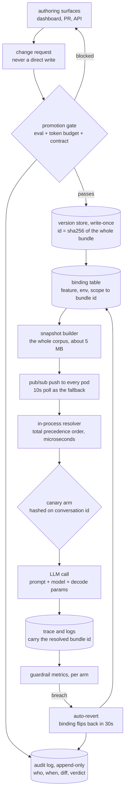
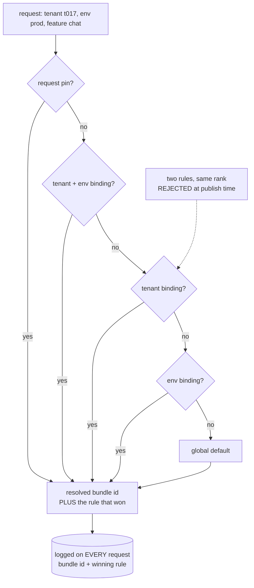
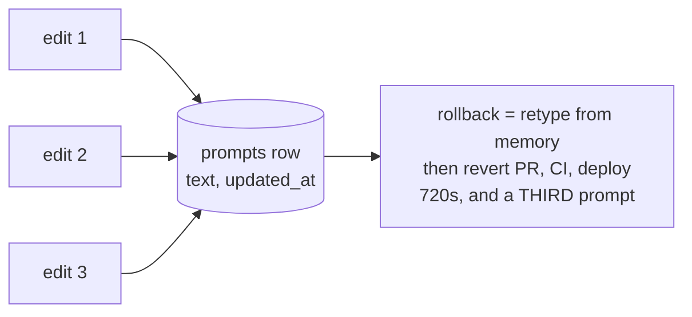
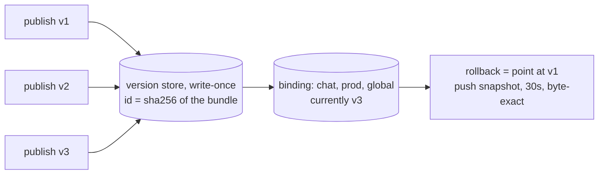
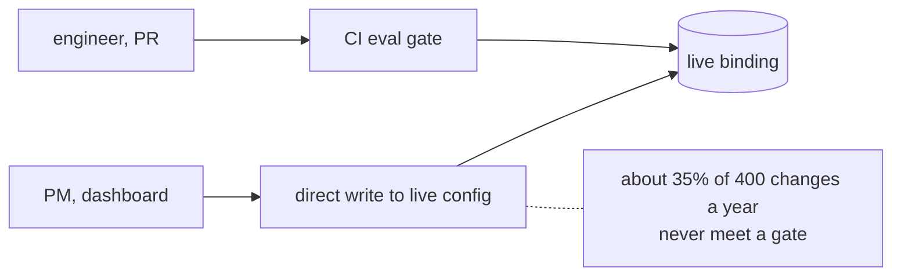
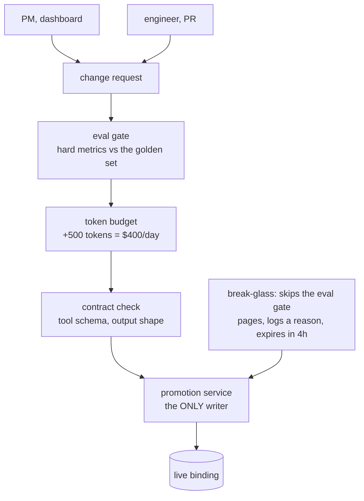
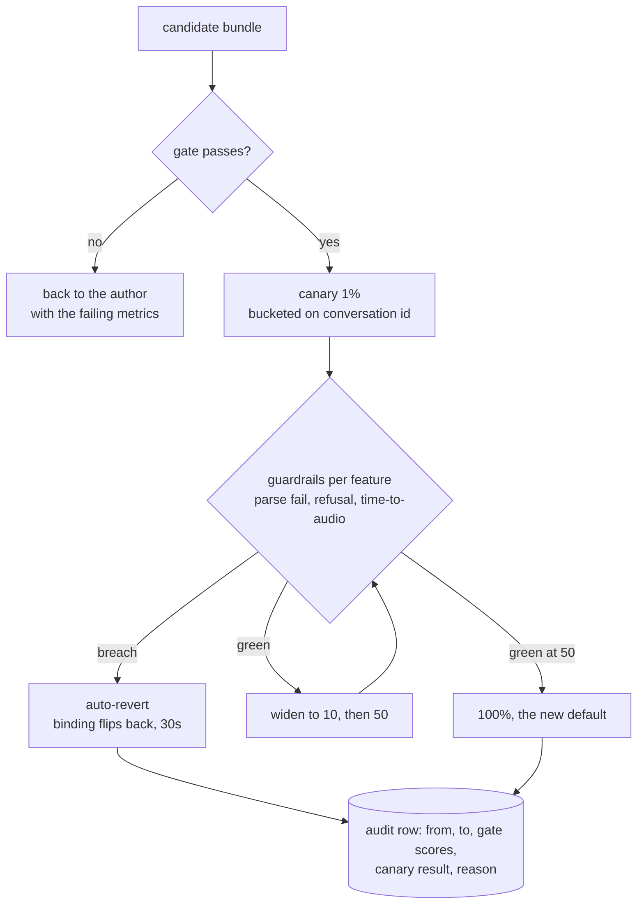

# Prompt and config management — diagrams

## 1. The whole system, end to end

Read it as one change and one request sharing a spine. The control plane runs
left of the resolver — nothing there is in the request path. The data plane
resolves from an in-memory snapshot, so a config-store outage cannot fail an LLM
call. Two edges close the loop: guardrails to auto-revert, and everything to the
audit log.

---

## 2. Precedence — the thing that actually breaks

Highest rank wins outright — never a merge, because a merged prompt is one nobody
wrote and nobody evaluated. The dotted edge is the part people skip: equal-rank
ambiguity is refused when the binding set is published, not resolved arbitrarily
at read time. And the resolver returns *which* rule won, so "why did this tenant
get that prompt" is a log line rather than an argument.

---

## 3. Rollback: rows versus versions

#### Mutable rows — rollback is a rewrite

#### Immutable versions + a binding — rollback is a pointer flip

24× faster is the headline; byte-exactness is the point. The mutable row has
nothing to roll back *to*, so recovery depends on someone remembering a prompt
correctly during an incident.

---

## 4. The gate: available versus unavoidable

#### Available — a gate with a door beside it

#### Unavoidable — one writer

The difference is not the checks — both diagrams run the same ones. It is whether
a second write path exists. Break-glass is drawn deliberately: a gate with no
emergency path becomes the outage the first time its provider is down.

---

## 5. The promotion lifecycle, with auto-revert

Bucketing on conversation id rather than request id is the detail that makes the
canary measurable: a thread that straddles both arms measures the seam, not the
change. Guardrails differ per feature — extraction watches parse failures, voice
watches time-to-first-audio — and a single shared error rate catches neither.
