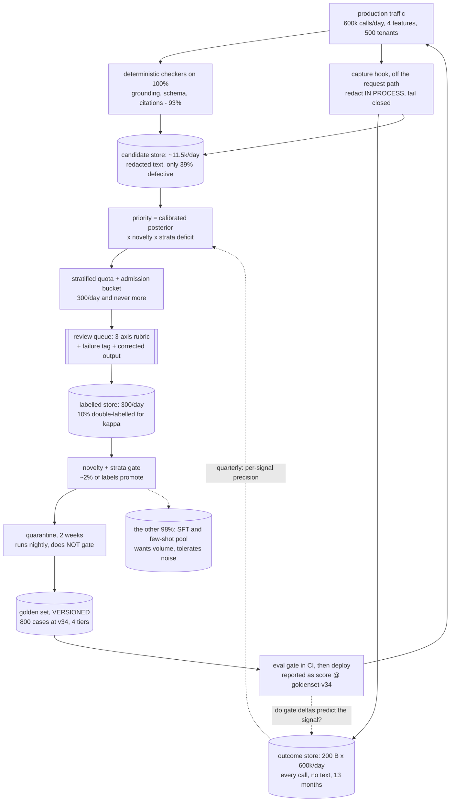
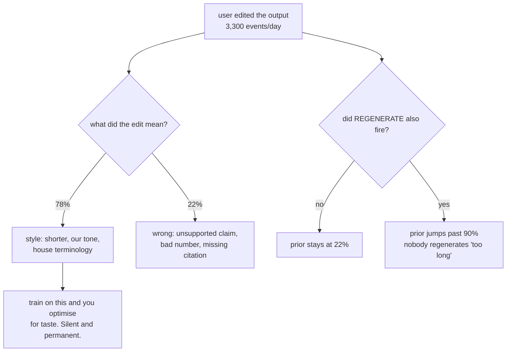
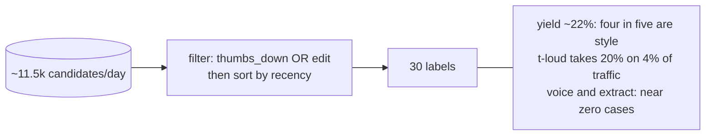
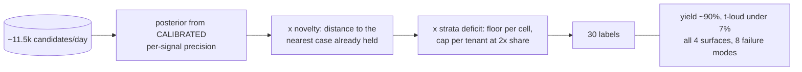
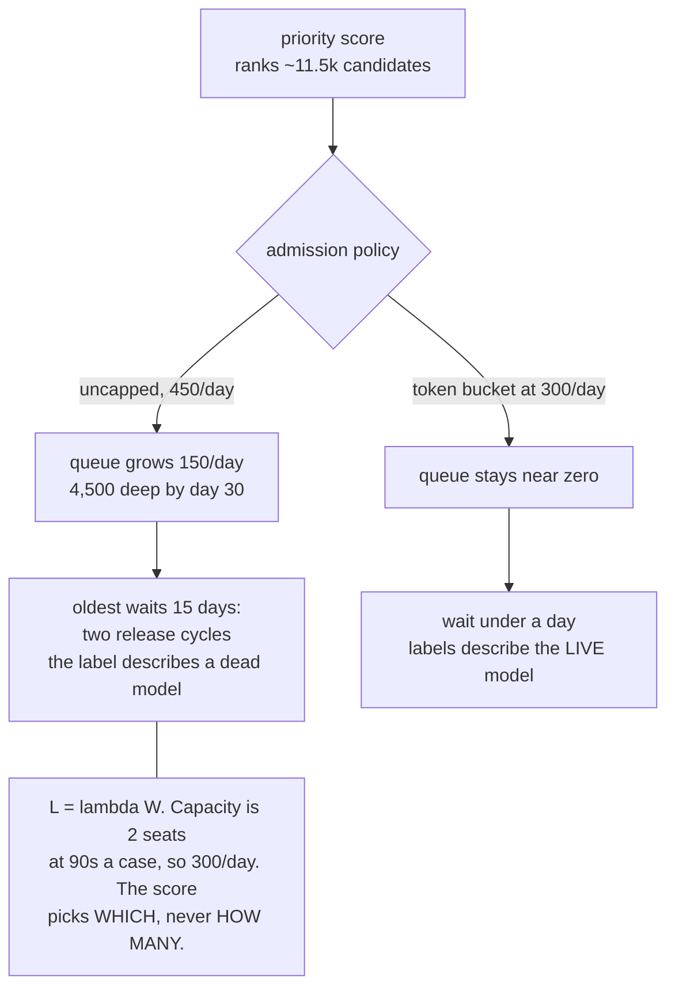
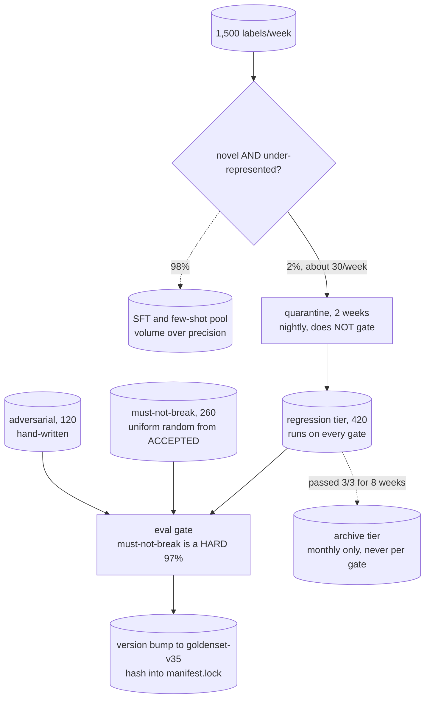

# The feedback flywheel — diagrams

## 1. The whole system, end to end

Read it as one loop: traffic in at the top, a gated deploy back into traffic at the bottom. Two things
separate it from a logging pipeline. The **outcome store holds every call and no text**, which is what
lets you compute signal rates and calibration weights without keeping a corpus of PII. And there are
**two dotted feedback edges, not one** — calibration teaches the sampler what each signal is worth, and
the correlation check asks whether the gate predicts anything. Cut either and the loop still runs,
still looks busy, and stops being worth running.

---

## 2. What "the user edited it" actually means

The left branch is the trap: four in five edits are preference, and an eval set built from them gates
releases on tone. The right branch is the cheap escape — a second weak signal agreeing costs nothing
and moves the prior further than any single strong signal does.

---

## 3. The sampler: same 30 labels, two very different sets

#### Naive — log thumbs and edits, work the recent ones

#### Priority — calibrated posterior, novelty, strata

Same budget, same pool, four times as many labels worth having. The cap is not redundant with the
score: the posterior is calibrated globally, so it under-penalises the one tenant whose base click
rate is anomalous.

---

## 4. The review queue is the only queue that cannot autoscale

Everything else here runs at 0.13 events/second. The constraint is two people, and a queue fed faster
than they drain it does not degrade gracefully — it silently starts producing labels for a model that
no longer exists, and a stale label still counts.

---

## 5. Promotion, quarantine, retirement, versioning

Three sources feed the gate and only one comes from the flywheel. **Must-not-break is sampled
uniformly from the accepted class** — the tier that stops a model that refuses everything scoring
brilliantly, and it must be a hard threshold because inside a composite the arithmetic still lets it
through. Retirement is not tidying: without it the pass rate climbs to 98% and the set quietly stops
discriminating.

---
