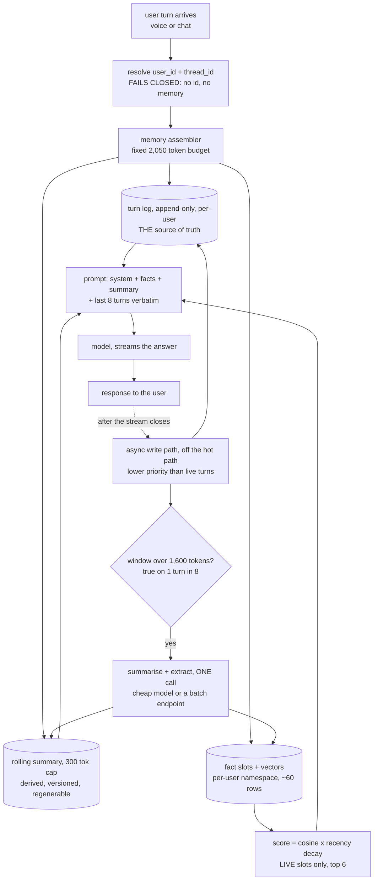
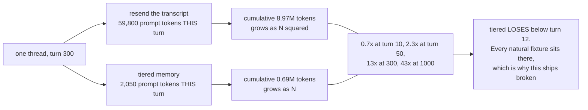
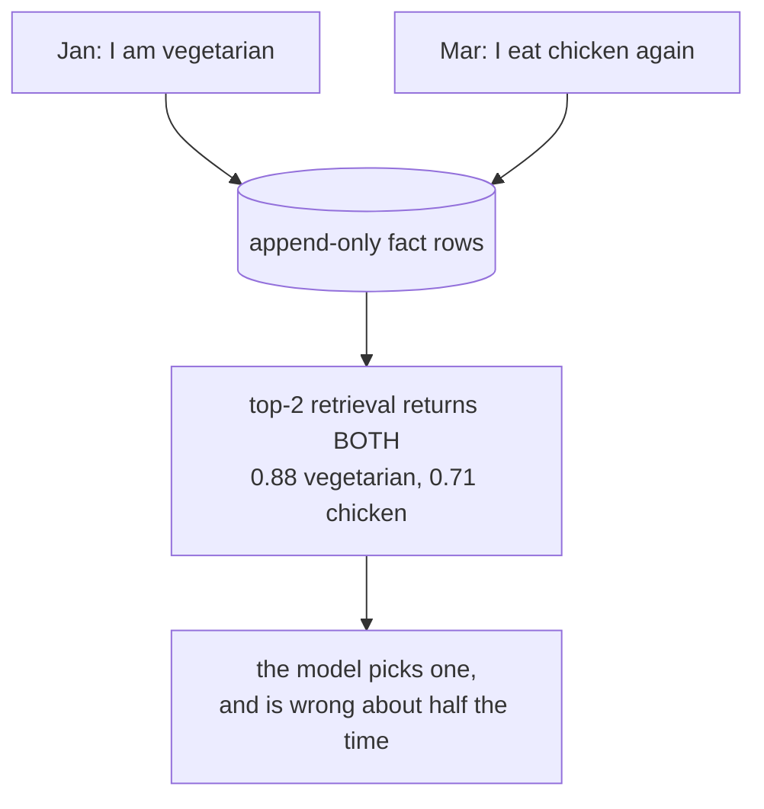
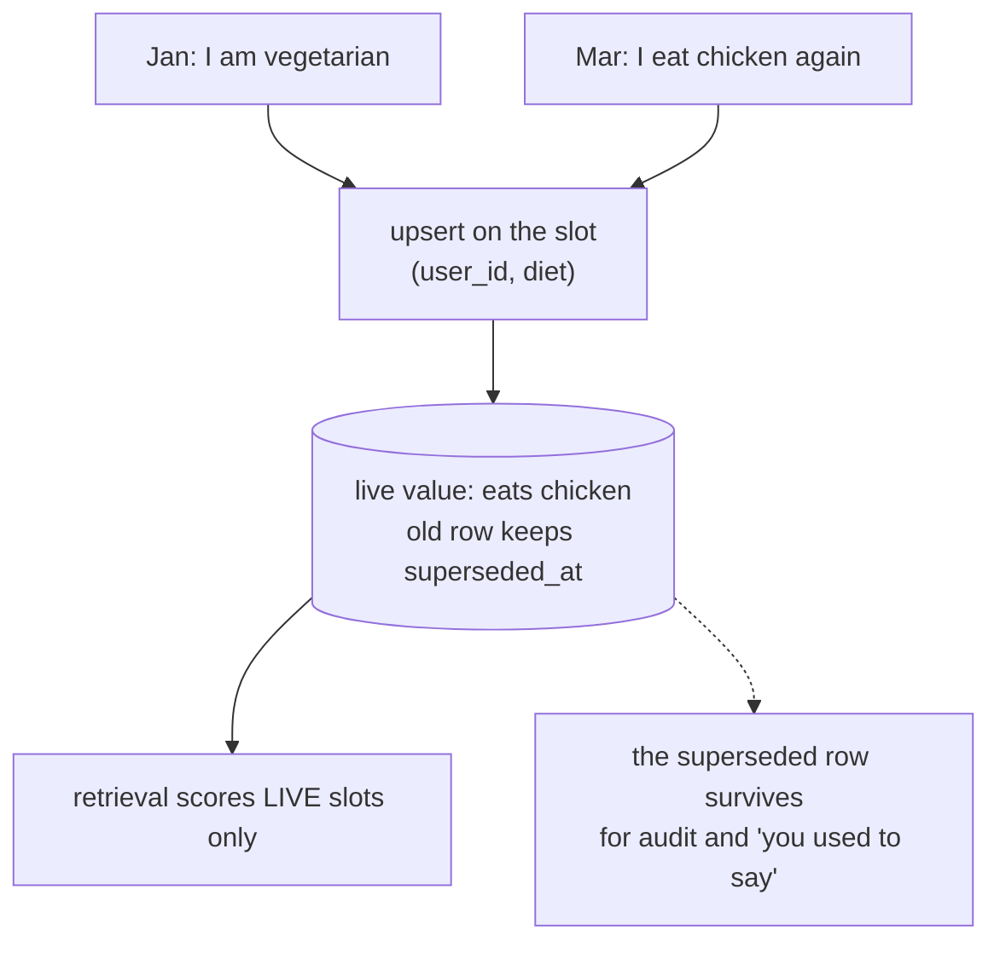
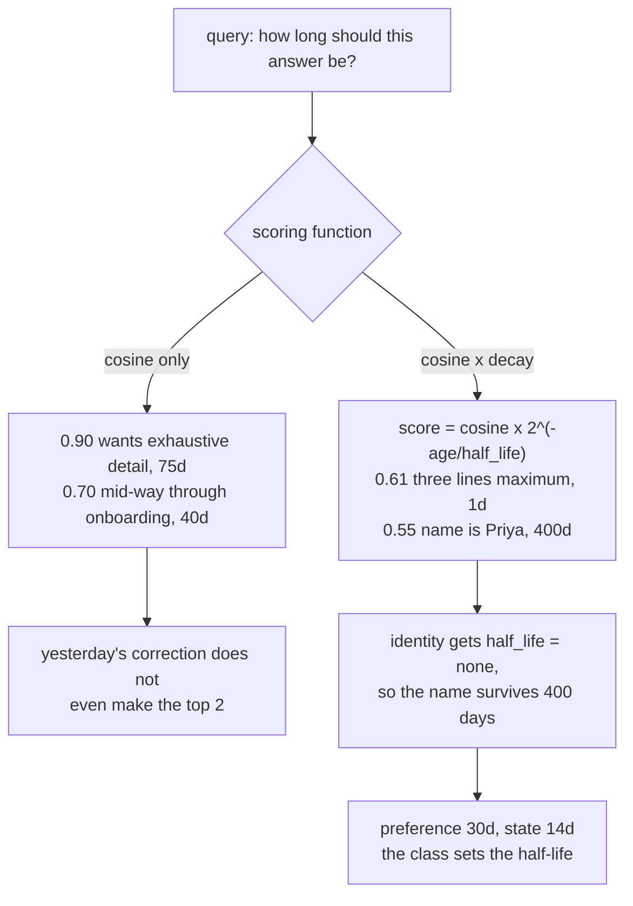
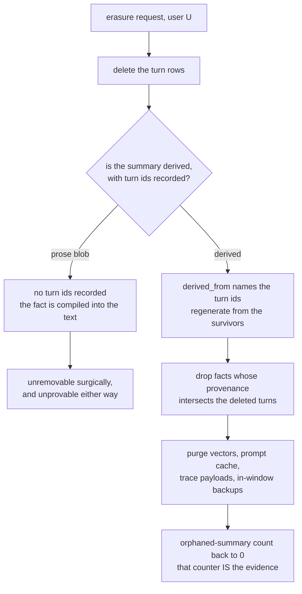

# Conversation memory — diagrams

## 1. The whole system, end to end

Read it as one turn. The read half is three cheap lookups against a per-user
namespace, assembled to a fixed token budget and handed to the model. The write
half hangs off the *end* of the stream, and on seven turns in eight it does
nothing but append a row. The only synchronous write is the turn-log append,
because that is the source of truth everything else regenerates from.

## 2. Why the cost shape is the whole scenario

Notice the left end of that ratio. Tiered memory is genuinely more expensive on
short threads, so a ten-turn test rewards the wrong design. The metric that
catches it is memory tokens per turn plotted **against turn index** — you alert
on the slope, never on the level.

## 3. Contradiction: a log cannot resolve it, a slot already has

#### Append-only fact log — the bug

#### Slots — the fix

The conflict is resolved at **write** time, so retrieval has nothing to
disambiguate. A log pushes that decision into the model, which is the one place
in the system with no way to make it.

## 4. Ranking: relevance alone is not enough

Supersession and decay are not the same mechanism. Supersession kills conflict
*within* a slot; decay kills staleness *across* slots, which is what you get
when the extractor emits `answer_style` and `answer_length` as separate rows —
and it will.

## 5. Erasure: the derived artefacts are the hard part

Deleting the turn is the easy half. Everything derived from it — the summary,
the extracted facts, their embeddings, the cached prompt — is derived personal
data and has to go with it. That requirement is what forces summaries to be
regenerable rather than authoritative, and it is worth deciding on day one
because it cannot be retrofitted onto a prose store.
