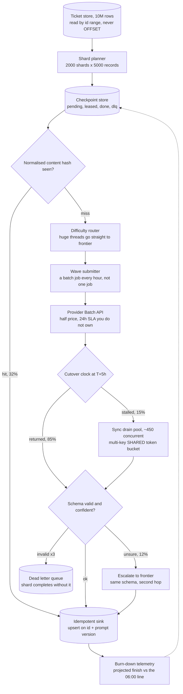
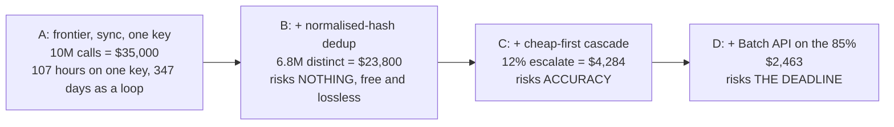
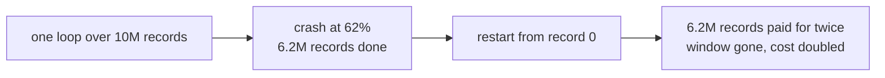
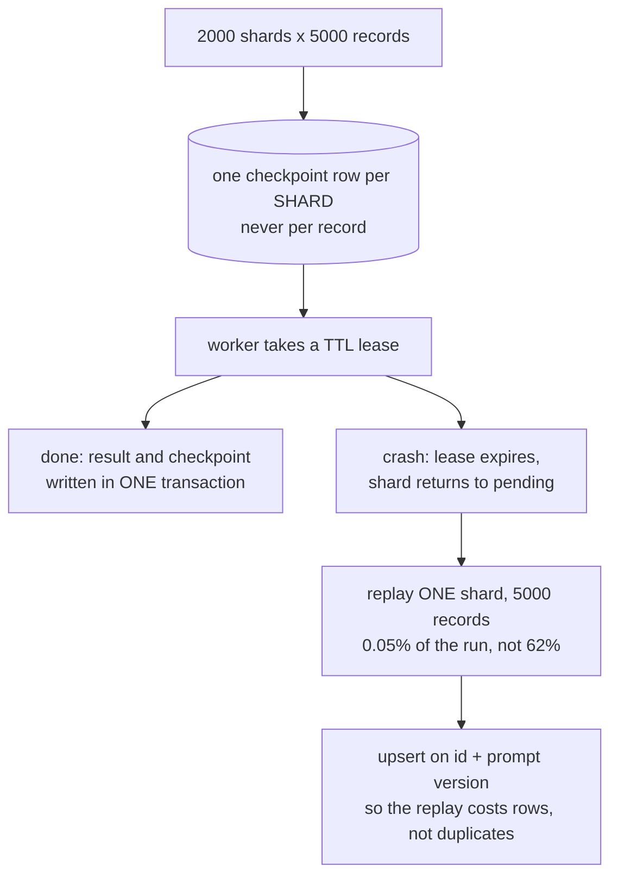
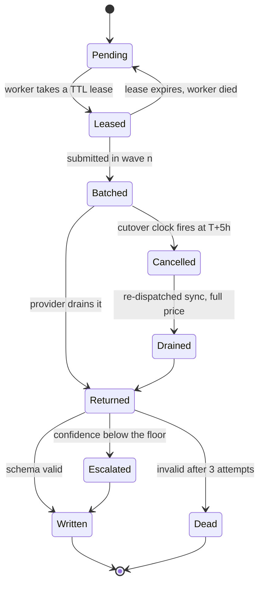
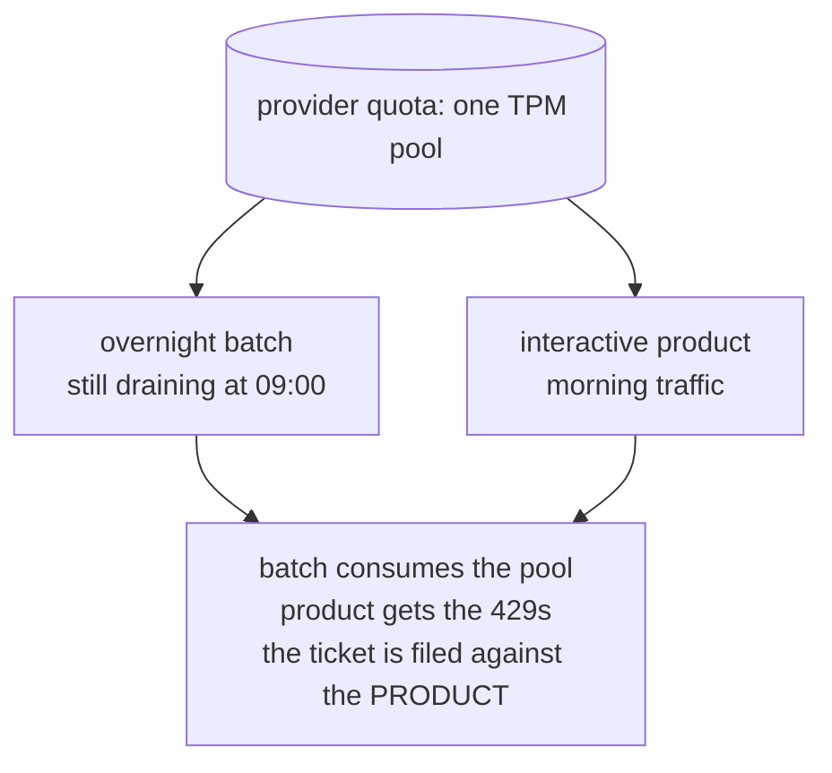
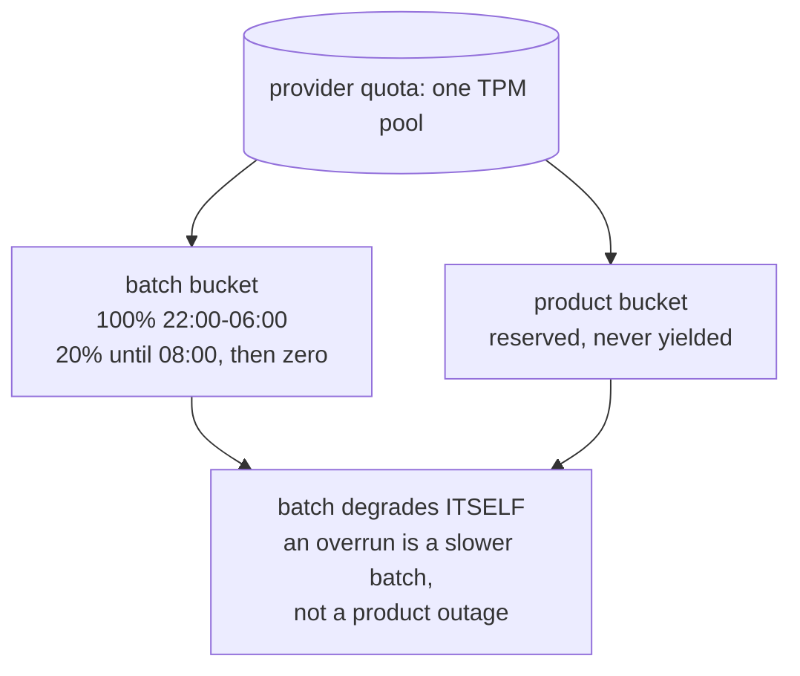

# 10M records overnight — diagrams

## 1. The whole system, end to end

One record's path: hash first (a third never reach a model), then a difficulty decision, then
the Batch API with a clock over it, then validation, then an upsert that is safe to repeat. The
only feedback edge is telemetry writing progress back to the checkpoint store — everything else
flows one way, which is what makes a replay cheap.

---

## 2. The cost ladder, and what each lever risks

Take them left to right, and notice the ordering is not by size. Dedup goes first because it is
free; the Batch API goes last because it is the only lever that can make you miss the window,
and it has to be insured against with the cutover clock in diagram 4.

---

## 3. Resumability

#### No checkpoint — progress lives in a variable

#### Shard leases and checkpoints

Waste on a crash is bounded by *workers in flight × shard size*, not by how far into the night
you were. That is why the shard is sized in seconds of work — under a minute — rather than in a
round number of records.

---

## 4. A shard's life, including the cutover

Two exits, both deliberate. `Cancelled` is the deadline insurance — you stop waiting on someone
else's queue and pay full price for the remainder. `Dead` is the poison-record exit that lets
the shard reach `Written` for everything else instead of spinning on one malformed ticket.

---

## 5. One quota pool, two workloads

#### Batch at full throttle after 06:00

#### The batch as a low-priority tenant

The provider sees one tenant, so the fairness has to be yours. This is the dedicated-Celery-queue
bulkhead argument applied to quota instead of workers: the thing that overruns must be the thing
that suffers.
