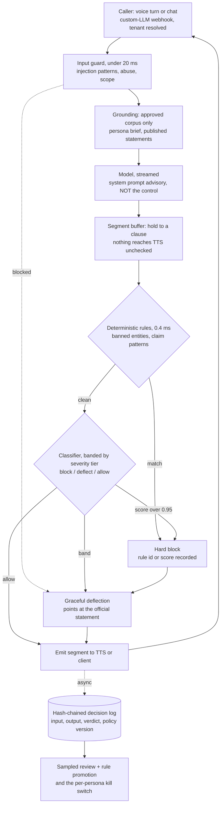
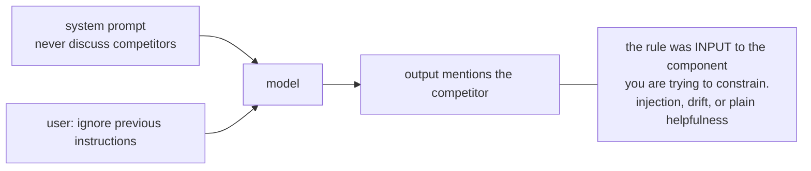
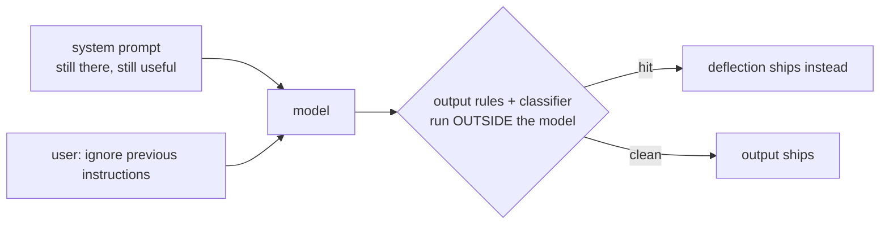
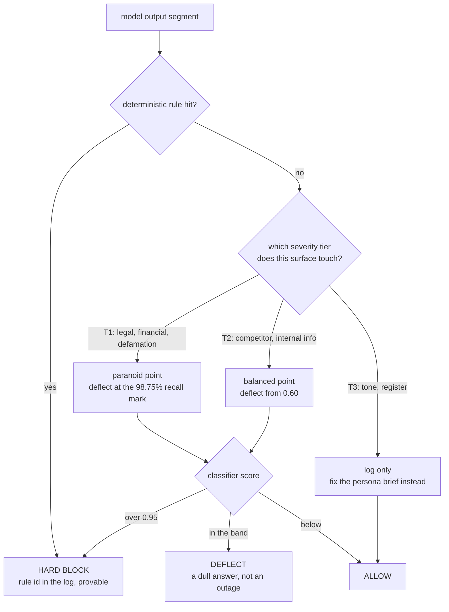
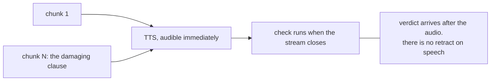
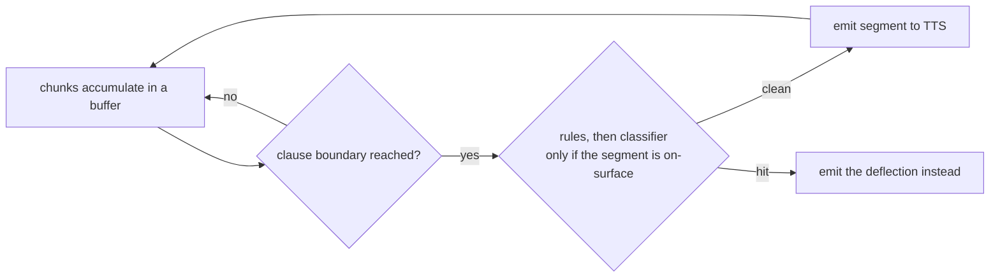
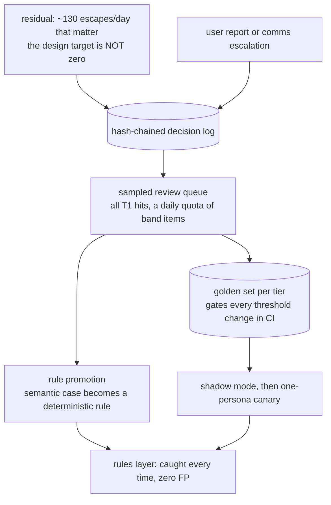
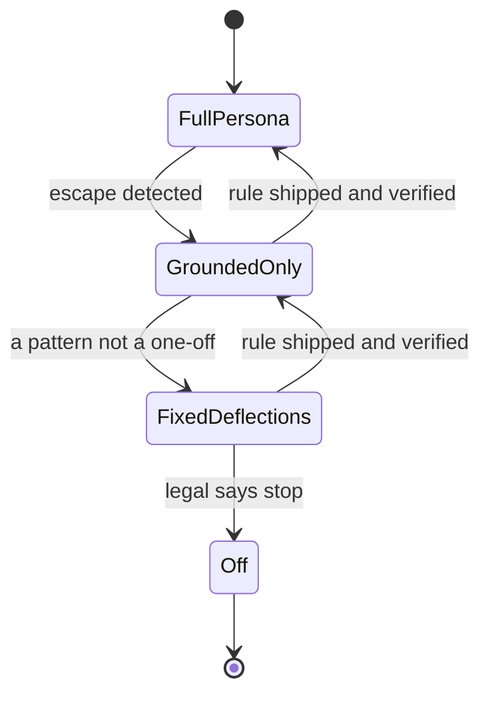

# Guardrails and content safety — diagrams

## 1. The whole system, end to end

Read it as one turn. Three refusal points, deliberately different: the input guard drops
instructions before they reach the model, the rules stop the enumerated classes at zero
latency, and the classifier's band becomes a *deflection* rather than an error. Everything
after `OUT` is off the critical path — the log write must never hold up audio.

---

## 2. Where enforcement lives — the trap and the fix

#### Prompt-level: advisory, and one line defeats it

#### Enforced: the model does not get a vote

The system prompt stays — it raises the base rate of good behaviour cheaply. It just stops
being the thing you rely on. Same argument as authz: policy is evaluated in the request path,
not requested politely from the caller.

---

## 3. The banded decision, and why tiering exists

The band is the whole trick: containment is identical to a single threshold, but the mass of
false positives lands on *deflect* instead of *block*. Tiering is the second trick — one global
threshold forces a choice between 60 escapes a day and 57,000 blocked answers, and severity
tiers refuse that choice by applying the expensive point only to the narrow T1 surface.

---

## 4. Streaming to TTS — the bug and the gate

#### Checked at stream close: already spoken

#### Segment gate: buffer to a clause boundary

Cost is one segment of buffering — 8 to 15 tokens, ~200 ms at 50 tok/s — and only on the first
segment, because every later one is checked while the previous is still playing. Chat gets a
cheaper deal: stream optimistically and replace the bubble.

---

## 5. The residual — detected and recoverable, not prevented

This is the only loop in the design that makes the system better over time, and it is the
justification for the review queue's cost. A promoted rule moves a case from *caught 78% of the
time at a false-positive price* to *caught every time at zero* — which is why the first hour of
an incident is spent shipping a rule, not retraining anything.

---

## 6. Kill switch: a ladder, not a toggle

Scoped per persona, read per turn, not per deploy. A hard `Off` on a live voice product is
often worse than a dull persona, so the ladder exists to give the incident commander a choice
that isn't "outage or risk".
