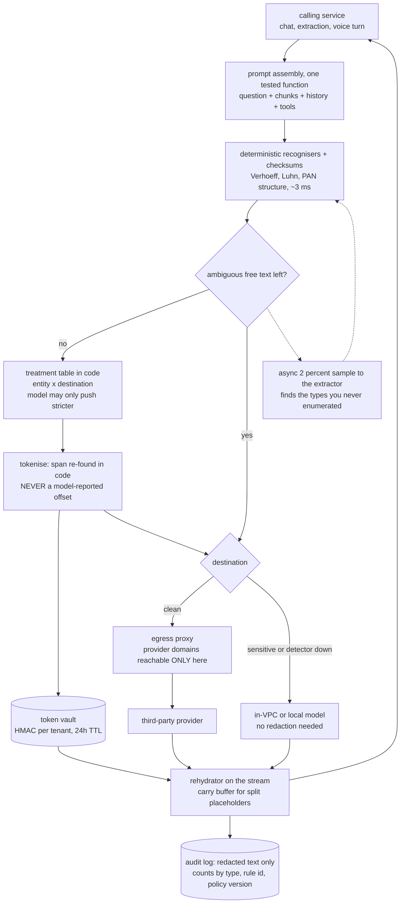
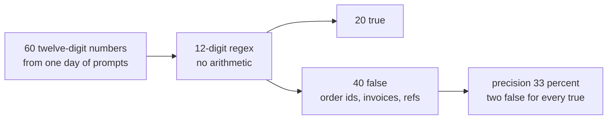
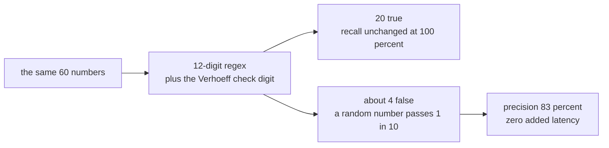
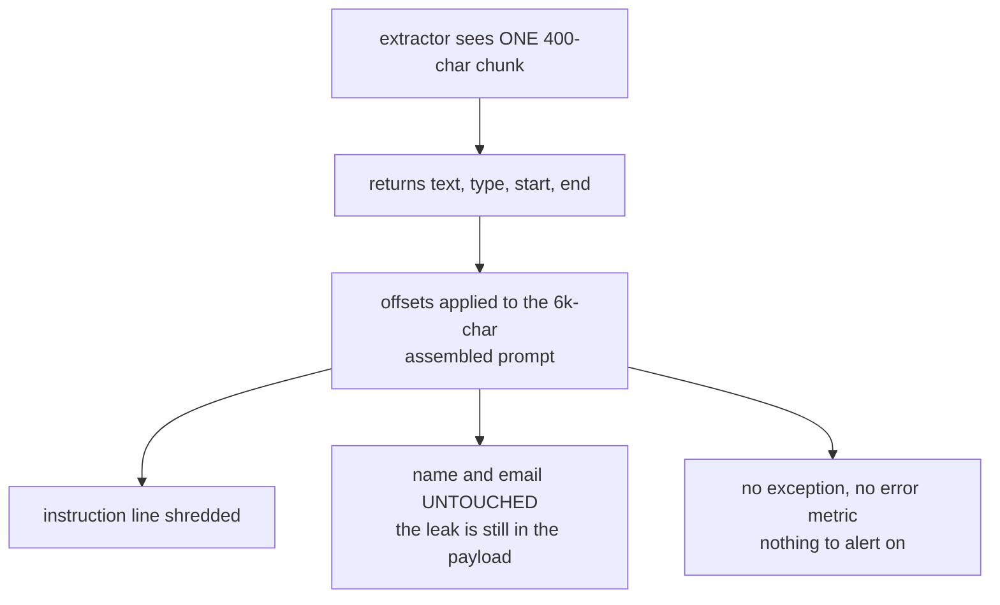
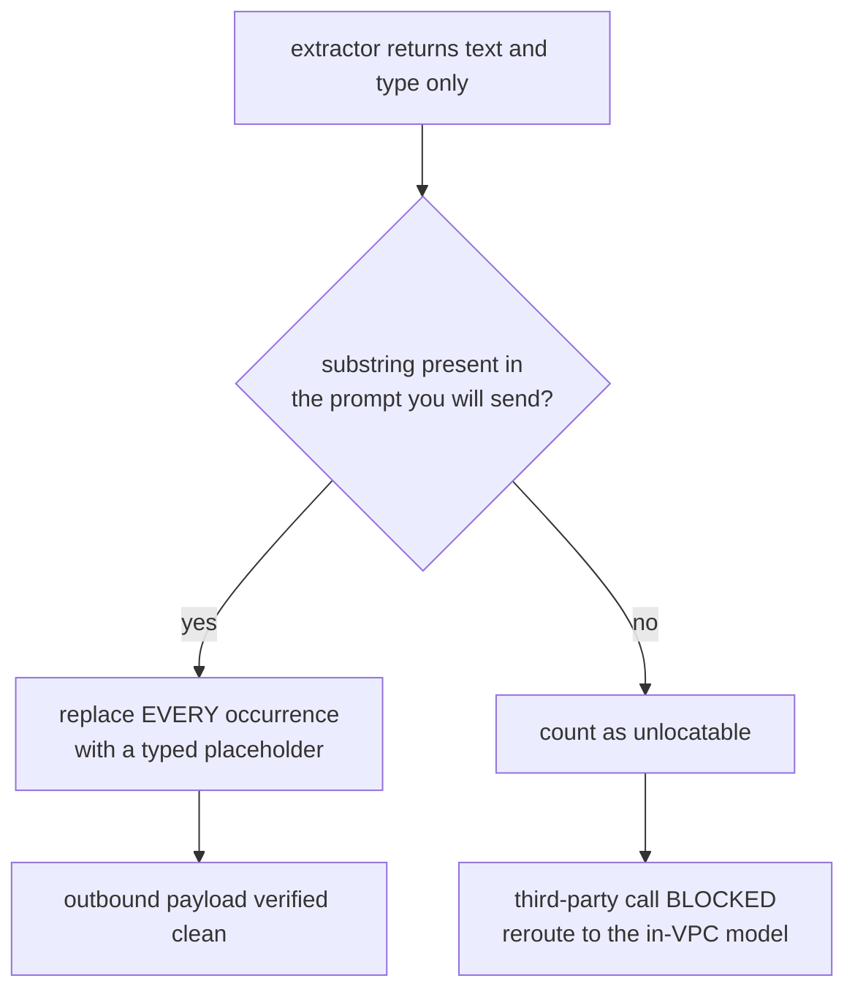
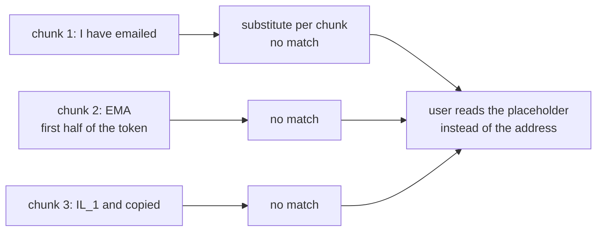
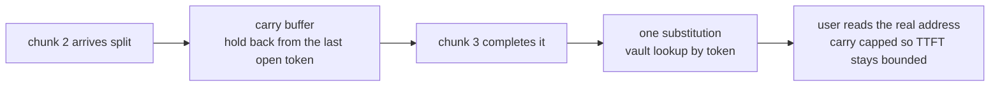
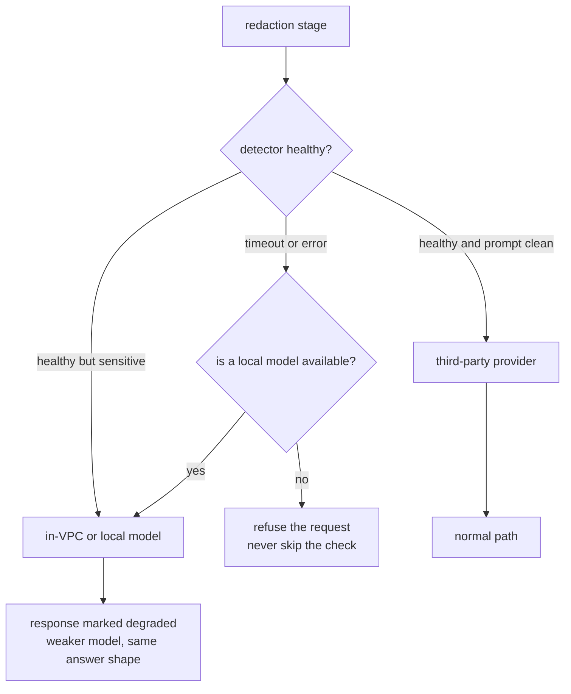

# PII redaction gateway — diagrams

## 1. The whole system, end to end

Read it as one request. The stage sits **after** prompt assembly, because the retrieved chunks
and tool outputs carry more PII than the user's question ever does. Ambiguity is a branch to a
different **destination**, not a wait on a model. The vault is touched twice — mint on the way
out, look up on the way back — and it is the only new store this design creates. The egress
proxy is the box that turns the whole thing from a convention into a guarantee: nothing else in
the estate can reach a provider domain at all.

---

## 2. Why a checksum is free precision

#### Bare regex

#### The same regex, plus the check digit

The identifiers people worry about mostly carry arithmetic — Verhoeff on Aadhaar, Luhn on
cards, structure on PAN and GSTIN, a bank-code table for IFSC. Using it is the only precision
fix that costs no recall, which matters because everything else in this design is tuned to
over-detect.

---

## 3. Spans: the model's offsets index a string you no longer have

#### Trusting start and end

#### Re-finding the substring in code

The model was not lying about the offsets — it never saw the assembled prompt. Substrings are
invariant to where they sit, positions are not. And note the `unlocatable` branch: an entity the
model reported but you cannot locate is not a clean prompt, it is an unverified one.

---

## 4. Reversal, and the placeholder that arrives in two pieces

#### Naive per-chunk substitution

#### With a carry buffer

Same failure shape as buffering a stream to count tokens: invisible to every non-streaming
test, and the first thing a user reports. The cap on the carry is what keeps the fix from
becoming the bug it replaced.

---

## 5. Fail closed means change the destination, not skip the check

The whole ladder turns on one clarifying question. With a local or in-VPC model, a detector
outage is a quality event; without one, it is an availability event. Notice this is the
opposite call from rate limiting, where failing open is right — a missed rate limit costs
money, a missed redaction costs a disclosure.
