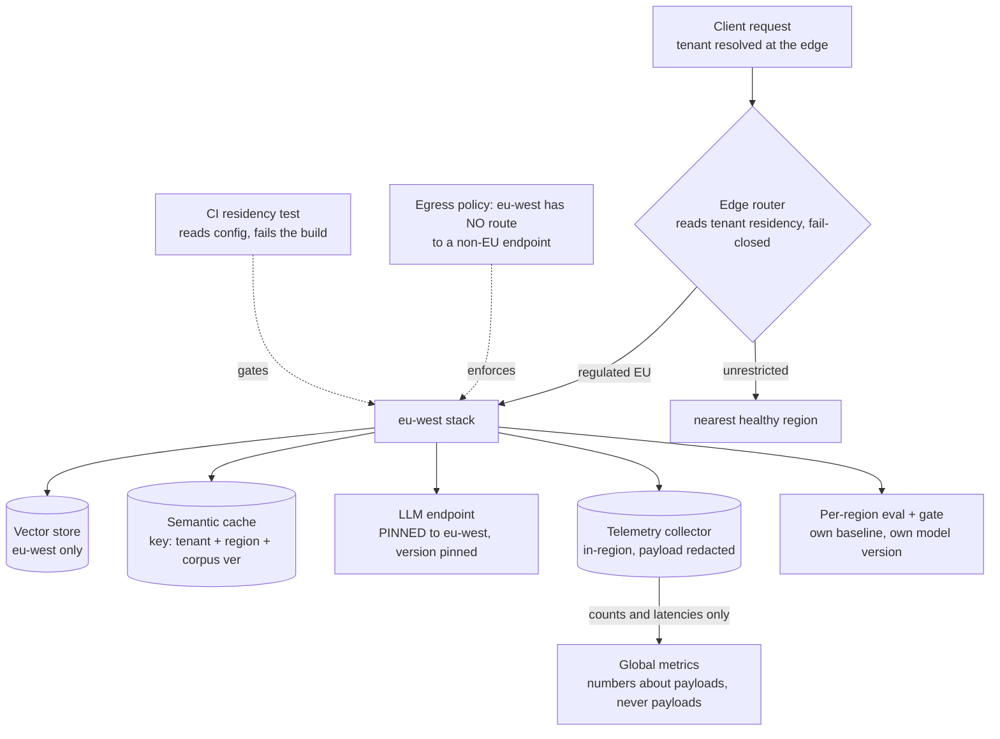
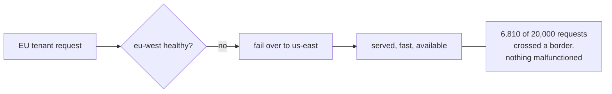
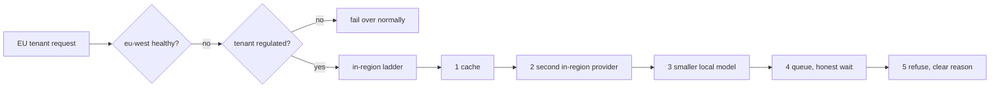
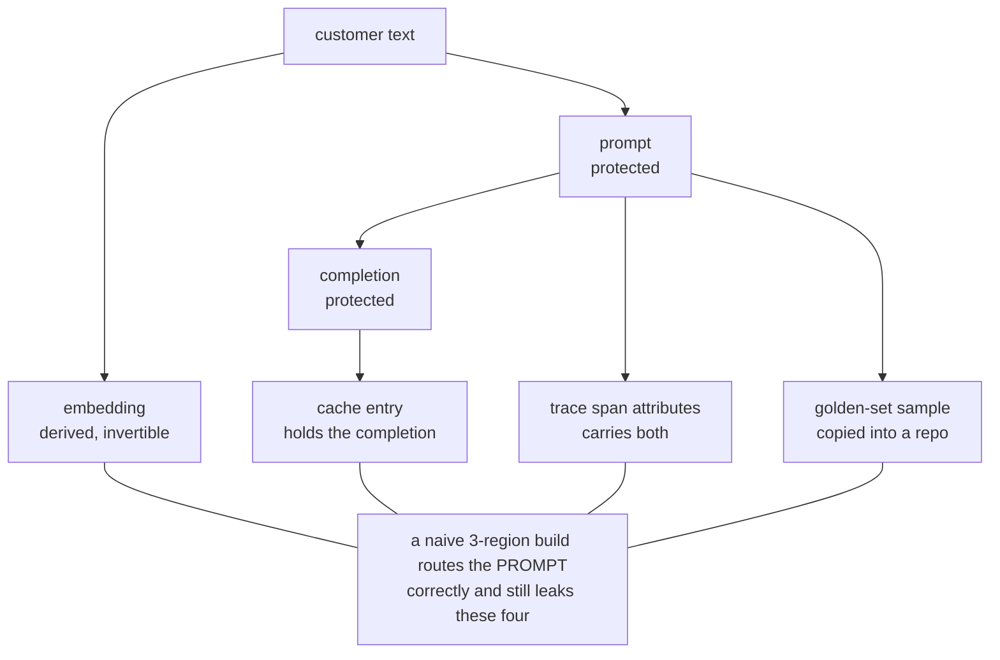
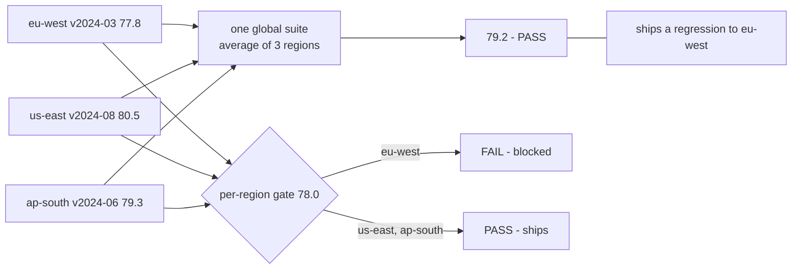
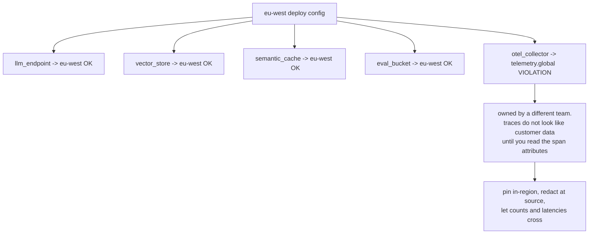
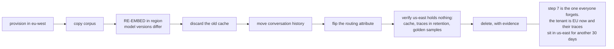

# Multi-region residency — diagrams

## 1. The whole system, end to end

The edge is the only place the routing decision is made. Everything inside a regional box is
local by construction — which is exactly why a leak there is invisible in code review.

---

## 2. Failover: the best practice that is the breach

#### Nearest healthy region — correct everywhere else

#### Residency-aware — degrade in place

Availability and residency are in direct conflict. Residency wins, so the ladder has to exist
before the incident — one improvised during an outage is cross-region failover with extra steps.

---

## 3. What counts as personal data

Every leaking artefact is a sensible default that shipped before residency was a requirement.
The prompt is the one everybody protects and the least likely to escape.

---

## 4. One eval suite hides three models

Same model ID, three rollout states. Providers version by region and rarely announce it, so
parity is an assumption you have to test rather than a property you inherit.

---

## 5. The leak a config test catches

Four of five clients regionalised. The test reads **config, not intent**, and fails the build —
which is why it still works after everyone who read the policy has left.

---

## 6. Tenant relocation is a migration, not a flag

