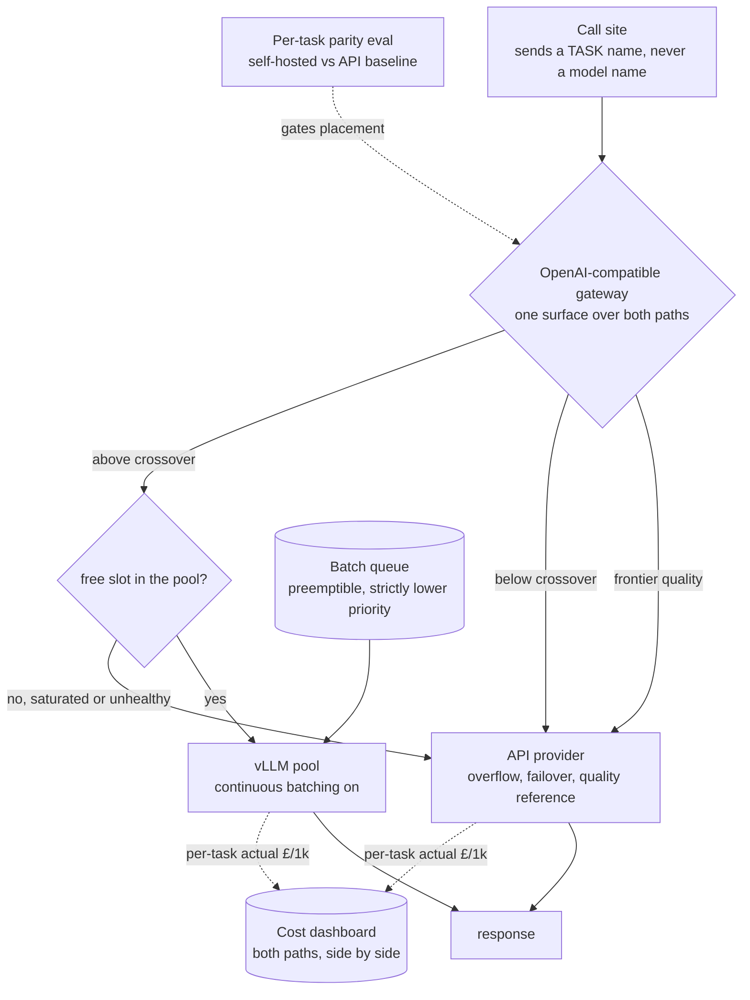
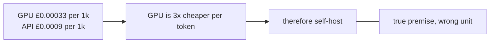
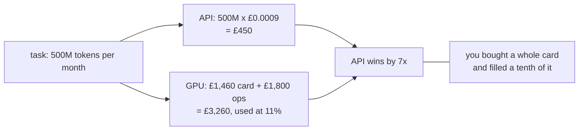
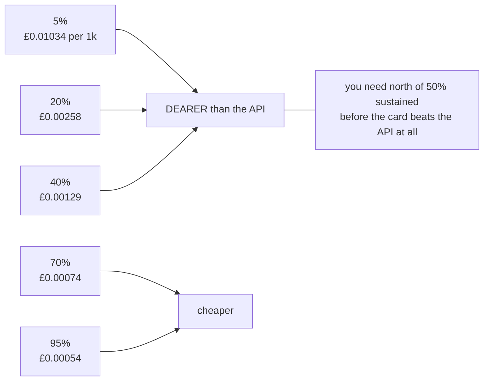
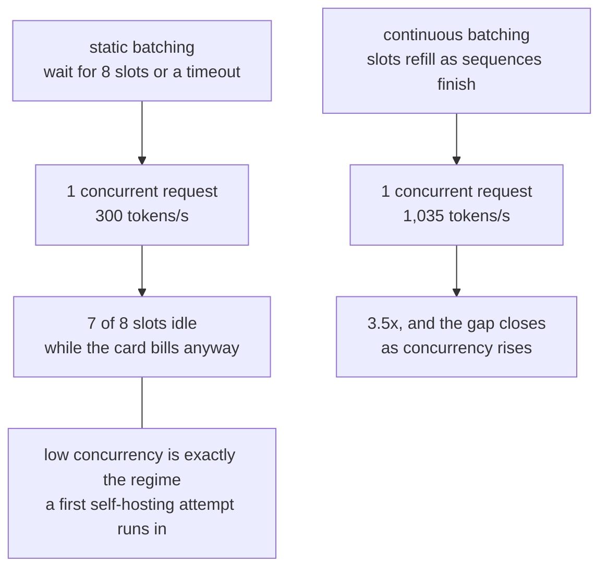
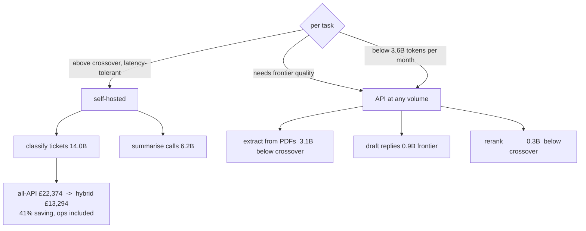
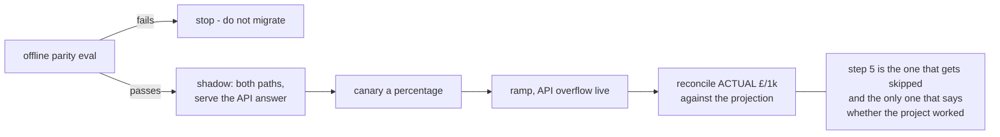

# Hybrid GPU + API — diagrams

## 1. The whole platform

The gateway routes on **capacity**, not on a static map. A task has a preferred home; whether it
lands there depends on whether there is a free slot. That is what stops you paying for idle
cards, and it is why the API path stays live even for fully migrated tasks.

---

## 2. The arithmetic error at the centre of the trap

#### A ratio

#### A product

Per-token price is a ratio; the bill is a product. Only one of them arrives at the end of the
month.

---

## 3. Utilisation is the business case

Interactive traffic is spiky, so you size for the peak and idle through the trough. A fleet
serving interactive only will struggle past 40%. The same fleet with a batch queue behind it
clears 80% — which is why batch work, not a better GPU, is the real unlock.

---

## 4. Continuous batching, and where the waste is

---

## 5. Placement is a table, not a verdict

Two of six tasks move. That ratio is normal, and an answer claiming otherwise has not done the
arithmetic.

---

## 6. Migrating a task, with a way back

