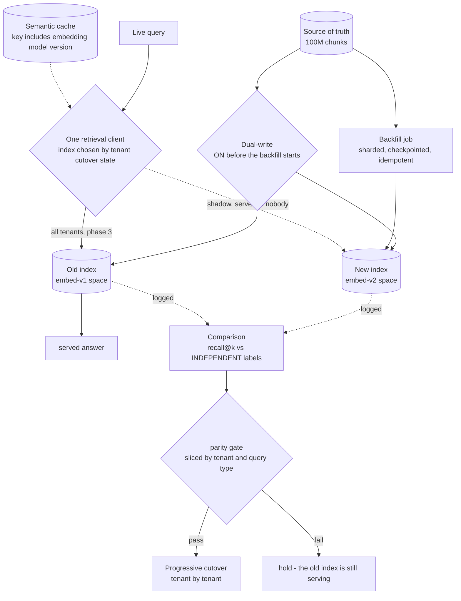
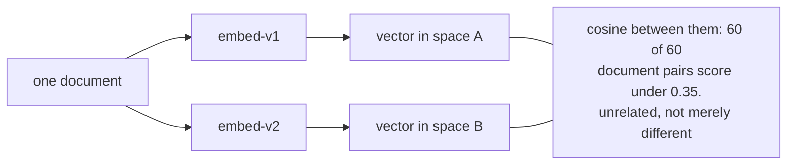
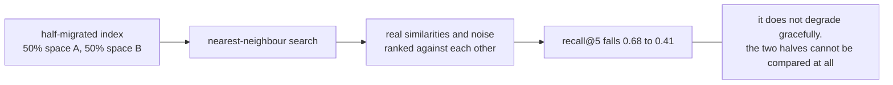
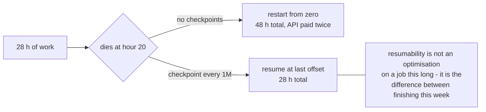
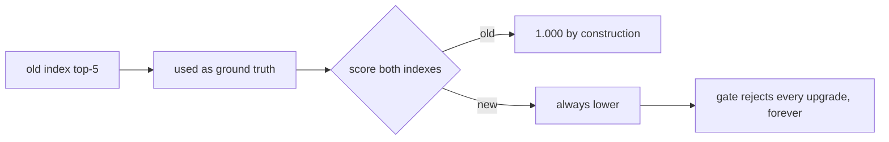
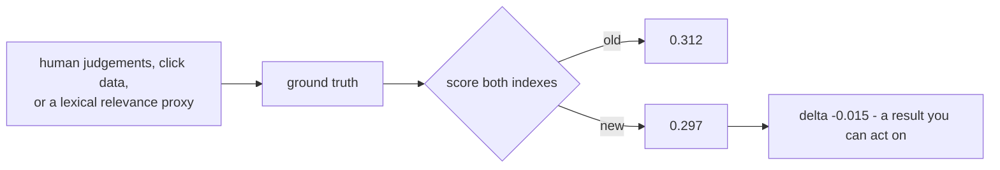
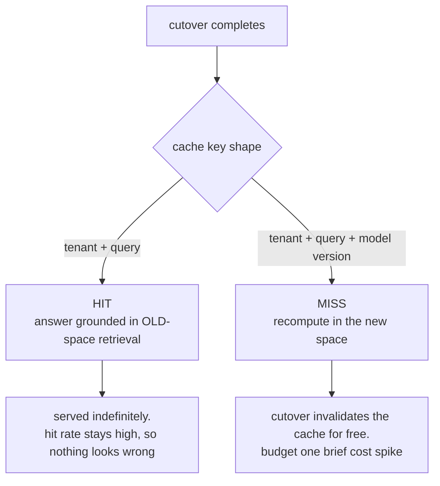
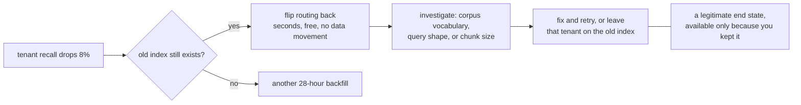

# Embedding migration — diagrams

## 1. The whole migration

Dual-write starts **before** the backfill, or the backfill chases a moving target and never
converges. That ordering is the step most often got wrong.

---

## 2. Why in-place does not exist

Same dimensionality changes nothing: two 768-dimension spaces are exactly as incomparable as a
768 and a 1536.

---

## 3. The backfill, and the hour-20 failure

---

## 4. The labelled set, and the circular version of it

#### Circular — labels from the index under test

#### Independent — labels from neither

---

## 5. The cache, full of the previous universe

The quietest failure in the migration: nothing errors, latency improves, and every answer is
from the world before the change.

---

## 6. Rollback is a routing change, while both indexes exist

