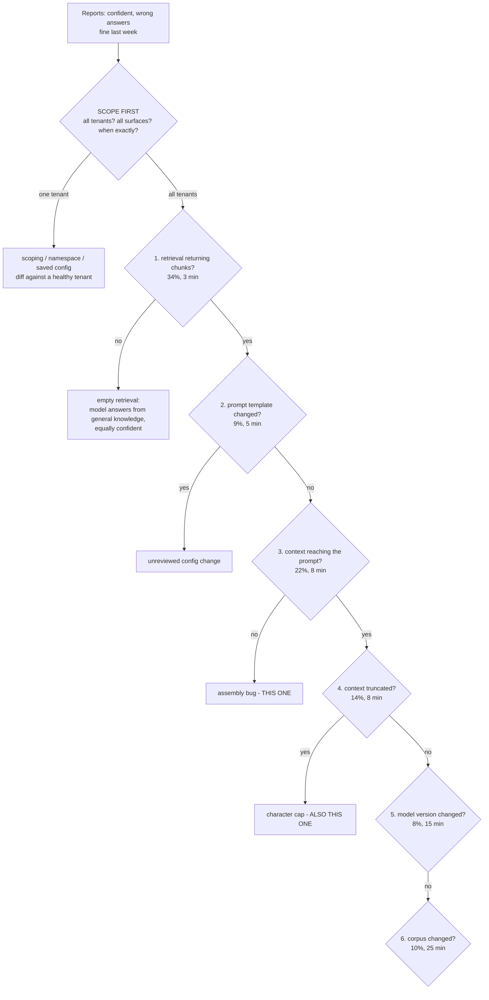
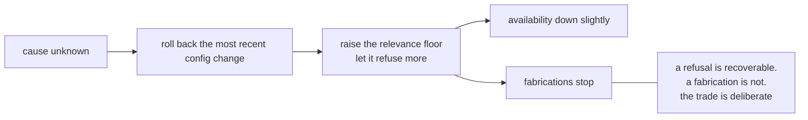
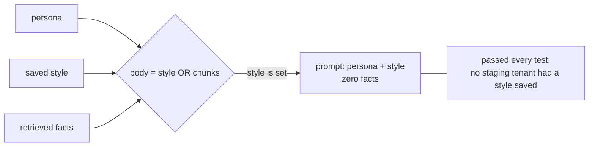
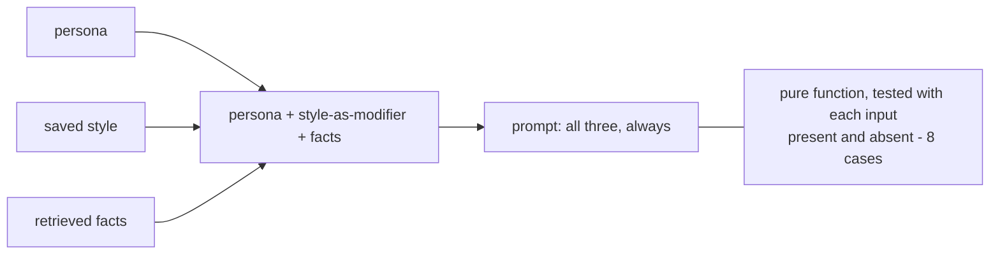
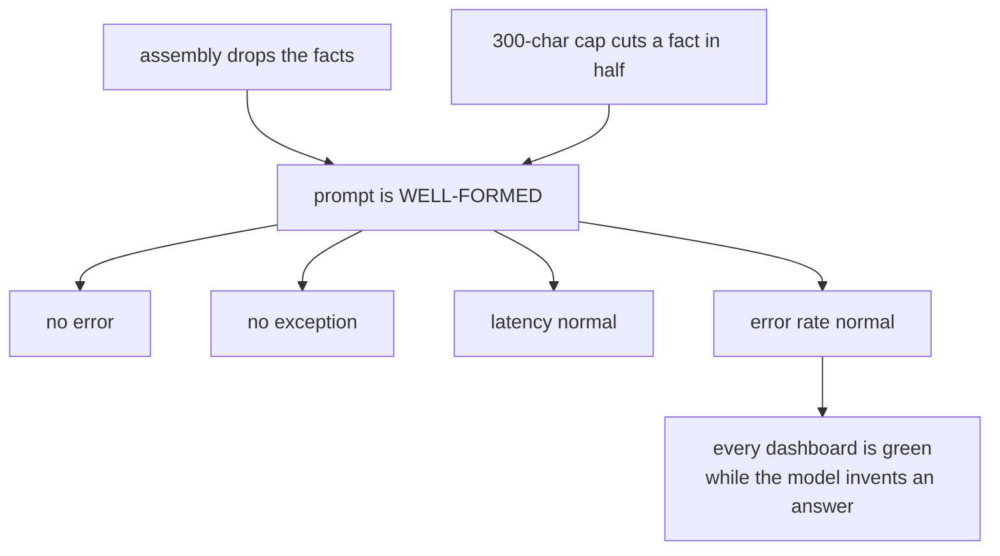
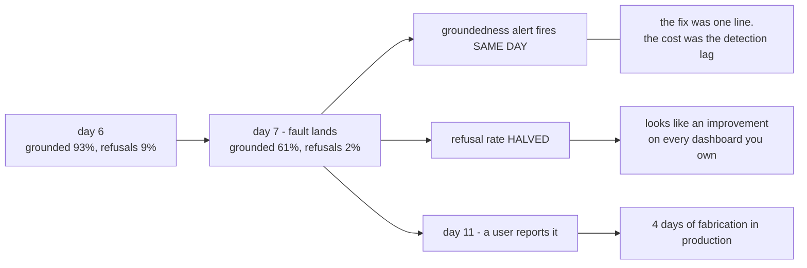
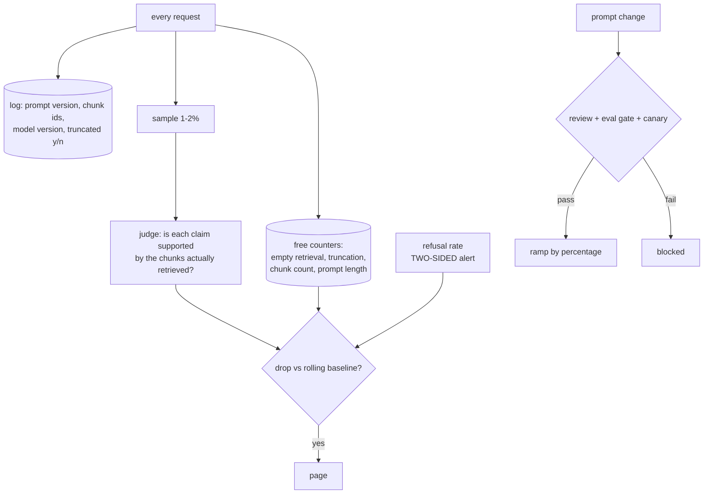

# The fabrication incident — diagrams

## 1. The bisection

Ordered by **prior divided by cost**, and the rule matters more than the list: it survives
being wrong. The top two hypotheses are over half the probability and eleven minutes of work.

---

## 2. Mitigate before you diagnose

---

## 3. The either/or bug

#### Buggy: style replaced the facts

#### Fixed: style is a modifier, facts are not optional

---

## 4. Why both bugs are invisible

---

## 5. Detection: the counterfactual

---

## 6. The control set that closes it

