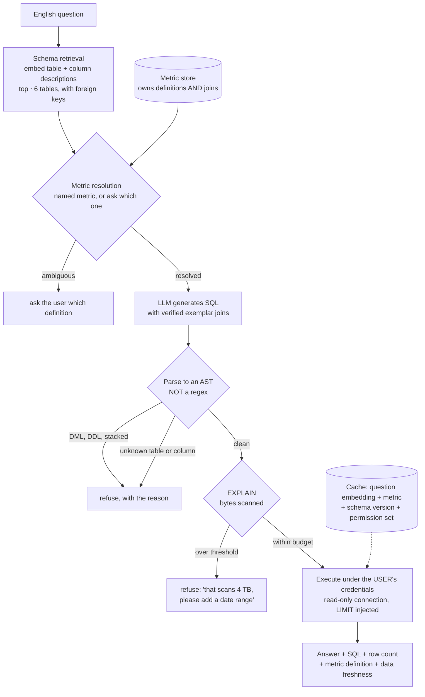
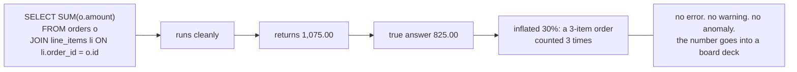
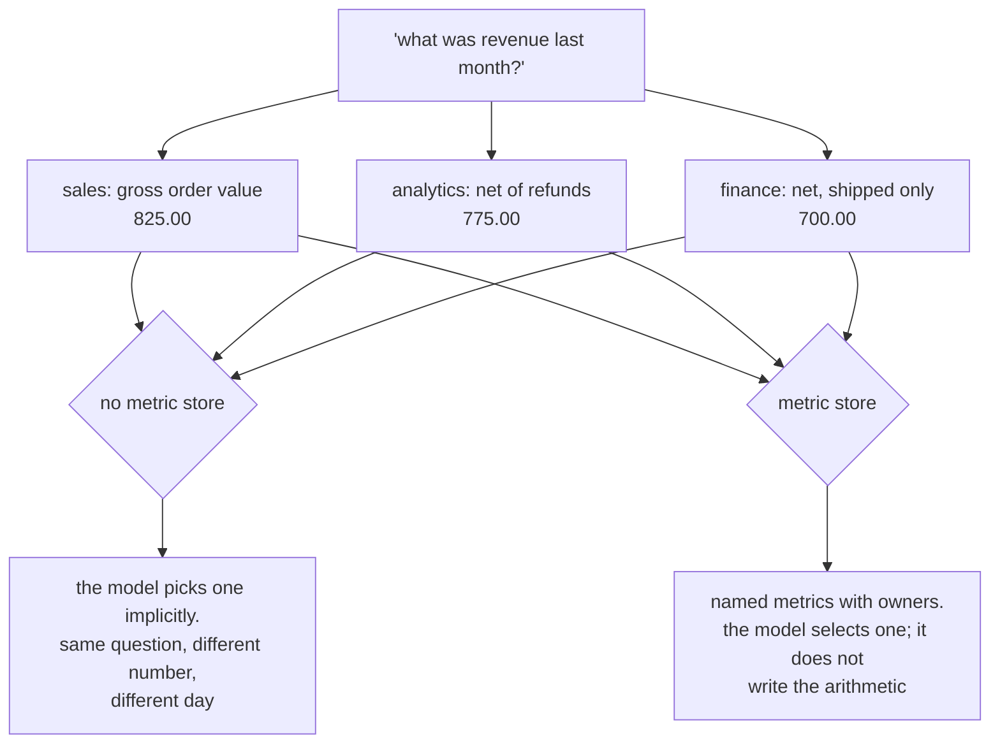
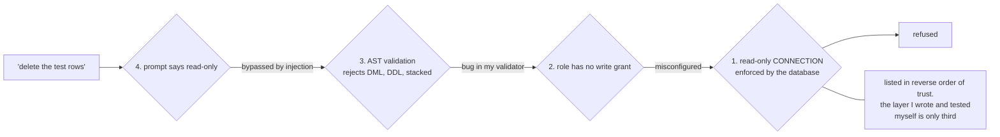
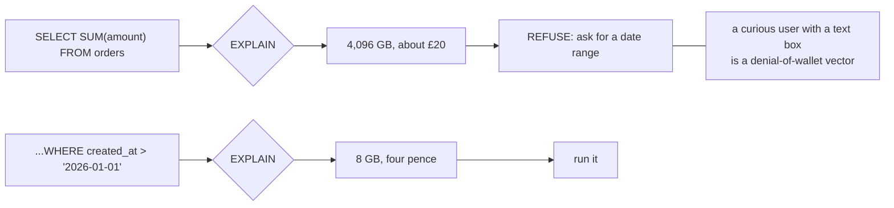
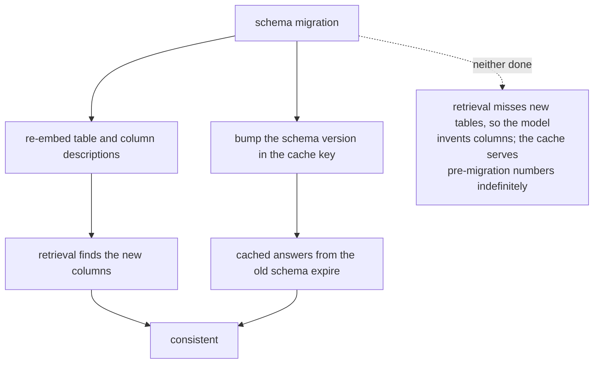

# Text-to-SQL — diagrams

## 1. The whole request path

The model appears once, in the middle, and is the least interesting box on the page. Everything
that makes the feature safe is retrieval, a definition, a parser or a cost check.

---

## 2. The failure that matters

An error is recoverable because somebody sees it. This is worse than an error, and a better
model writes it less often rather than never.

---

## 3. Three revenues, all correct

---

## 4. Defence in depth for writes

---

## 5. The cost guard

---

## 6. Schema drift invalidates two things

