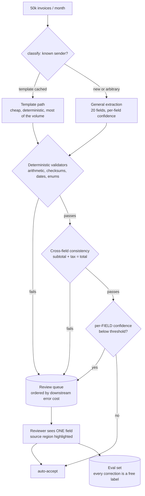
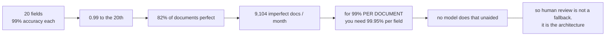
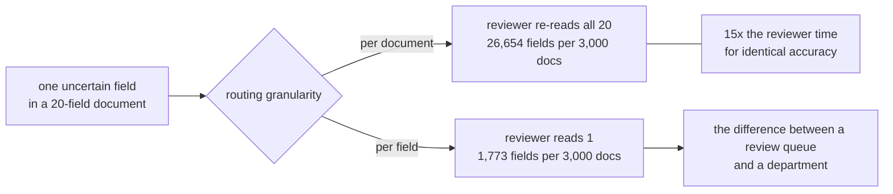
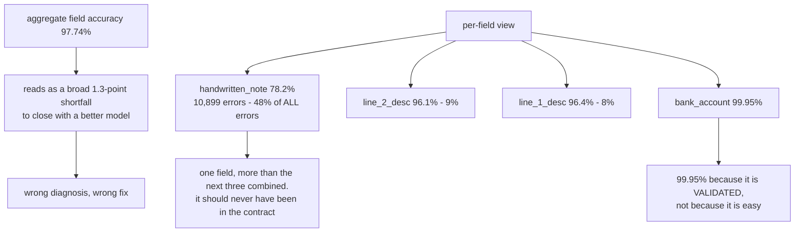
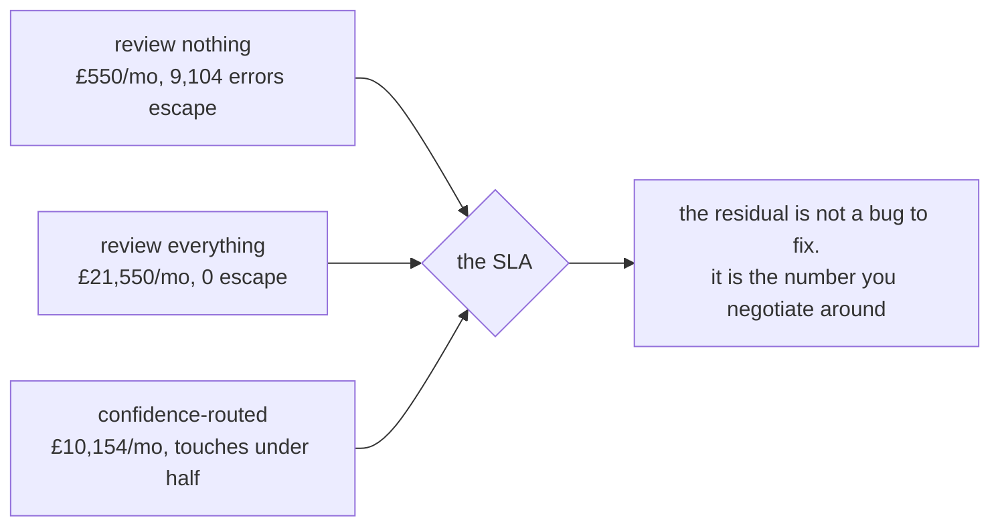
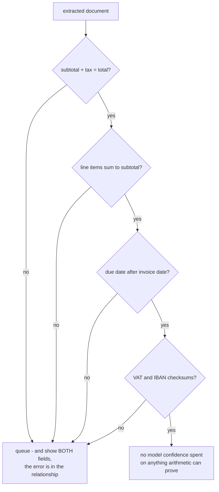

# Extraction against an SLA — diagrams

## 1. The pipeline

Validators run **before** confidence routing on purpose: each deterministic catch is a review
avoided, and review is the expensive resource in this system.

---

## 2. The arithmetic that reframes the problem

---

## 3. Per-field routing versus per-document

---

## 4. What an aggregate hides

---

## 5. Routing economics

---

## 6. Validators are free accuracy

