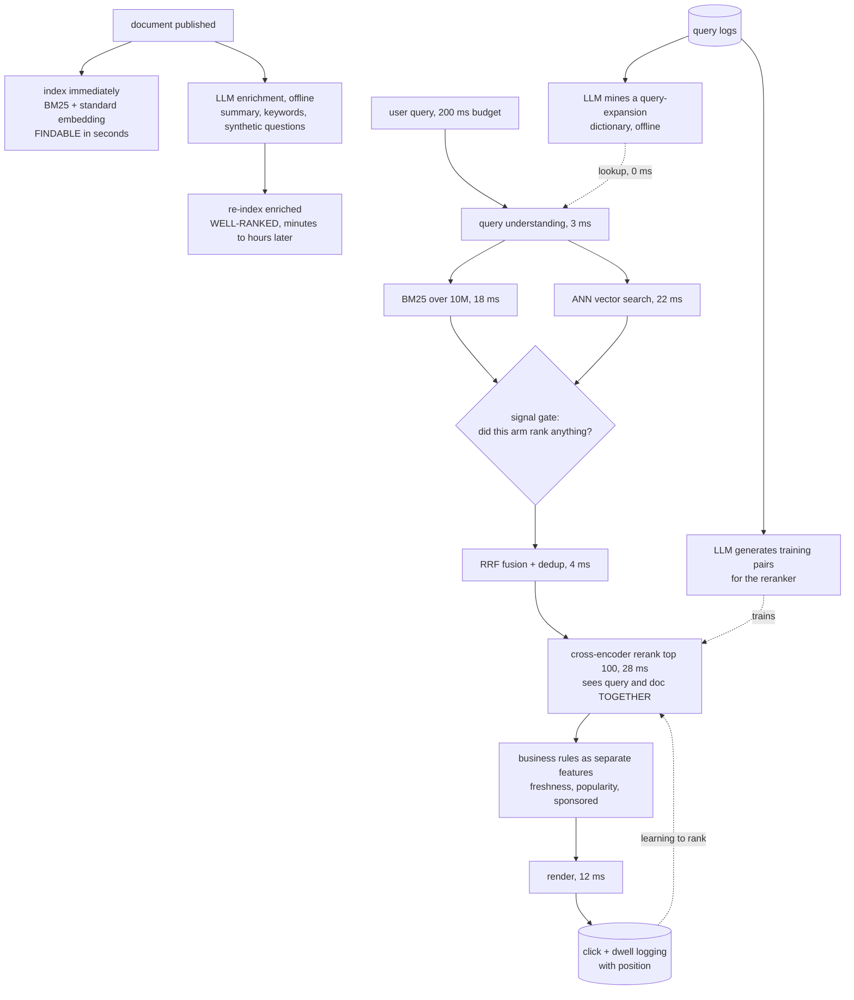
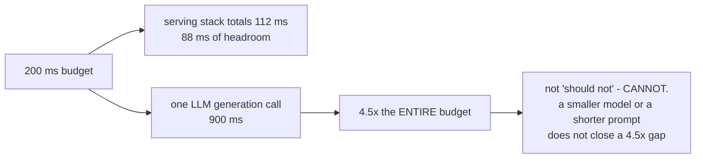
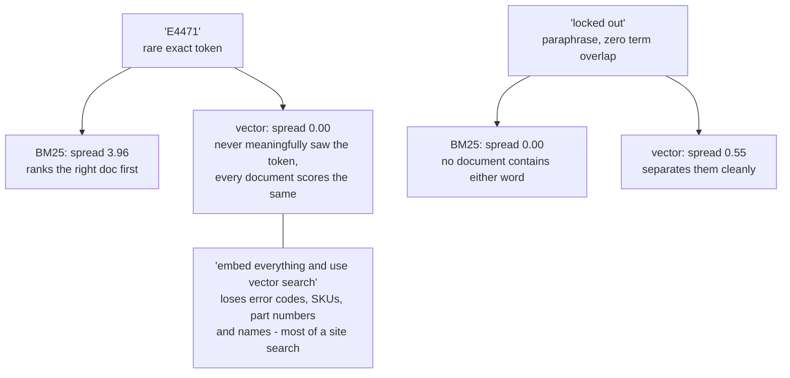
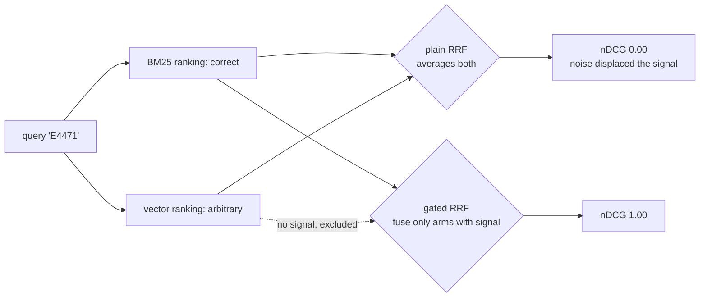
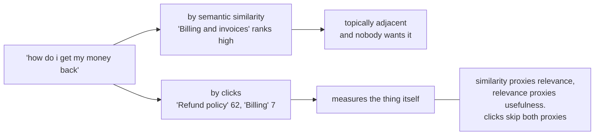
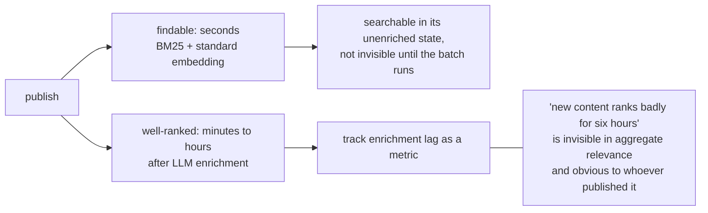

# Search and ranking — diagrams

## 1. Two paths: offline is where the LLM lives

No LLM appears anywhere in the request path. Everything it does happens hours earlier, and the
system is faster and better for it.

---

## 2. The budget, and what it rules out

---

## 3. Each retriever is blind where the other sees

---

## 4. Naive fusion is worse than one arm alone

Worst-query nDCG: BM25 alone 0.25, vector alone 0.00, plain RRF **0.00**, gated RRF **0.82**.
Read the worst row, not the mean — hybrid buys a floor.

---

## 5. Similarity is not usefulness

---

## 6. Freshness has two clocks

