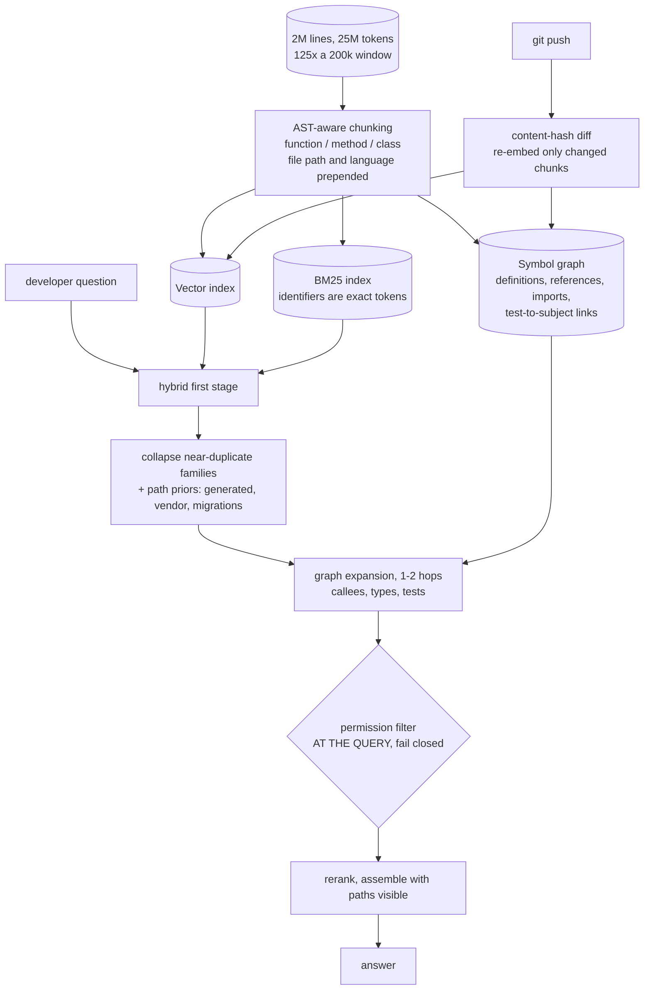
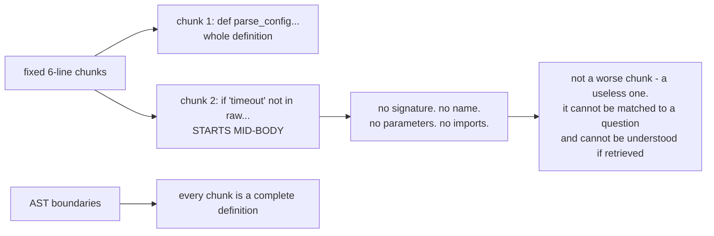
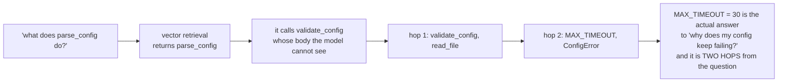
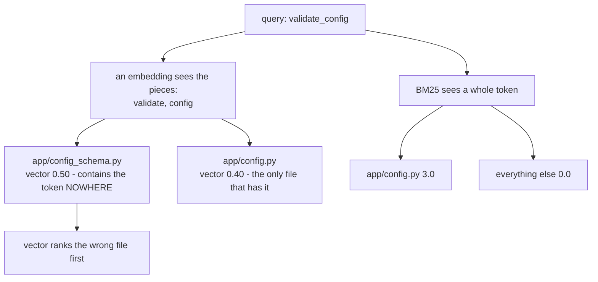
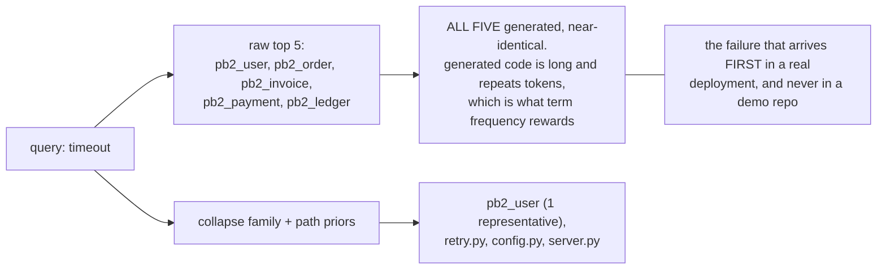
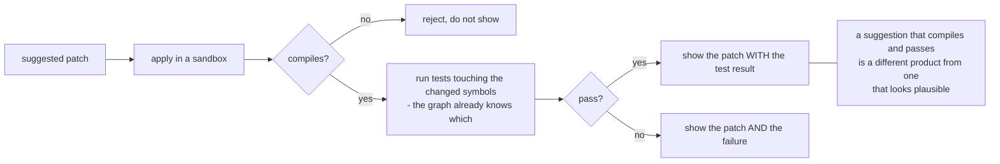

# Repo-aware code assistant — diagrams

## 1. The index is three things, not one

The permission filter's position is the security answer. Filtering after generation means the
private code was already in the prompt.

---

## 2. Why fixed-size chunking breaks code

Prose degrades gracefully when split; code does not.

---

## 3. Similarity finds the call site, references find the answer

---

## 4. An identifier is a token, not a concept

---

## 5. Near-duplication owns the page

---

## 6. Suggesting a change is a different product

